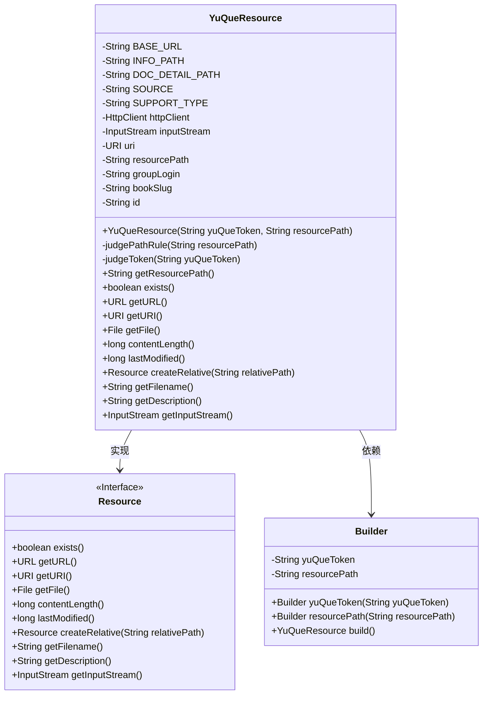

# 基础信息

|      |      |
|------|------|
| 名称 | YuQueResource |
| 编码语言 | .java |
| 代码路径 | spring-ai-alibaba/community/document-readers/spring-ai-alibaba-starter-document-reader-yuque/src/main/java/com/alibaba/cloud/ai/reader/yuque/YuQueResource.java |
| 包名 | com.alibaba.cloud.ai.reader.yuque |
| 依赖项 | ['java.io.ByteArrayInputStream', 'java.io.File', 'java.io.IOException', 'java.io.InputStream', 'java.net.URI', 'java.net.URL', 'java.net.http.HttpClient', 'java.net.http.HttpRequest', 'java.net.http.HttpResponse', 'java.util.Objects', 'java.util.regex.Matcher', 'java.util.regex.Pattern', 'com.fasterxml.jackson.databind.JsonNode', 'com.fasterxml.jackson.databind.ObjectMapper', 'org.springframework.core.io.Resource', 'org.springframework.util.Assert', 'org.springframework.util.StringUtils'] |
| 概述说明 | YuQueResource类处理语雀API资源，验证路径和令牌，获取文档内容并返回输入流。 |

# 说明

YuQueResource类主要用于处理与语雀API相关的资源操作。它负责验证路径和令牌的有效性，确保请求的合法性。此外，该类还负责获取文档内容，并将其以输入流的形式返回，便于后续处理和使用。通过这些功能，YuQueResource类实现了与语雀API的交互，确保数据的准确获取和安全传输。

# 类列表 Class Summary

| 名称   | 类型  | 说明 |
|-------|------|-------------|
| YuQueResource | class | YuQueResource类用于处理语雀API资源，验证路径和令牌，获取文档内容并返回输入流。 |

## 类 YuQueResource

|      |      |
|------|------|
| 访问范围 | public |
| 类型 | class |
| 名称 | YuQueResource |
| 说明 | YuQueResource类用于处理语雀API资源，验证路径和令牌，获取文档内容并返回输入流。 |

### UML类图

**描述：**  
`YuQueResource` 类实现了 `Resource` 接口，用于处理与语雀（YuQue）API 相关的资源操作。该类通过 `HttpClient` 发送请求，获取资源内容，并提供了对资源的基本操作方法。`Builder` 类用于构建 `YuQueResource` 对象，确保必要的参数（如 `yuQueToken` 和 `resourcePath`）在构建时被正确设置。`judgePathRule` 和 `judgeToken` 方法分别用于验证资源路径的格式和语雀令牌的有效性。

### 内部方法调用关系图

```mermaid
graph TD
    A["类YuQueResource"]
    B["属性: HttpClient httpClient"]
    C["属性: InputStream inputStream"]
    D["属性: URI uri"]
    E["属性: String resourcePath"]
    F["属性: String groupLogin"]
    G["属性: String bookSlug"]
    H["属性: String id"]
    I["构造方法: YuQueResource(String yuQueToken, String resourcePath)"]
    J["方法: judgePathRule(String resourcePath)"]
    K["方法: judgeToken(String yuQueToken)"]
    L["方法: getResourcePath()"]
    M["方法: exists()"]
    N["方法: getURL()"]
    O["方法: getURI()"]
    P["方法: getFile()"]
    Q["方法: contentLength()"]
    R["方法: lastModified()"]
    S["方法: createRelative(String relativePath)"]
    T["方法: getFilename()"]
    U["方法: getDescription()"]
    V["方法: getInputStream()"]
    W["内部类: Builder"]
    X["方法: yuQueToken(String yuQueToken)"]
    Y["方法: resourcePath(String resourcePath)"]
    Z["方法: build()"]

    A --> B
    A --> C
    A --> D
    A --> E
    A --> F
    A --> G
    A --> H
    A --> I
    I --> J
    I --> K
    A --> L
    A --> M
    A --> N
    A --> O
    A --> P
    A --> Q
    A --> R
    A --> S
    A --> T
    A --> U
    A --> V
    A -.-> W
    W --> X
    W --> Y
    W --> Z
```

这段代码定义了一个名为`YuQueResource`的类，用于处理与语雀API相关的资源操作。类中包含多个属性和方法，主要用于验证资源路径和令牌，并通过HTTP请求获取资源内容。代码还包含一个内部类`Builder`，用于构建`YuQueResource`对象。流程图展示了类的主要结构和方法调用关系，帮助理解代码的执行流程。

### 字段列表 Field List

| 名称  | 类型  | 说明 |
|-------|-------|------|
| groupLogin | String | 定义私有字符串变量groupLogin。 |
| SOURCE = "source" | String | 定义常量字符串SOURCE，值为"source"。 |
| httpClient | HttpClient | 定义了一个私有的HttpClient对象。 |
| BASE_URL = "https://www.yuque.com" | String | 定义常量BASE_URL，值为"https://www.yuque.com"。 |
| SUPPORT_TYPE = "Doc" | String | 定义常量SUPPORT_TYPE，值为"Doc"。 |
| uri | URI | 私有不可变的URI对象。 |
| inputStream | InputStream | 私有不可变的输入流对象。 |
| resourcePath | String | 私有字符串变量resourcePath。 |
| DOC_DETAIL_PATH = "/api/v2/repos/%s/%s/docs/%s" | String | 私有常量定义文档详情路径格式。 |
| id | String | 定义了一个私有字符串类型的变量id。 |
| bookSlug | String | 定义私有字符串变量bookSlug。 |
| INFO_PATH = "/api/v2/hello" | String | INFO_PATH变量指向API路径"/api/v2/hello"。 |

### 方法列表 Method List

| 名称  | 类型  | 说明 |
|-------|-------|------|
| getResourcePath | String | 获取资源路径的方法。 |
| getFile | File | 重写getFile方法，返回null，可能抛出IOException。 |
| getFilename | String | 重写getFilename方法，返回空字符串。 |
| getDescription | String | 重写getDescription方法，返回空字符串。 |
| createRelative | Resource | 重写方法createRelative，返回null，抛出IOException。 |
| exists | boolean | 方法exists()重写，始终返回false。 |
| judgePathRule | void | 判断资源路径格式并提取关键信息。 |
| getURI | URI | 重写getURI方法，返回URI对象，可能抛出IOException异常。 |
| getInputStream | InputStream | 重写getInputStream方法，返回inputStream对象。 |
| judgeToken | void | 验证语雀令牌有效性的私有方法，发送HTTP请求并检查状态码。 |
| builder | Builder | 静态方法`builder()`返回一个新的`Builder`实例。 |
| getURL | URL | 该方法重写getURL，返回null，可能抛出IOException。 |
| lastModified | long | 该方法重写并返回0，表示资源未修改。 |
| contentLength | long | 重写contentLength方法，返回0并抛出IOException。 |

