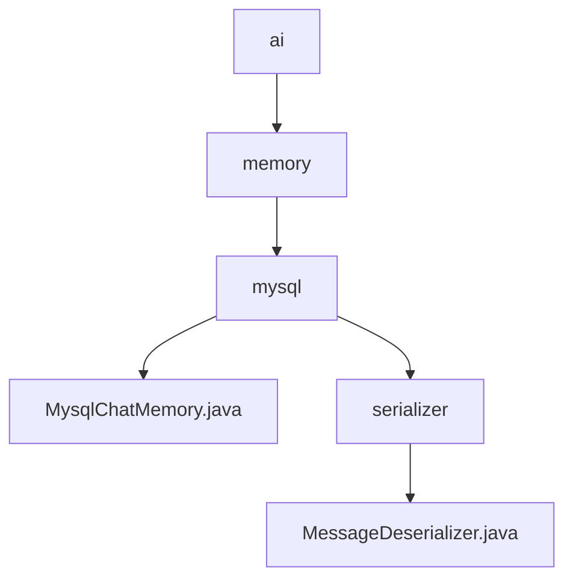

# 基础信息

|      |      |
|------|------|
| 名称 | ai |
| 编码语言 | .java |
| 代码路径 | spring-ai-alibaba/community/memories/spring-ai-alibaba-mysql-memory/src/main/java/com/alibaba/cloud/ai |
| 包名 | spring-ai-alibaba.community.memories.spring-ai-alibaba-mysql-memory.src.main.java.com.alibaba.cloud.ai |
| 概述说明 | MysqlChatMemory类实现MySQL存储聊天记录，支持增删查改。MessageDeserializer类解析JSON消息并生成相应对象。 |

# 说明

## 概述
该代码模块主要涉及聊天记忆的存储与管理，以及与消息解析相关的功能。核心类包括`MysqlChatMemory`和`MessageDeserializer`，分别用于实现MySQL数据库存储聊天记录和解析JSON格式的消息。模块通过简化与MySQL数据库的交互，确保聊天数据的持久化和可访问性，同时提供了消息解析功能，支持将JSON数据转换为具体的消息实例。

## 主要业务场景
1. **聊天记录存储与管理**：通过`MysqlChatMemory`类，用户可以将聊天记录存储在MySQL数据库中，并执行增加、删除、查询和修改等操作。适用于需要长期保存和检索聊天记录的应用场景，如客服系统、聊天机器人等。
2. **消息解析与处理**：`MessageDeserializer`类负责将JSON格式的消息解析为具体的消息对象（如`UserMessage`或`AssistantMessage`），以便在系统中进行进一步处理。适用于需要处理多种类型消息的场景，如消息队列、事件驱动系统等。

### 包内部结构视图

该流程图展示了路径的层级关系，从最顶层的`ai`开始，逐步深入到`memory`、`mysql`，最终分别指向`MysqlChatMemory.java`和`serializer`，而`serializer`又指向`MessageDeserializer.java`。这种结构清晰地反映了文件与文件夹之间的嵌套关系。

# 文件列表 File List

| 名称   | 类型  | 说明 |
|-------|------|-------------|
| [memory](memory/_module.md) | package | MysqlChatMemory类实现MySQL存储聊天记录，支持增删查改。MessageDeserializer类解析JSON消息并生成相应对象。 |

