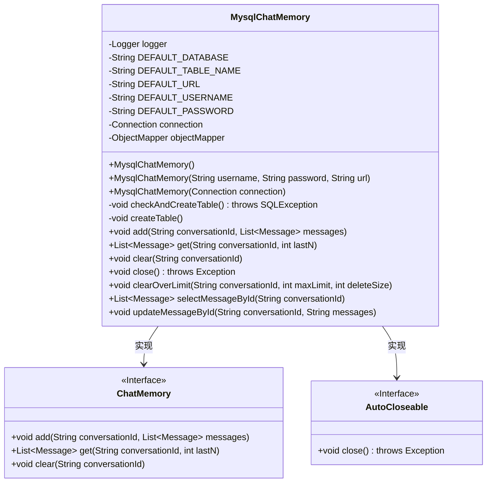

# 基础信息

|      |      |
|------|------|
| 名称 | MysqlChatMemory |
| 编码语言 | .java |
| 代码路径 | spring-ai-alibaba/community/memories/spring-ai-alibaba-mysql-memory/src/main/java/com/alibaba/cloud/ai/memory/mysql/MysqlChatMemory.java |
| 包名 | com.alibaba.cloud.ai.memory.mysql |
| 依赖项 | ['java.sql.DriverManager', 'java.sql.Connection', 'java.sql.ResultSet', 'java.sql.SQLException', 'java.sql.Statement', 'java.sql.PreparedStatement', 'java.util.ArrayList', 'java.util.List', 'com.fasterxml.jackson.core.JsonProcessingException', 'com.fasterxml.jackson.core.type.TypeReference', 'com.fasterxml.jackson.databind.ObjectMapper', 'com.fasterxml.jackson.databind.module.SimpleModule', 'org.slf4j.Logger', 'org.slf4j.LoggerFactory', 'org.springframework.ai.chat.memory.ChatMemory', 'org.springframework.ai.chat.messages.Message', 'com.alibaba.cloud.ai.memory.mysql.serializer.MessageDeserializer'] |
| 概述说明 | MysqlChatMemory类实现MySQL聊天记忆存储，支持增删查改操作。 |

# 说明

MysqlChatMemory类是一个用于实现MySQL数据库存储聊天记忆的工具。它提供了对聊天记录的增加、删除、查询和修改等基本操作功能。通过该类，用户可以方便地将聊天数据存储在MySQL数据库中，并对其进行高效管理。该类的设计旨在简化与MySQL数据库的交互，确保数据的持久化和可访问性，适用于需要长期保存和检索聊天记录的应用场景。

# 类列表 Class Summary

| 名称   | 类型  | 说明 |
|-------|------|-------------|
| MysqlChatMemory | class | MysqlChatMemory类实现MySQL聊天记忆存储，支持增删查改操作。 |

## 类 MysqlChatMemory

|      |      |
|------|------|
| 访问范围 | public |
| 类型 | class |
| 名称 | MysqlChatMemory |
| 说明 | MysqlChatMemory类实现MySQL聊天记忆存储，支持增删查改操作。 |

### UML类图

这段代码定义了一个名为 `MysqlChatMemory` 的类，该类实现了 `ChatMemory` 和 `AutoCloseable` 接口。`MysqlChatMemory` 类用于管理与 MySQL 数据库中的聊天记录相关的操作，包括添加、获取、清除聊天记录等功能。类中包含了与数据库连接、表创建、数据查询和更新相关的私有方法，并通过构造函数初始化数据库连接和对象映射器。该类还提供了处理聊天记录的逻辑，如根据会话 ID 获取消息、清除超过限制的聊天记录等。

### 内部方法调用关系图

```mermaid
graph TD
    A["类MysqlChatMemory"]
    B["属性: Logger logger"]
    C["属性: String DEFAULT_DATABASE"]
    D["属性: String DEFAULT_TABLE_NAME"]
    E["属性: String DEFAULT_URL"]
    F["属性: String DEFAULT_USERNAME"]
    G["属性: String DEFAULT_PASSWORD"]
    H["属性: Connection connection"]
    I["属性: ObjectMapper objectMapper"]
    J["构造方法: MysqlChatMemory()"]
    K["构造方法: MysqlChatMemory(String username, String password, String url)"]
    L["构造方法: MysqlChatMemory(Connection connection)"]
    M["方法: void checkAndCreateTable()"]
    N["方法: void createTable()"]
    O["方法: void add(String conversationId, List<Message> messages)"]
    P["方法: List<Message> get(String conversationId, int lastN)"]
    Q["方法: void clear(String conversationId)"]
    R["方法: void close()"]
    S["方法: void clearOverLimit(String conversationId, int maxLimit, int deleteSize)"]
    T["方法: List<Message> selectMessageById(String conversationId)"]
    U["方法: void updateMessageById(String conversationId, String messages)"]

    A --> B
    A --> C
    A --> D
    A --> E
    A --> F
    A --> G
    A --> H
    A --> I
    A --> J
    A --> K
    A --> L
    K --> M
    M --> N
    A --> O
    O --> T
    O --> U
    A --> P
    P --> T
    A --> Q
    A --> R
    A --> S
    S --> T
    S --> U
    A --> T
    A --> U
```

这段代码定义了一个名为 `MysqlChatMemory` 的类，它实现了 `ChatMemory` 和 `AutoCloseable` 接口。该类用于管理与 MySQL 数据库的聊天记录，包括添加、获取、清除和更新聊天消息。代码中包含多个构造方法，用于初始化数据库连接和对象映射器，以及多个方法用于执行具体的数据库操作。流程图展示了类的主要属性和方法之间的调用关系，帮助理解代码的执行流程。

### 字段列表 Field List

| 名称  | 类型  | 说明 |
|-------|-------|------|
| logger = LoggerFactory.getLogger(MysqlChatMemory.class) | Logger | MysqlChatMemory类中定义了一个私有的静态Logger实例。 |
| DEFAULT_PASSWORD = "root" | String | 默认密码设为"root"。 |
| objectMapper = new ObjectMapper() | ObjectMapper | 创建私有不可变的ObjectMapper实例。 |
| DEFAULT_DATABASE = "spring_ai_alibaba_mysql" | String | 默认数据库名为spring_ai_alibaba_mysql。 |
| DEFAULT_URL = "127.0.0.1:3306" | String | 默认URL为"127.0.0.1:3306"。 |
| connection | Connection | 私有且不可变的连接对象。 |
| DEFAULT_TABLE_NAME = "chat_memory" | String | 定义默认表名为“chat_memory”的静态常量。 |
| DEFAULT_USERNAME = "root" | String | 定义默认用户名为"root"的私有静态常量字符串。 |

### 方法列表 Method List

| 名称  | 类型  | 说明 |
|-------|-------|------|
| checkAndCreateTable | void | 检查并创建数据库表，存在则记录，不存在则创建。 |
| close | void | 重写close方法，关闭非空连接。 |
| clear | void | 该方法用于删除指定对话ID的数据库记录。 |
| clearOverLimit | void | 清除超过限制的聊天消息，更新数据库。 |
| selectMessageById | List<Message> | 根据对话ID从数据库查询消息列表并返回。 |
| add | void | 方法add将消息列表添加到指定对话ID的MySQL聊天记录中，并更新数据库。 |
| get | List<Message> | 通过ID获取对话消息，异常时记录错误并抛出，返回最后N条消息。 |
| createTable | void | 创建表chat_memory，包含id、conversation_id和messages字段，处理异常并记录日志。 |
| updateMessageById | void | 根据ID更新消息，无记录则插入，处理换行和单引号。 |

