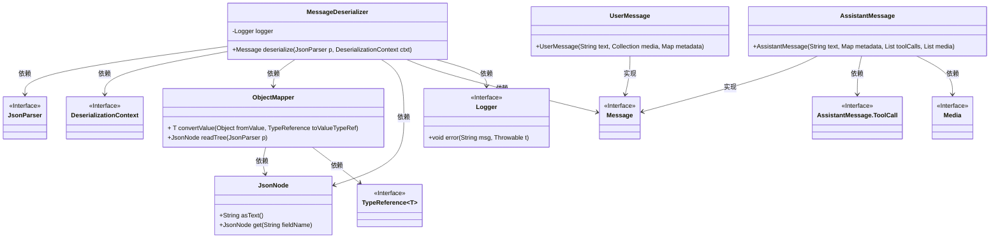

# 基础信息

|      |      |
|------|------|
| 名称 | MessageDeserializer |
| 编码语言 | .java |
| 代码路径 | spring-ai-alibaba/community/memories/spring-ai-alibaba-mysql-memory/src/main/java/com/alibaba/cloud/ai/memory/mysql/serializer/MessageDeserializer.java |
| 包名 | com.alibaba.cloud.ai.memory.mysql.serializer |
| 依赖项 | ['com.fasterxml.jackson.core.JsonParser', 'com.fasterxml.jackson.core.type.TypeReference', 'com.fasterxml.jackson.databind.DeserializationContext', 'com.fasterxml.jackson.databind.JsonDeserializer', 'com.fasterxml.jackson.databind.JsonNode', 'com.fasterxml.jackson.databind.ObjectMapper', 'org.slf4j.Logger', 'org.slf4j.LoggerFactory', 'org.springframework.ai.chat.messages.AssistantMessage', 'org.springframework.ai.chat.messages.Message', 'org.springframework.ai.chat.messages.UserMessage', 'org.springframework.ai.model.Media', 'java.io.IOException', 'java.util.Collection', 'java.util.List', 'java.util.Map'] |
| 概述说明 | MessageDeserializer类解析JSON并生成UserMessage或AssistantMessage对象。 |

# 说明

MessageDeserializer类负责解析JSON格式的消息，并根据消息类型创建相应的对象。如果消息类型为UserMessage，则生成UserMessage对象；如果消息类型为AssistantMessage，则生成AssistantMessage对象。该类的主要功能是将JSON数据转换为具体的消息实例，以便在系统中进行进一步处理和使用。

# 类列表 Class Summary

| 名称   | 类型  | 说明 |
|-------|------|-------------|
| MessageDeserializer | class | MessageDeserializer类解析JSON消息，根据类型创建UserMessage或AssistantMessage对象。 |

## 类 MessageDeserializer

|      |      |
|------|------|
| 访问范围 | public |
| 类型 | class |
| 名称 | MessageDeserializer |
| 说明 | MessageDeserializer类解析JSON消息，根据类型创建UserMessage或AssistantMessage对象。 |

### UML类图

### 描述
`MessageDeserializer` 类是一个用于反序列化 JSON 数据的类，它继承自 `JsonDeserializer<Message>`。该类通过 `deserialize` 方法将 JSON 数据解析为 `Message` 对象，并根据 `messageType` 字段的不同，分别创建 `UserMessage` 或 `AssistantMessage` 对象。`ObjectMapper` 负责处理 JSON 数据的读取和转换，`JsonNode` 用于访问 JSON 节点数据。`Logger` 用于记录反序列化过程中的错误。整个流程依赖于多个接口和类，如 `JsonParser`、`DeserializationContext` 和 `TypeReference`，以确保数据的正确解析和处理。

### 内部方法调用关系图

这段代码定义了一个`MessageDeserializer`类，用于将JSON数据反序列化为`Message`对象。代码首先通过`ObjectMapper`读取JSON数据，然后根据`messageType`字段的值决定创建`UserMessage`或`AssistantMessage`对象。如果`messageType`未知，则抛出`IllegalArgumentException`。在反序列化过程中，如果发生`IOException`，会记录错误日志并返回`null`。

### 字段列表 Field List

| 名称  | 类型  | 说明 |
|-------|-------|------|
| logger = LoggerFactory.getLogger(MessageDeserializer.class) | Logger | 定义静态日志记录器，用于MessageDeserializer类的日志输出。 |

### 方法列表 Method List

| 名称  | 类型  | 说明 |
|-------|-------|------|
| deserialize | Message | 解析JSON消息，根据类型创建用户或助手消息对象。 |

