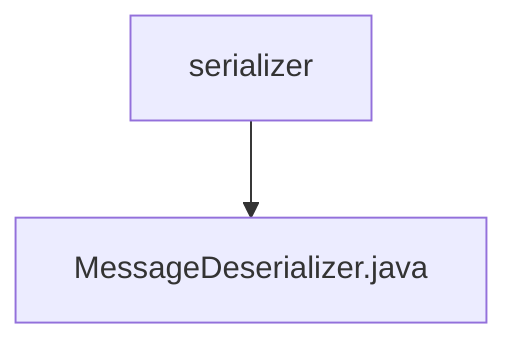

# 基础信息

|      |      |
|------|------|
| 名称 | serializer |
| 编码语言 | .java |
| 代码路径 | spring-ai-alibaba/community/memories/spring-ai-alibaba-mysql-memory/src/main/java/com/alibaba/cloud/ai/memory/mysql/serializer |
| 包名 | spring-ai-alibaba.community.memories.spring-ai-alibaba-mysql-memory.src.main.java.com.alibaba.cloud.ai.memory.mysql.serializer |
| 概述说明 | MessageDeserializer类解析JSON并生成UserMessage或AssistantMessage对象。 |

# 说明

MessageDeserializer类负责解析JSON格式的消息，并根据消息类型创建相应的对象。如果消息类型为UserMessage，则生成UserMessage对象；如果消息类型为AssistantMessage，则生成AssistantMessage对象。该类的主要功能是将JSON数据转换为具体的消息实例，以便在系统中进行进一步处理和使用。

### 包内部结构视图

该流程图展示了路径中的层级关系，`serializer` 是父节点，`MessageDeserializer.java` 是其子节点，表示文件位于该目录下。路径结构简洁明了，反映了文件在项目中的具体位置。

# 文件列表 File List

| 名称   | 类型  | 说明 |
|-------|------|-------------|
| [MessageDeserializer.java](MessageDeserializer.md) | file | MessageDeserializer类解析JSON并生成UserMessage或AssistantMessage对象。 |

