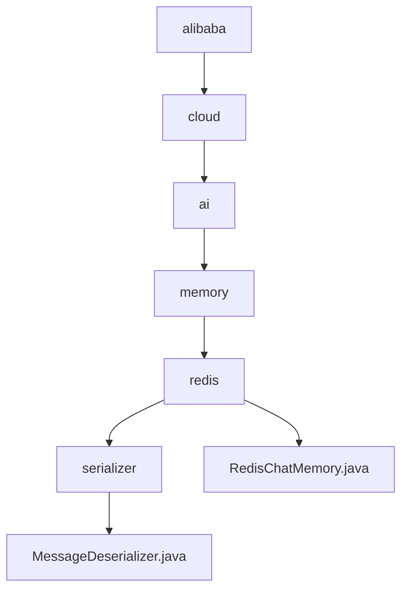

# 基础信息

|      |      |
|------|------|
| 名称 | alibaba |
| 编码语言 | .java |
| 代码路径 | spring-ai-alibaba/community/memories/spring-ai-alibaba-redis-memory/src/main/java/com/alibaba |
| 包名 | spring-ai-alibaba.community.memories.spring-ai-alibaba-redis-memory.src.main.java.com.alibaba |
| 概述说明 | MessageDeserializer类解析JSON为Message对象，支持USER和ASSISTANT类型。RedisChatMemory类管理聊天内存，支持Redis存储，提供添加、获取、清除和更新消息功能。 |

# 说明

## 概述
该代码模块主要围绕消息处理和聊天记录管理展开，包含两个核心类：`MessageDeserializer`和`RedisChatMemory`。`MessageDeserializer`类负责将JSON格式的数据解析为`Message`对象，支持处理`USER`和`ASSISTANT`两种类型的消息，确保消息解析和类型区分的准确性。`RedisChatMemory`类则是一个用于管理聊天内存的工具，通过Redis实现数据的存储和管理，提供了添加、获取、清除和更新聊天消息的功能，确保聊天记录的持久性和可访问性。

## 主要业务场景
1. **消息解析与类型区分**：`MessageDeserializer`类用于将输入的JSON数据解析为`Message`对象，并区分`USER`和`ASSISTANT`两种消息类型，为后续的消息处理提供明确的数据结构。
2. **聊天记录管理**：`RedisChatMemory`类通过Redis存储和管理聊天记录，支持对聊天消息的添加、获取、清除和更新操作，确保聊天数据的持久化和高效访问。
3. **数据持久化与可访问性**：通过Redis的存储机制，`RedisChatMemory`类实现了聊天记录的持久化，确保在系统重启或故障情况下，聊天数据依然可访问和恢复。

### 包内部结构视图

该流程图展示了从`alibaba`到`RedisChatMemory.java`和`MessageDeserializer.java`的层级关系。路径从`alibaba`开始，逐步深入到`cloud`、`ai`、`memory`、`redis`，并在`redis`下分为`serializer`和`RedisChatMemory.java`，最后在`serializer`下找到`MessageDeserializer.java`。

# 文件列表 File List

| 名称   | 类型  | 说明 |
|-------|------|-------------|
| [cloud](cloud/_module.md) | package | MessageDeserializer类解析JSON为Message对象，支持USER和ASSISTANT类型。RedisChatMemory类管理聊天内存，支持Redis存储，提供添加、获取、清除和更新消息功能。 |

