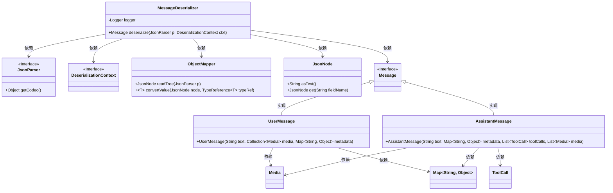
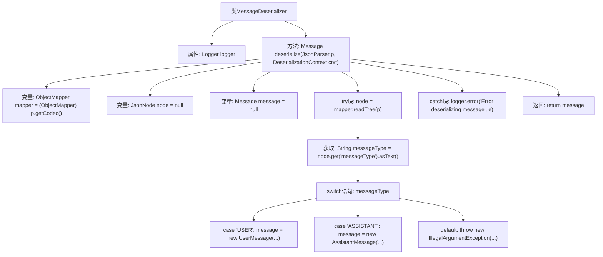

# 基础信息

|      |      |
|------|------|
| 名称 | MessageDeserializer |
| 编码语言 | .java |
| 代码路径 | spring-ai-alibaba/community/memories/spring-ai-alibaba-redis-memory/src/main/java/com/alibaba/cloud/ai/memory/redis/serializer/MessageDeserializer.java |
| 包名 | com.alibaba.cloud.ai.memory.redis.serializer |
| 依赖项 | ['com.fasterxml.jackson.core.JsonParser', 'com.fasterxml.jackson.core.type.TypeReference', 'com.fasterxml.jackson.databind.DeserializationContext', 'com.fasterxml.jackson.databind.JsonDeserializer', 'com.fasterxml.jackson.databind.JsonNode', 'com.fasterxml.jackson.databind.ObjectMapper', 'org.slf4j.Logger', 'org.slf4j.LoggerFactory', 'org.springframework.ai.chat.messages.AssistantMessage', 'org.springframework.ai.chat.messages.Message', 'org.springframework.ai.chat.messages.UserMessage', 'org.springframework.ai.model.Media', 'java.io.IOException', 'java.util.Collection', 'java.util.List', 'java.util.Map'] |
| 概述说明 | MessageDeserializer类将JSON解析为Message对象，支持USER和ASSISTANT类型。 |

# 说明

MessageDeserializer类负责将JSON数据解析为Message对象，该过程支持处理USER和ASSISTANT两种类型的消息。通过这一功能，系统能够有效地将输入的JSON格式数据转换为具有明确类型的Message对象，便于后续处理和操作。这一设计使得MessageDeserializer类在消息解析和类型区分方面表现出色，满足了系统对消息处理的需求。

# 类列表 Class Summary

| 名称   | 类型  | 说明 |
|-------|------|-------------|
| MessageDeserializer | class | MessageDeserializer类解析JSON为Message对象，支持USER和ASSISTANT类型。 |

## 类 MessageDeserializer

|      |      |
|------|------|
| 访问范围 | public |
| 类型 | class |
| 名称 | MessageDeserializer |
| 说明 | MessageDeserializer类解析JSON为Message对象，支持USER和ASSISTANT类型。 |

### UML类图

这段代码描述了一个`MessageDeserializer`类，用于将JSON数据反序列化为不同类型的`Message`对象。`MessageDeserializer`依赖于`JsonParser`、`DeserializationContext`、`ObjectMapper`和`JsonNode`来处理JSON数据，并根据`messageType`字段创建`UserMessage`或`AssistantMessage`对象。`UserMessage`和`AssistantMessage`都实现了`Message`接口，并分别依赖于`Media`、`Map<String, Object>`和`ToolCall`等类。

### 内部方法调用关系图

这段代码定义了一个 `MessageDeserializer` 类，用于将 JSON 数据反序列化为 `Message` 对象。代码首先通过 `ObjectMapper` 读取 JSON 数据，并根据 `messageType` 字段的值创建不同类型的 `Message` 对象（如 `UserMessage` 或 `AssistantMessage`）。如果 `messageType` 未知，则抛出 `IllegalArgumentException`。在反序列化过程中，如果发生 `IOException`，则记录错误日志并返回 `null`。流程图展示了代码的主要执行步骤和逻辑分支。

### 字段列表 Field List

| 名称  | 类型  | 说明 |
|-------|-------|------|
| logger = LoggerFactory.getLogger(MessageDeserializer.class) | Logger | 定义私有静态日志记录器，用于MessageDeserializer类。 |

### 方法列表 Method List

| 名称  | 类型  | 说明 |
|-------|-------|------|
| deserialize | Message | 反序列化JSON消息，根据类型创建UserMessage或AssistantMessage对象。 |

