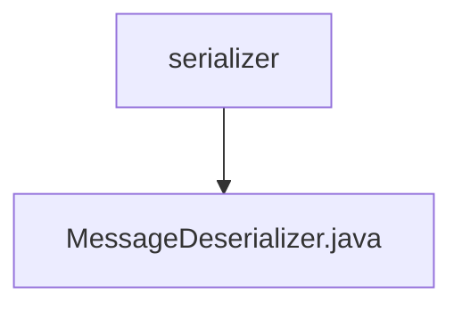

# 基础信息

|      |      |
|------|------|
| 名称 | serializer |
| 编码语言 | .java |
| 代码路径 | spring-ai-alibaba/community/memories/spring-ai-alibaba-redis-memory/src/main/java/com/alibaba/cloud/ai/memory/redis/serializer |
| 包名 | spring-ai-alibaba.community.memories.spring-ai-alibaba-redis-memory.src.main.java.com.alibaba.cloud.ai.memory.redis.serializer |
| 概述说明 | MessageDeserializer类将JSON解析为Message对象，支持USER和ASSISTANT类型。 |

# 说明

MessageDeserializer类负责将JSON数据解析为Message对象，该过程支持处理USER和ASSISTANT两种类型的消息。通过这一功能，系统能够有效地将输入的JSON格式数据转换为具有明确类型的Message对象，便于后续处理和操作。这一设计使得MessageDeserializer类在消息解析和类型区分方面表现出色，满足了系统对消息处理的需求。

### 包内部结构视图

该流程图展示了路径的层级关系，`serializer` 是父节点，`MessageDeserializer.java` 是其子节点，表示文件 `MessageDeserializer.java` 位于 `serializer` 目录下。

# 文件列表 File List

| 名称   | 类型  | 说明 |
|-------|------|-------------|
| [MessageDeserializer.java](MessageDeserializer.md) | file | MessageDeserializer类将JSON解析为Message对象，支持USER和ASSISTANT类型。 |

