# 基础信息

|      |      |
|------|------|
| 名称 | ai |
| 编码语言 | .java |
| 代码路径 | spring-ai-alibaba/community/openmanus/src/main/java/com/alibaba/cloud/ai |
| 包名 | spring-ai-alibaba.community.openmanus.src.main.java.com.alibaba.cloud.ai |
| 概述说明 | 智能体框架管理多任务，支持浏览器、工具调用、Python代码和文件操作，提升执行效率。 |

# 说明

## 概述
该代码模块是一个基于智能体（Agent）的框架，主要用于管理和执行多种任务。模块的核心是`BaseAgent`，它提供了状态管理、执行控制和工具调用等基础功能。`ReActAgent`继承自`BaseAgent`，进一步提供了思考、行动和完整步骤执行的功能，并要求子类实现具体的业务逻辑。`ToolCallAgent`作为`ReActAgent`的一部分，专门负责工具调用的管理，支持工具的执行和重试机制，确保系统的可靠性和稳定性。模块中还包含多个继承自`ToolCallAgent`的子类，如`BrowserAgent`、`ManusAgent`、`PythonAgent`和`FileAgent`，它们分别负责浏览器管理、工作目录和Chrome驱动服务、Python代码执行以及文件操作等特定任务。

此外，模块还涉及计划流程的管理与执行、客户端请求处理、浏览器无头模式控制、代码执行与结果管理、命令处理、IP地址管理、日志生成以及工具执行结果封装等功能。模块中的各个类通过提供灵活且高效的API，简化了开发者在处理复杂任务时的复杂性，确保系统在规划流程、客户端请求处理和浏览器操作中的高效运行。

## 主要业务场景
1. **浏览器管理**：`BrowserAgent`负责管理浏览器的状态和执行相关任务，支持多种工具调用，确保浏览器操作的灵活性和高效性。
2. **工具调用与管理**：`ToolCallAgent`和其子类（如`ManusAgent`、`PythonAgent`、`FileAgent`）负责管理和执行各种工具调用，支持重试机制和错误处理，确保任务的顺利完成。
3. **Python代码执行**：`PythonAgent`专门用于执行Python代码，支持常用库如`math`和`numpy`，具备任务执行、错误处理和最佳实践功能。
4. **文件操作**：`FileAgent`负责处理文件相关操作，包括路径验证、文件处理、错误监控和任务完成跟踪，确保文件操作的安全性和可靠性。
5. **智能任务执行**：`ReActAgent`和`BaseAgent`提供了通用的执行流程和基础架构，支持子类实现具体的业务逻辑，确保智能任务的灵活性和扩展性。
6. **流程初始化与执行**：`PlanningFlow`类负责管理计划流程的初始化、步骤执行和总结生成，确保每个步骤的准确执行和状态的实时跟踪。
7. **客户端请求处理**：`ManusConfiguration`类用于配置`PlanningFlow`和`RestClient.Builder`，确保系统在规划流程和客户端请求处理中的高效运行。
8. **浏览器无头模式控制**：`BrowserProperties`类用于配置浏览器的无头模式，适用于自动化测试和服务器环境。
9. **代码执行与结果管理**：通过`CodeExecutionResult`和`ExecuteCommandResult`类，开发者可以方便地管理和操作代码或命令执行后的结果。
10. **多语言代码解析与执行**：`CodeUtils`类提供了多语言代码解析与执行的能力，适用于需要跨语言代码处理的场景。
11. **本地IP地址管理**：`IpUtils`类能够动态获取和更新本地IP地址，确保在网络环境变化时仍能准确反映当前网络状态。
12. **全局有序日志生成**：`LogIdGenerator`类用于生成全局有序的UUID，并支持生成子RPC ID，确保在分布式系统中标识的唯一性和顺序性。
13. **命令执行与工作目录控制**：`BashProcess`类允许用户在执行命令时指定工作目录，确保命令在特定路径下运行。
14. **工具执行结果封装**：`ToolExecuteResult`类用于封装工具执行的结果，便于开发者管理和操作工具执行后的数据。
15. **浏览器操作自动化**：`BrowserUseTool`类支持页面导航、元素点击、文本输入以及屏幕截图等操作，适用于需要自动化浏览器任务的场景。
16. **文件加载与解析**：`DocLoaderTool`类能够读取和解析多种类型的本地文件，适用于需要提取文件信息的场景。
17. **Google搜索功能**：`GoogleSearch`类通过调用相关接口或方法，执行搜索操作并返回与搜索关键词相关的链接列表，适用于需要快速检索信息的场景。
18. **文件保存与持久化**：`FileSaver`类用于将指定内容保存到本地文件的指定路径，适用于需要本地文件存储的场景。

该模块的设计旨在简化复杂任务的管理和执行，提供稳定和可靠的操作环境，支持多样化的工具调用和任务执行，从而提升整体操作效率。

### 包内部结构视图

```mermaid
graph TD
    ai --> example
    example --> manus
    manus --> agent
    manus --> llm
    manus --> controller
    manus --> service
    manus --> flow
    manus --> config
    manus --> tool
    agent --> BrowserAgent.java
    agent --> ToolCallAgent.java
    agent --> ManusAgent.java
    agent --> AgentState.java
    agent --> PythonAgent.java
    agent --> FileAgent.java
    agent --> ReActAgent.java
    agent --> BaseAgent.java
    llm --> LlmService.java
    controller --> ManusController.java
    service --> ChromeDriverService.java
    flow --> PlanStepStatus.java
    flow --> PlanningFlow.java
    flow --> FlowType.java
    flow --> BaseFlow.java
    config --> ManusConfiguration.java
    config --> BrowserProperties.java
    config --> QueryCommandRunner.java
    tool --> Summary.java
    tool --> PythonExecute2.java
    tool --> PlanningTool.java
    tool --> PythonExecute.java
    tool --> Bash.java
    tool --> support
    tool --> BrowserUseTool.java
    tool --> DocLoaderTool.java
    tool --> GoogleSearch.java
    tool --> FileSaver.java
    support --> CodeExecutionResult.java
    support --> CodeUtils.java
    support --> IpUtils.java
    support --> LogIdGenerator.java
    support --> ToolExecuteResult.java
    support --> llmbash
    support --> serpapi
    support --> ExecuteCommandResult.java
    llmbash --> BashProcess.java
    serpapi --> SerpApiService.java
    serpapi --> SerpApiProperties.java
```

该流程图展示了`spring-ai-alibaba`项目中`openmanus`模块的目录结构及其文件层级关系。从根目录`ai`开始，逐步展开到`example`、`manus`等子目录，最终显示各个子目录下的具体文件和文件夹。每个节点代表一个文件夹或文件，清晰地展示了项目的组织结构。

# 文件列表 File List

| 名称   | 类型  | 说明 |
|-------|------|-------------|
| [example](example/_module.md) | package | 智能体框架管理多任务，支持浏览器、工具调用、Python代码和文件操作，提升执行效率。 |

