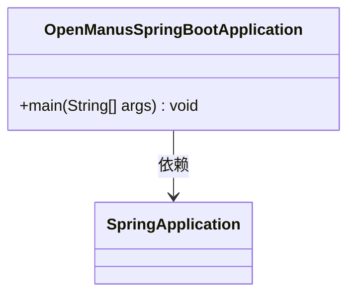
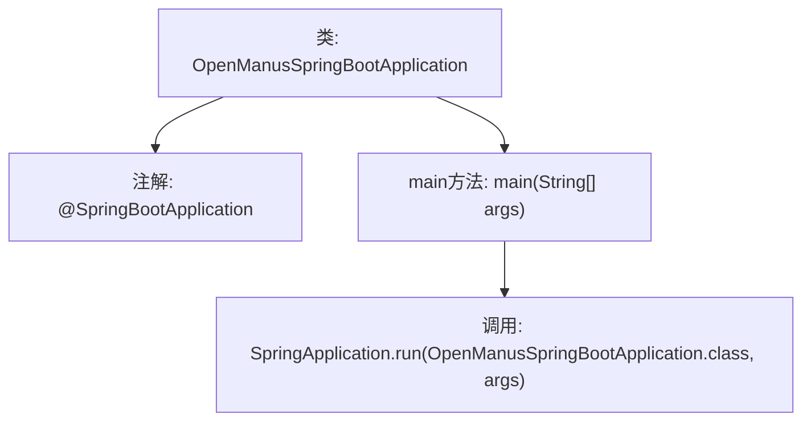

# 基础信息

|      |      |
|------|------|
| 名称 | OpenManusSpringBootApplication |
| 编码语言 | .java |
| 代码路径 | spring-ai-alibaba/community/openmanus/src/main/java/com/alibaba/cloud/ai/example/manus/OpenManusSpringBootApplication.java |
| 包名 | com.alibaba.cloud.ai.example.manus |
| 依赖项 | ['org.springframework.boot.SpringApplication', 'org.springframework.boot.autoconfigure.SpringBootApplication'] |
| 概述说明 | Spring Boot应用启动类，包含主方法以运行应用。 |

# 说明

Spring Boot应用的启动类是一个包含主方法的Java类，用于启动和运行整个Spring Boot应用程序。主方法通过调用SpringApplication.run()方法来初始化并启动应用，确保应用能够正常加载配置、依赖和服务。这个类是Spring Boot应用的入口点，负责引导整个应用的启动过程。

# 类列表 Class Summary

| 名称   | 类型  | 说明 |
|-------|------|-------------|
| OpenManusSpringBootApplication | class | Spring Boot应用启动类，包含主方法运行应用。 |

## 类 OpenManusSpringBootApplication

|      |      |
|------|------|
| 访问范围 | @SpringBootApplication;public |
| 类型 | class |
| 名称 | OpenManusSpringBootApplication |
| 说明 | Spring Boot应用启动类，包含主方法运行应用。 |

### UML类图

这段代码定义了一个名为 `OpenManusSpringBootApplication` 的类，它是一个 Spring Boot 应用程序的入口点。类中包含一个 `main` 方法，该方法通过调用 `SpringApplication.run` 方法来启动 Spring Boot 应用。`OpenManusSpringBootApplication` 类依赖于 `SpringApplication` 类来执行应用的启动逻辑。整个类图展示了 Spring Boot 应用的基本结构，其中 `OpenManusSpringBootApplication` 是应用的入口，而 `SpringApplication` 负责应用的启动和运行。

### 内部方法调用关系图

该流程图描述了 `OpenManusSpringBootApplication` 类的结构和主要方法调用关系。类使用了 `@SpringBootApplication` 注解，表示这是一个Spring Boot应用程序的入口类。`main` 方法是程序的启动点，它调用了 `SpringApplication.run` 方法来启动Spring Boot应用。整个流程简洁明了，展示了Spring Boot应用的启动过程。

### 字段列表 Field List

| 名称  | 类型  | 说明 |
|-------|-------|------|

### 方法列表 Method List

| 名称  | 类型  | 说明 |
|-------|-------|------|
| main | void | Java Spring Boot应用启动主方法。 |

