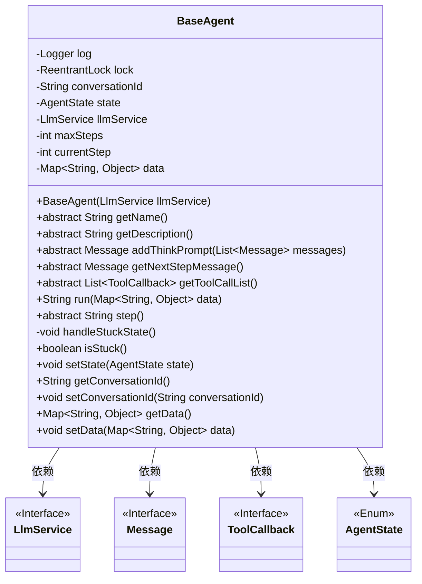

# 基础信息

|      |      |
|------|------|
| 名称 | BaseAgent |
| 编码语言 | .java |
| 代码路径 | spring-ai-alibaba/community/openmanus/src/main/java/com/alibaba/cloud/ai/example/manus/agent/BaseAgent.java |
| 包名 | com.alibaba.cloud.ai.example.manus.agent |
| 依赖项 | ['com.alibaba.cloud.ai.example.manus.llm.LlmService', 'org.slf4j.Logger', 'org.slf4j.LoggerFactory', 'org.springframework.ai.chat.messages.AssistantMessage', 'org.springframework.ai.chat.messages.Message', 'org.springframework.ai.tool.ToolCallback', 'java.util', 'java.util.concurrent.locks.ReentrantLock'] |
| 概述说明 | BaseAgent是智能体基类，具备状态管理、执行控制和工具调用功能。 |

# 说明

BaseAgent是智能体基类，具备状态管理、执行控制和工具调用等核心功能。它通过状态管理维护智能体的运行状态，执行控制确保任务按预定流程进行，工具调用则支持智能体在需要时使用外部工具或资源。这些功能共同构成了BaseAgent的基础架构，使其能够高效地执行各类智能任务。

# 类列表 Class Summary

| 名称   | 类型  | 说明 |
|-------|------|-------------|
| BaseAgent | class | BaseAgent是智能体基类，包含状态管理、执行控制和工具调用等功能。 |

## 类 BaseAgent

|      |      |
|------|------|
| 访问范围 | public abstract |
| 类型 | class |
| 名称 | BaseAgent |
| 说明 | BaseAgent是智能体基类，包含状态管理、执行控制和工具调用等功能。 |

### UML类图

这段代码定义了一个抽象类 `BaseAgent`，它作为智能体的基类，包含了智能体的核心逻辑和状态管理。`BaseAgent` 依赖于 `LlmService` 接口来处理语言模型服务，`Message` 接口用于消息传递，`ToolCallback` 接口用于工具回调，`AgentState` 枚举用于管理智能体的状态。`BaseAgent` 提供了抽象方法，要求子类实现智能体的名称、描述、思考提示、下一步操作提示等具体逻辑。

### 内部方法调用关系图

```mermaid
graph TD
    A["类BaseAgent"]
    B["属性: Logger log"]
    C["属性: ReentrantLock lock"]
    D["属性: String conversationId"]
    E["属性: AgentState state"]
    F["属性: LlmService llmService"]
    G["属性: int maxSteps"]
    H["属性: int currentStep"]
    I["属性: Map<String, Object> data"]
    J["抽象方法: String getName()"]
    K["抽象方法: String getDescription()"]
    L["抽象方法: Message addThinkPrompt(List<Message> messages)"]
    M["抽象方法: Message getNextStepMessage()"]
    N["抽象方法: List<ToolCallback> getToolCallList()"]
    O["构造方法: BaseAgent(LlmService llmService)"]
    P["方法: String run(Map<String, Object> data)"]
    Q["抽象方法: String step()"]
    R["方法: void handleStuckState()"]
    S["方法: boolean isStuck()"]
    T["方法: void setState(AgentState state)"]
    U["方法: String getConversationId()"]
    V["方法: void setConversationId(String conversationId)"]
    W["方法: Map<String, Object> getData()"]
    X["方法: void setData(Map<String, Object> data)"]

    A --> B
    A --> C
    A --> D
    A --> E
    A --> F
    A --> G
    A --> H
    A --> I
    A --> J
    A --> K
    A --> L
    A --> M
    A --> N
    A --> O
    A --> P
    P --> Q
    P --> R
    P --> S
    A --> T
    A --> U
    A --> V
    A --> W
    A --> X
```

这段代码定义了一个抽象类 `BaseAgent`，用于实现智能体的基本框架。类中包含多个属性和方法，用于管理智能体的状态、执行步骤、处理卡住状态等。抽象方法如 `getName()` 和 `getDescription()` 要求子类实现，以提供智能体的名称和描述。`run()` 方法是智能体的主要执行逻辑，它会调用 `step()` 方法执行每一步操作，并在遇到卡住状态时调用 `handleStuckState()` 进行处理。`isStuck()` 方法用于检测智能体是否处于卡住状态。整体设计旨在提供一个可扩展的智能体框架，支持多种智能体的实现。

### 字段列表 Field List

| 名称  | 类型  | 说明 |
|-------|-------|------|
| currentStep = 0 | int | 当前步骤初始化为0。 |
| log = LoggerFactory.getLogger(BaseAgent.class) | Logger | BaseAgent类中定义了私有的静态日志记录器log。 |
| maxSteps = 8 | int | 定义私有整型变量maxSteps，初始值为8。 |
| llmService | LlmService | 保护修饰的LlmService类实例变量llmService。 |
| lock = new ReentrantLock() | ReentrantLock | 使用ReentrantLock实现线程同步。 |
| conversationId | String | 定义私有字符串变量conversationId。 |
| state = AgentState.IDLE | AgentState | 私有变量state初始化为AgentState.IDLE状态。 |
| data = new HashMap<>() | Map<String, Object> | 创建了一个名为data的私有HashMap对象，用于存储键值对。 |

### 方法列表 Method List

| 名称  | 类型  | 说明 |
|-------|-------|------|
| getDescription | String | 抽象方法，返回描述信息。 |
| step | String | 保护抽象方法step，返回类型为String。 |
| getConversationId | String | 获取对话ID的方法。 |
| getData | Map<String, Object> | 获取数据的方法，返回Map类型数据。 |
| getToolCallList | List<ToolCallback> | 抽象方法获取工具回调列表。 |
| getName | String | 抽象方法getName用于获取名称。 |
| run | String | 方法运行代理，检查状态，执行步骤，记录结果，重置状态。 |
| getNextStepMessage | Message | 获取下一步消息的受保护抽象方法。 |
| handleStuckState | void | 检测到代理卡顿，缺失工具调用，结束当前步骤并记录错误提示。 |
| setData | void | 方法setData用于设置数据，接受Map类型参数。 |
| addThinkPrompt | Message | 保护抽象方法，用于添加思考提示到消息列表。 |
| setConversationId | void | 设置会话ID的方法，将传入值赋给当前对象的会话ID属性。 |
| setState | void | 该方法用于设置代理状态为指定值。 |
| isStuck | boolean | 方法isStuck检查对话中最近六条消息，若助手消息未调用工具达三次，则返回true。 |

