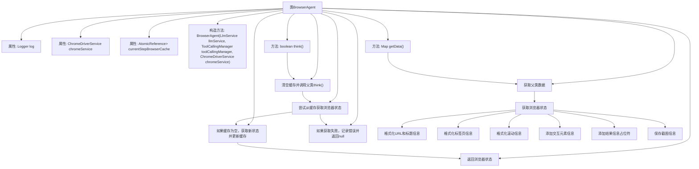

# 基础信息

|      |      |
|------|------|
| 名称 | BrowserAgent |
| 编码语言 | .java |
| 代码路径 | spring-ai-alibaba/community/openmanus/src/main/java/com/alibaba/cloud/ai/example/manus/agent/BrowserAgent.java |
| 包名 | com.alibaba.cloud.ai.example.manus.agent |
| 依赖项 | ['com.alibaba.cloud.ai.example.manus.llm.LlmService', 'com.alibaba.cloud.ai.example.manus.service.ChromeDriverService', 'com.alibaba.cloud.ai.example.manus.tool.BrowserUseTool', 'com.alibaba.cloud.ai.example.manus.tool.FileSaver', 'com.alibaba.cloud.ai.example.manus.tool.GoogleSearch', 'com.alibaba.cloud.ai.example.manus.tool.PythonExecute', 'com.alibaba.cloud.ai.example.manus.tool.Summary', 'org.slf4j.Logger', 'org.slf4j.LoggerFactory', 'org.springframework.ai.chat.messages.Message', 'org.springframework.ai.chat.prompt.PromptTemplate', 'org.springframework.ai.chat.prompt.SystemPromptTemplate', 'org.springframework.ai.model.tool.ToolCallingManager', 'org.springframework.ai.tool.ToolCallback', 'java.util.HashMap', 'java.util.List', 'java.util.Map', 'java.util.concurrent.atomic.AtomicReference'] |
| 概述说明 | BrowserAgent继承ToolCallAgent，管理浏览器状态及任务执行，支持多工具调用。 |

# 说明

BrowserAgent是ToolCallAgent的子类，专门负责管理浏览器的状态和执行相关任务。它具备调用多种工具的能力，确保浏览器操作的灵活性和高效性。通过继承ToolCallAgent，BrowserAgent能够处理复杂的浏览器交互，提供稳定和可靠的任务执行环境。其设计旨在简化浏览器管理流程，支持多样化的工具调用，从而提升整体操作效率。

# 类列表 Class Summary

| 名称   | 类型  | 说明 |
|-------|------|-------------|
| BrowserAgent | class | BrowserAgent继承ToolCallAgent，管理浏览器状态和任务执行，支持多种工具调用。 |


## 类 BrowserAgent

|      |      |
|------|------|
| 访问范围 | public |
| 类型 | class |
| 名称 | BrowserAgent |
| 说明 | BrowserAgent继承ToolCallAgent，管理浏览器状态和任务执行，支持多种工具调用。 |


### UML类图

```mermaid
classDiagram
    class ToolCallAgent {
        +LlmService llmService
        +ToolCallingManager toolCallingManager
        +ToolCallAgent(LlmService llmService, ToolCallingManager toolCallingManager)
        +boolean think()
        +Message addThinkPrompt(List~Message~ messages)
        +String getName()
        +String getDescription()
        +Map~String, Object~ getData()
    }

    class BrowserAgent {
        -Logger log
        -ChromeDriverService chromeService
        -AtomicReference~Map~String, Object~~ currentStepBrowserCache
        +BrowserAgent(LlmService llmService, ToolCallingManager toolCallingManager, ChromeDriverService chromeService)
        +boolean think()
        -Map~String, Object~ getBrowserState()
        +Message getNextStepMessage()
        +Message addThinkPrompt(List~Message~ messages)
        +String getName()
        +String getDescription()
        +List~ToolCallback~ getToolCallList()
        +Map~String, Object~ getData()
    }

    class BrowserUseTool {
        +BrowserUseTool getInstance(ChromeDriverService chromeService)
        +Map~String, Object~ getCurrentState()
    }

    class ToolCallback {
        <<Interface>>
    }

    class GoogleSearch {
        +ToolCallback getFunctionToolCallback()
    }

    class FileSaver {
        +ToolCallback getFunctionToolCallback()
    }

    class PythonExecute {
        +ToolCallback getFunctionToolCallback()
    }

    class Summary {
        +ToolCallback getFunctionToolCallback(BrowserAgent browserAgent, Memory memory, String conversationId)
    }

    class LlmService {
        <<Interface>>
    }

    class ToolCallingManager {
        <<Interface>>
    }

    class ChromeDriverService {
        <<Interface>>
    }

    class Message {
        <<Interface>>
    }

    class PromptTemplate {
        +PromptTemplate(String template)
        +Message createMessage(Map~String, Object~ data)
    }

    class SystemPromptTemplate {
        +SystemPromptTemplate(String template)
        +Message createMessage(Map~String, Object~ data)
    }

    BrowserAgent --> ToolCallAgent : 继承
    BrowserAgent --> BrowserUseTool : 依赖 : 获取浏览器状态
    BrowserAgent --> GoogleSearch : 依赖 : 工具回调
    BrowserAgent --> FileSaver : 依赖 : 工具回调
    BrowserAgent --> PythonExecute : 依赖 : 工具回调
    BrowserAgent --> Summary : 依赖 : 工具回调
    BrowserAgent --> PromptTemplate : 依赖 : 创建消息
    BrowserAgent --> SystemPromptTemplate : 依赖 : 创建系统消息
    BrowserUseTool --> ChromeDriverService : 依赖 : 获取浏览器实例
    ToolCallAgent --> LlmService : 依赖 : 语言模型服务
    ToolCallAgent --> ToolCallingManager : 依赖 : 工具调用管理
```

**描述**：  
`BrowserAgent` 类继承自 `ToolCallAgent`，用于控制浏览器以完成任务。它通过 `BrowserUseTool` 获取浏览器状态，并使用缓存机制优化性能。`BrowserAgent` 还提供了多种工具回调（如 `GoogleSearch`、`FileSaver` 等）以支持不同的浏览器操作。通过 `PromptTemplate` 和 `SystemPromptTemplate`，`BrowserAgent` 能够生成用户和系统消息，指导下一步操作。


### 内部方法调用关系图



这段代码定义了一个`BrowserAgent`类，继承自`ToolCallAgent`，用于控制浏览器执行任务。类中包含多个方法，如`think()`用于清空缓存并调用父类的`think()`方法，`getBrowserState()`用于获取浏览器状态并更新缓存，`getNextStepMessage()`用于生成下一步操作的提示信息，`addThinkPrompt()`用于添加系统提示信息，`getData()`用于获取浏览器数据并格式化输出。代码通过缓存机制优化性能，并处理了多种浏览器操作和状态管理。

### 字段列表 Field List

| 名称  | 类型  | 说明 |
|-------|-------|------|
| chromeService | ChromeDriverService | 私有且不可变的ChromeDriverService实例。 |
| log = LoggerFactory.getLogger(BrowserAgent.class) | Logger | BrowserAgent类中定义了一个私有的静态日志记录器。 |
| currentStepBrowserCache = new AtomicReference<>() | AtomicReference<Map<String, Object>> | 使用AtomicReference存储当前步骤的浏览器缓存映射。 |

### 方法列表 Method List

| 名称  | 类型  | 说明 |
|-------|-------|------|
| think | boolean | 重写think方法，清空缓存后调用父类方法。 |
| getDescription | String | 浏览器代理，控制浏览器完成任务。 |
| getBrowserState | Map<String, Object> | 获取浏览器状态，优先从缓存读取，若无则生成新状态并更新缓存。 |
| getToolCallList | List<ToolCallback> | 获取工具回调列表，包含Google搜索、文件保存、Python执行、浏览器使用和总结功能。 |
| getNextStepMessage | Message | 方法生成包含当前状态、交互元素和操作提示的下步消息。 |
| addThinkPrompt | Message | AI代理自动化浏览器任务，遵循JSON响应格式，执行表单填写、导航等操作，处理错误和视觉上下文。 |
| getName | String | 重写getName方法，返回值为"BROWSER_AGENT"。 |
| getData | Map<String, Object> | 方法获取并格式化浏览器状态数据，包括URL、标题、标签页、滚动信息和交互元素等。 |


