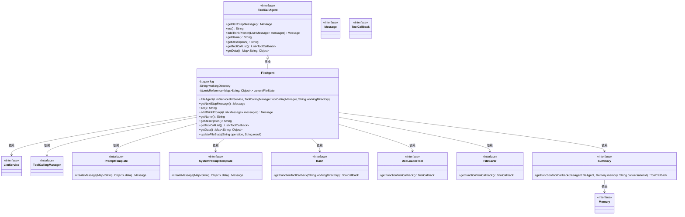
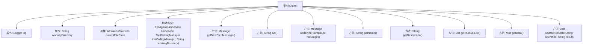

# 基础信息

|      |      |
|------|------|
| 名称 | FileAgent |
| 编码语言 | .java |
| 代码路径 | spring-ai-alibaba/community/openmanus/src/main/java/com/alibaba/cloud/ai/example/manus/agent/FileAgent.java |
| 包名 | com.alibaba.cloud.ai.example.manus.agent |
| 依赖项 | ['com.alibaba.cloud.ai.example.manus.llm.LlmService', 'com.alibaba.cloud.ai.example.manus.tool.Bash', 'com.alibaba.cloud.ai.example.manus.tool.DocLoaderTool', 'com.alibaba.cloud.ai.example.manus.tool.FileSaver', 'com.alibaba.cloud.ai.example.manus.tool.Summary', 'org.slf4j.Logger', 'org.slf4j.LoggerFactory', 'org.springframework.ai.chat.messages.Message', 'org.springframework.ai.chat.prompt.PromptTemplate', 'org.springframework.ai.chat.prompt.SystemPromptTemplate', 'org.springframework.ai.model.tool.ToolCallingManager', 'org.springframework.ai.tool.ToolCallback', 'java.util.HashMap', 'java.util.List', 'java.util.Map', 'java.util.concurrent.atomic.AtomicReference'] |
| 概述说明 | FileAgent类继承ToolCallAgent，专管文件操作，涵盖路径验证、处理、错误监控及任务跟踪。 |

# 说明

FileAgent类继承自ToolCallAgent，专门负责处理文件相关操作。其主要功能包括路径验证、文件处理、错误监控以及任务完成跟踪。通过路径验证，确保文件路径的正确性和安全性；文件处理涉及文件的读取、写入、删除等操作；错误监控用于实时检测和记录操作过程中出现的异常；任务完成跟踪则用于监控文件操作的进度和状态，确保任务按预期完成。该类全面管理文件操作流程，提升系统的稳定性和可靠性。

# 类列表 Class Summary

| 名称   | 类型  | 说明 |
|-------|------|-------------|
| FileAgent | class | FileAgent类继承ToolCallAgent，负责文件操作，包括路径验证、文件处理、错误监控及任务完成跟踪。 |

## 类 FileAgent

|      |      |
|------|------|
| 访问范围 | public |
| 类型 | class |
| 名称 | FileAgent |
| 说明 | FileAgent类继承ToolCallAgent，负责文件操作，包括路径验证、文件处理、错误监控及任务完成跟踪。 |

### UML类图

### 描述
`FileAgent` 是一个继承自 `ToolCallAgent` 的类，专门用于处理文件操作任务。它通过 `LlmService` 和 `ToolCallingManager` 进行工具调用，并维护当前文件操作状态。`FileAgent` 提供了获取下一步操作消息、执行操作、添加思考提示等功能，并通过 `getToolCallList` 方法获取相关工具回调。该类还负责更新文件操作状态，确保任务的有效执行。

### 内部方法调用关系图

这段代码定义了一个名为 `FileAgent` 的类，继承自 `ToolCallAgent`，专门用于处理文件操作。类中包含多个方法，用于获取下一步操作消息、执行操作、添加思考提示、获取名称和描述、获取工具调用列表、获取数据以及更新文件操作状态。代码通过 `AtomicReference` 来维护当前文件操作状态，并提供了详细的提示模板来指导文件操作和错误处理。

### 字段列表 Field List

| 名称  | 类型  | 说明 |
|-------|-------|------|
| workingDirectory | String | 私有字符串变量，存储工作目录路径。 |
| log = LoggerFactory.getLogger(FileAgent.class) | Logger | FileAgent类中声明了静态日志记录器log。 |
| currentFileState = new AtomicReference<>() | AtomicReference<Map<String, Object>> | 私有原子引用变量，存储当前文件状态映射。 |

### 方法列表 Method List

| 名称  | 类型  | 说明 |
|-------|-------|------|
| getDescription | String | 文件操作代理，支持读写多种文件类型。 |
| getNextStepMessage | Message | 获取下一步操作提示，包含文件操作状态和操作建议。 |
| updateFileState | void | 更新文件状态方法，存储操作和结果到Map中。 |
| getData | Map<String, Object> | 重写getData方法，合并父类数据，添加工作目录和文件操作状态。 |
| getName | String | 重写getName方法，返回"FILE_AGENT"。 |
| addThinkPrompt | Message | AI代理处理文件操作，验证路径、权限，监控进度，遵循最佳实践。 |
| act | String | 重写act方法，调用父类方法并更新文件状态。 |
| getToolCallList | List<ToolCallback> | 该方法返回包含Bash、DocLoaderTool、FileSaver和Summary工具回调的列表。 |

