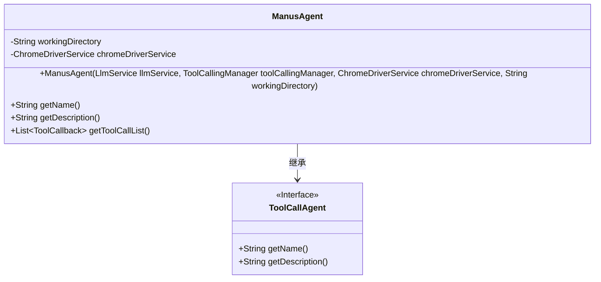
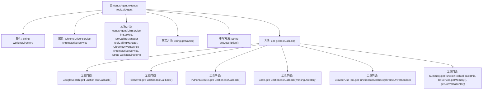

# 基础信息

|      |      |
|------|------|
| 名称 | ManusAgent |
| 编码语言 | .java |
| 代码路径 | spring-ai-alibaba/community/openmanus/src/main/java/com/alibaba/cloud/ai/example/manus/agent/ManusAgent.java |
| 包名 | com.alibaba.cloud.ai.example.manus.agent |
| 依赖项 | ['com.alibaba.cloud.ai.example.manus.llm.LlmService', 'com.alibaba.cloud.ai.example.manus.service.ChromeDriverService', 'com.alibaba.cloud.ai.example.manus.tool.Bash', 'com.alibaba.cloud.ai.example.manus.tool.BrowserUseTool', 'com.alibaba.cloud.ai.example.manus.tool.FileSaver', 'com.alibaba.cloud.ai.example.manus.tool.GoogleSearch', 'com.alibaba.cloud.ai.example.manus.tool.PythonExecute', 'com.alibaba.cloud.ai.example.manus.tool.Summary', 'java.util.List', 'org.springframework.ai.model.tool.ToolCallingManager', 'org.springframework.ai.tool.ToolCallback'] |
| 概述说明 | ManusAgent继承ToolCallAgent，具备工作目录和Chrome驱动服务，支持多种工具回调。 |

# 说明

ManusAgent是ToolCallAgent的子类，具备工作目录和Chrome驱动服务，支持多种工具回调功能，提供全面的工具调用和管理能力。

# 类列表 Class Summary

| 名称   | 类型  | 说明 |
|-------|------|-------------|
| ManusAgent | class | ManusAgent继承ToolCallAgent，包含工作目录和Chrome驱动服务，提供多种工具回调功能。 |

## 类 ManusAgent

|      |      |
|------|------|
| 访问范围 | public |
| 类型 | class |
| 名称 | ManusAgent |
| 说明 | ManusAgent继承ToolCallAgent，包含工作目录和Chrome驱动服务，提供多种工具回调功能。 |

### UML类图

类图描述：`ManusAgent` 类继承自 `ToolCallAgent` 接口，并扩展了其功能。`ManusAgent` 包含私有成员 `workingDirectory` 和 `chromeDriverService`，并通过构造函数进行初始化。它实现了 `getName` 和 `getDescription` 方法，并提供了 `getToolCallList` 方法，返回一系列工具回调。该类的主要作用是作为一个多功能代理，能够使用多种工具解决各种任务。

### 内部方法调用关系图

这段代码定义了一个名为 `ManusAgent` 的类，它继承自 `ToolCallAgent`。`ManusAgent` 类包含两个私有属性：`workingDirectory` 和 `chromeDriverService`，并通过构造函数初始化这些属性。类中重写了 `getName` 和 `getDescription` 方法，分别返回代理的名称和描述。`getToolCallList` 方法返回一个包含多个工具回调的列表，这些工具回调用于执行不同的任务，如谷歌搜索、文件保存、Python 执行、Bash 命令、浏览器使用和总结功能。

### 字段列表 Field List

| 名称  | 类型  | 说明 |
|-------|-------|------|
| workingDirectory | String | 定义私有不可变的字符串变量workingDirectory。 |
| chromeDriverService | ChromeDriverService | 私有且不可变的ChromeDriverService实例。 |

### 方法列表 Method List

| 名称  | 类型  | 说明 |
|-------|-------|------|
| getName | String | 重写getName方法，返回字符串"MANUS"。 |
| getDescription | String | 多功能代理，可解决多种任务，首选Manus代理。 |
| getToolCallList | List<ToolCallback> | 获取工具回调列表，包含搜索、文件保存、Python执行、Bash、浏览器使用和总结功能。 |

