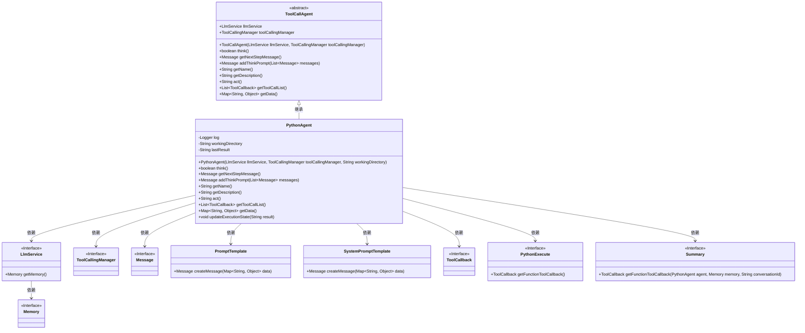
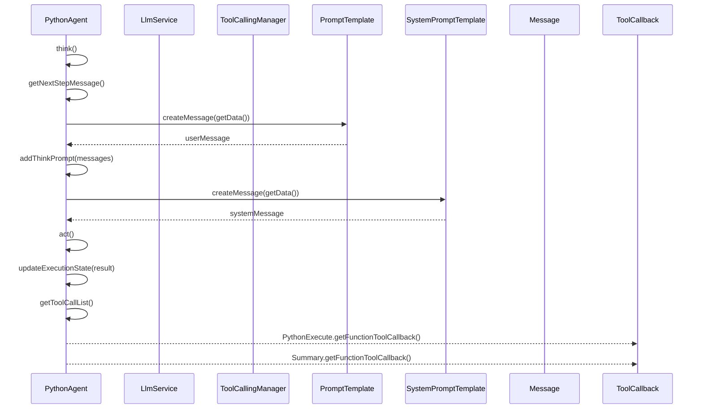

# 基础信息

|      |      |
|------|------|
| 名称 | PythonAgent |
| 编码语言 | .java |
| 代码路径 | spring-ai-alibaba/community/openmanus/src/main/java/com/alibaba/cloud/ai/example/manus/agent/PythonAgent.java |
| 包名 | com.alibaba.cloud.ai.example.manus.agent |
| 依赖项 | ['com.alibaba.cloud.ai.example.manus.llm.LlmService', 'com.alibaba.cloud.ai.example.manus.tool.Bash', 'com.alibaba.cloud.ai.example.manus.tool.PythonExecute', 'com.alibaba.cloud.ai.example.manus.tool.Summary', 'org.slf4j.Logger', 'org.slf4j.LoggerFactory', 'org.springframework.ai.chat.messages.Message', 'org.springframework.ai.chat.prompt.PromptTemplate', 'org.springframework.ai.chat.prompt.SystemPromptTemplate', 'org.springframework.ai.model.tool.ToolCallingManager', 'org.springframework.ai.tool.ToolCallback', 'java.util.HashMap', 'java.util.List', 'java.util.Map', 'java.util.concurrent.atomic.AtomicReference'] |
| 概述说明 | PythonAgent继承ToolCallAgent，执行Python代码，支持math、numpy等库，具备任务完成、错误处理及最佳实践功能。 |

# 说明

PythonAgent是ToolCallAgent的子类，专门用于执行Python代码。它支持多个常用库，如math和numpy，具备任务执行、错误处理和最佳实践功能。该工具旨在高效、安全地运行Python代码，确保任务的顺利完成，并能妥善处理可能出现的错误，同时遵循最佳实践原则，提升代码质量和执行效率。

# 类列表 Class Summary

| 名称   | 类型  | 说明 |
|-------|------|-------------|
| PythonAgent | class | PythonAgent继承ToolCallAgent，用于执行Python代码，支持库如math、numpy等，具备任务完成、错误处理及最佳实践功能。 |

## 类 PythonAgent

|      |      |
|------|------|
| 访问范围 | public |
| 类型 | class |
| 名称 | PythonAgent |
| 说明 | PythonAgent继承ToolCallAgent，用于执行Python代码，支持库如math、numpy等，具备任务完成、错误处理及最佳实践功能。 |

### UML类图

### 描述
`PythonAgent` 继承自 `ToolCallAgent`，是一个专门用于执行 Python 代码的 AI 代理。它依赖于 `LlmService` 和 `ToolCallingManager` 来处理语言模型和工具调用管理。`PythonAgent` 通过 `PromptTemplate` 和 `SystemPromptTemplate` 生成提示消息，并使用 `PythonExecute` 和 `Summary` 工具回调来执行 Python 代码和生成摘要。该类还维护了执行状态，并通过 `updateExecutionState` 方法更新最后执行结果。

### 内部方法调用关系图

```mermaid
graph TD
    A["类PythonAgent"]
    B["属性: Logger log"]
    C["属性: String workingDirectory"]
    D["属性: String lastResult"]
    E["构造方法: PythonAgent(LlmService llmService, ToolCallingManager toolCallingManager, String workingDirectory)"]
    F["重写方法: boolean think()"]
    G["重写方法: Message getNextStepMessage()"]
    H["重写方法: Message addThinkPrompt(List<Message> messages)"]
    I["重写方法: String getName()"]
    J["重写方法: String getDescription()"]
    K["重写方法: String act()"]
    L["重写方法: List<ToolCallback> getToolCallList()"]
    M["重写方法: Map<String, Object> getData()"]
    N["方法: void updateExecutionState(String result)"]

    A --> B
    A --> C
    A --> D
    A --> E
    A --> F
    A --> G
    A --> H
    A --> I
    A --> J
    A --> K
    A --> L
    A --> M
    A --> N
```

### 描述
这段代码定义了一个名为`PythonAgent`的类，它继承自`ToolCallAgent`。`PythonAgent`类主要负责执行Python代码并管理执行状态。它包含多个重写方法，如`think()`用于清空缓存并开始思考，`getNextStepMessage()`用于生成下一步操作的提示信息，`addThinkPrompt()`用于添加系统提示信息，`act()`用于执行操作并更新执行状态。此外，`getToolCallList()`方法返回工具回调列表，`getData()`方法获取当前数据状态。`updateExecutionState()`方法用于更新执行结果。这些方法共同协作，确保Python代码的有效执行和状态管理。

### 字段列表 Field List

| 名称  | 类型  | 说明 |
|-------|-------|------|
| lastResult | String | 定义私有字符串变量lastResult。 |
| workingDirectory | String | 私有字符串变量，存储工作目录路径。 |
| log = LoggerFactory.getLogger(PythonAgent.class) | Logger | PythonAgent类中定义了一个私有静态日志记录器。 |

### 方法列表 Method List

| 名称  | 类型  | 说明 |
|-------|-------|------|
| updateExecutionState | void | 更新执行状态，将结果赋值给lastResult。 |
| getName | String | 重写getName方法，返回值为"PYTHON_AGENT"。 |
| act | String | 重写act方法，调用父类方法并更新执行状态。 |
| getNextStepMessage | Message | 重写方法生成下一步提示消息，包含工作目录和上次执行结果，强调使用工具和PythonExecute。 |
| addThinkPrompt | Message | AI代理专注于Python编程，遵循代码执行、错误处理、任务完成和最佳实践规则。 |
| think | boolean | 重写think方法，清空缓存后调用父类方法。 |
| getData | Map<String, Object> | 重写getData方法，合并父类数据并添加工作目录和上次执行结果。 |
| getToolCallList | List<ToolCallback> | 该方法返回包含Python执行和总结功能的工具回调列表。 |
| getDescription | String | PYTHON AGENT可直接执行Python代码并返回结果，支持math、numpy等库。 |

