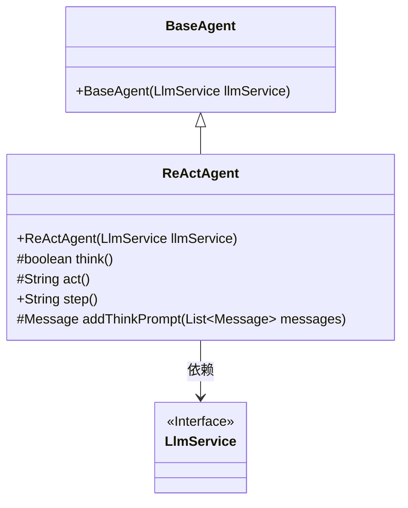
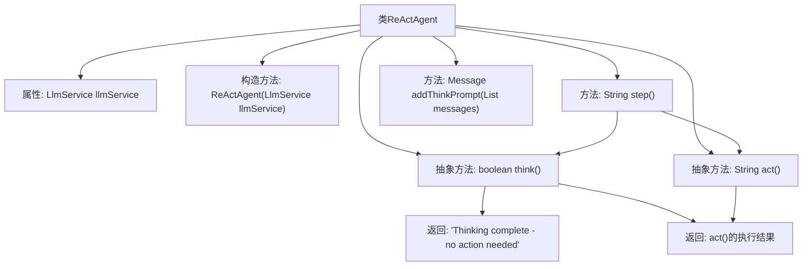

# 基础信息

|      |      |
|------|------|
| 名称 | ReActAgent |
| 编码语言 | .java |
| 代码路径 | spring-ai-alibaba/community/openmanus/src/main/java/com/alibaba/cloud/ai/example/manus/agent/ReActAgent.java |
| 包名 | com.alibaba.cloud.ai.example.manus.agent |
| 依赖项 | ['java.util.List', 'org.springframework.ai.chat.messages.Message', 'com.alibaba.cloud.ai.example.manus.llm.LlmService'] |
| 概述说明 | ReActAgent继承BaseAgent，具备思考、行动及执行功能，需子类实现逻辑。 |

# 说明

ReActAgent类继承自BaseAgent，具备思考、行动以及完整步骤执行的功能。该类作为基础框架，要求子类实现具体的逻辑细节，以便完成特定的任务和操作。通过这种方式，ReActAgent类提供了通用的执行流程，而具体的业务逻辑则由子类定制化实现，确保了灵活性和扩展性。

# 类列表 Class Summary

| 名称   | 类型  | 说明 |
|-------|------|-------------|
| ReActAgent | class | ReActAgent类继承BaseAgent，包含思考、行动及完整步骤执行功能，需子类实现具体逻辑。 |

## 类 ReActAgent

|      |      |
|------|------|
| 访问范围 | public abstract |
| 类型 | class |
| 名称 | ReActAgent |
| 说明 | ReActAgent类继承BaseAgent，包含思考、行动及完整步骤执行功能，需子类实现具体逻辑。 |

### UML类图

这段代码定义了一个抽象类 `ReActAgent`，它继承自 `BaseAgent`，并依赖于 `LlmService` 接口。`ReActAgent` 类包含了几个关键方法：`think()` 和 `act()` 是抽象方法，分别用于执行思考过程和具体行动；`step()` 方法用于执行一个完整的思考-行动步骤；`addThinkPrompt()` 方法用于添加思考过程的提示词到消息列表。`ReActAgent` 的设计允许子类根据具体需求实现不同的思考和行为逻辑，从而实现灵活的智能体行为。

### 内部方法调用关系图

这段代码定义了一个名为 `ReActAgent` 的抽象类，继承自 `BaseAgent`。该类包含一个构造函数、两个抽象方法 `think()` 和 `act()`，以及两个具体方法 `step()` 和 `addThinkPrompt()`。`step()` 方法通过调用 `think()` 判断是否需要执行行动，若不需要则返回思考完成的消息，否则调用 `act()` 并返回执行结果。`addThinkPrompt()` 方法用于添加思考过程的提示词到消息列表，但当前实现为空，需子类扩展。

### 字段列表 Field List

| 名称  | 类型  | 说明 |
|-------|-------|------|

### 方法列表 Method List

| 名称  | 类型  | 说明 |
|-------|-------|------|
| act | String | 定义受保护的抽象方法act，返回字符串类型。 |
| step | String | 重写step方法，判断是否需要执行操作。 |
| addThinkPrompt | Message | 该方法根据消息列表生成提示词，目前未实现。 |
| think | boolean | 该方法为受保护的抽象布尔类型方法，名为think。 |

