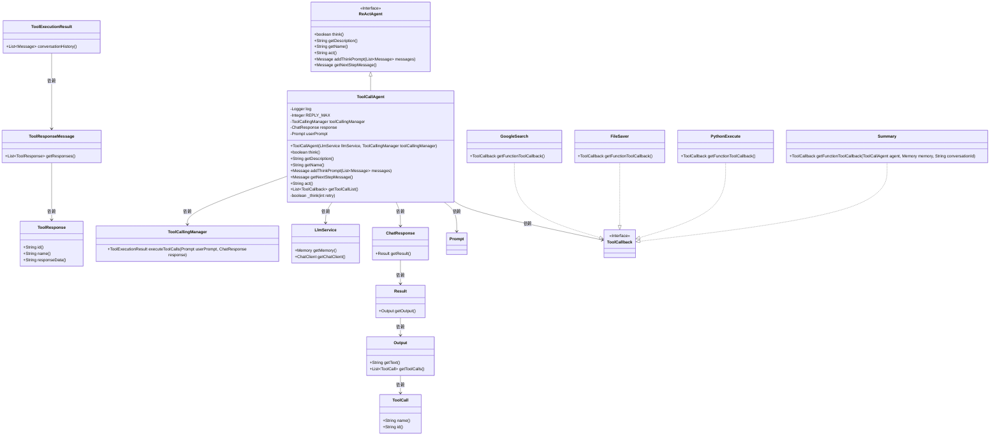
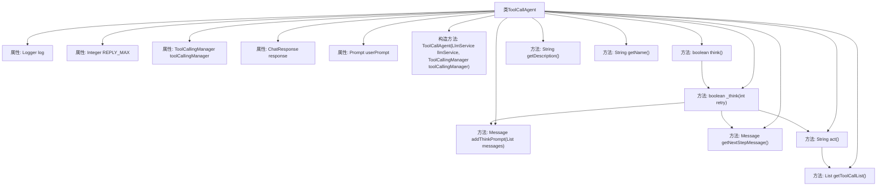

# 基础信息

|      |      |
|------|------|
| 名称 | ToolCallAgent |
| 编码语言 | .java |
| 代码路径 | spring-ai-alibaba/community/openmanus/src/main/java/com/alibaba/cloud/ai/example/manus/agent/ToolCallAgent.java |
| 包名 | com.alibaba.cloud.ai.example.manus.agent |
| 依赖项 | ['com.alibaba.cloud.ai.example.manus.llm.LlmService', 'org.springframework.ai.chat.messages.AssistantMessage.ToolCall', 'org.springframework.ai.chat.messages.Message', 'com.alibaba.cloud.ai.example.manus.tool.BrowserUseTool', 'com.alibaba.cloud.ai.example.manus.tool.FileSaver', 'com.alibaba.cloud.ai.example.manus.tool.GoogleSearch', 'com.alibaba.cloud.ai.example.manus.tool.PythonExecute', 'com.alibaba.cloud.ai.example.manus.tool.Summary', 'org.slf4j.Logger', 'org.slf4j.LoggerFactory', 'java.util.ArrayList', 'java.util.List', 'java.util.Map', 'java.util.stream.Collectors', 'org.springframework.ai.chat.messages.ToolResponseMessage', 'org.springframework.ai.chat.messages.UserMessage', 'org.springframework.ai.chat.model.ChatResponse', 'org.springframework.ai.chat.prompt.ChatOptions', 'org.springframework.ai.chat.prompt.Prompt', 'org.springframework.ai.chat.prompt.PromptTemplate', 'org.springframework.ai.chat.prompt.SystemPromptTemplate', 'org.springframework.ai.model.tool.ToolCallingChatOptions', 'org.springframework.ai.model.tool.ToolCallingManager', 'org.springframework.ai.model.tool.ToolExecutionResult', 'org.springframework.ai.tool.ToolCallback', 'org.springframework.ai.chat.client.advisor.AbstractChatMemoryAdvisor.CHAT_MEMORY_CONVERSATION_ID_KEY', 'org.springframework.ai.chat.client.advisor.AbstractChatMemoryAdvisor.CHAT_MEMORY_RETRIEVE_SIZE_KEY'] |
| 概述说明 | ToolCallAgent管理ReActAgent工具调用，支持执行与重试。 |

# 说明

ToolCallAgent在ReActAgent中负责管理工具调用，其主要功能包括支持工具的执行和提供重试机制。该组件确保工具调用的顺利进行，并在需要时进行重试，以提高系统的可靠性和稳定性。

# 类列表 Class Summary

| 名称   | 类型  | 说明 |
|-------|------|-------------|
| ToolCallAgent | class | ToolCallAgent负责管理ReActAgent中的工具调用，支持工具执行和重试机制。 |

## 类 ToolCallAgent

|      |      |
|------|------|
| 访问范围 | public |
| 类型 | class |
| 名称 | ToolCallAgent |
| 说明 | ToolCallAgent负责管理ReActAgent中的工具调用，支持工具执行和重试机制。 |

### UML类图

### 描述
`ToolCallAgent` 是一个继承自 `ReActAgent` 的类，负责管理工具调用和执行。它包含了对工具调用的思考过程、提示信息的构建、工具调用的执行以及结果的处理。`ToolCallAgent` 依赖于 `ToolCallingManager` 来执行工具调用，依赖于 `LlmService` 来获取聊天客户端和内存管理，并通过 `ChatResponse` 和 `Prompt` 来处理和存储响应与提示信息。它还实现了 `ToolCallback` 接口的工具，如 `GoogleSearch`、`FileSaver`、`PythonExecute` 和 `Summary`，用于具体的工具调用。

### 内部方法调用关系图

这段代码描述了一个名为 `ToolCallAgent` 的类，它继承自 `ReActAgent`，并负责管理工具调用的智能体。该类包含了多个方法，用于处理工具调用的思考过程、提示消息的生成、工具的执行以及工具回调列表的获取。流程图展示了类的属性、构造方法以及各个方法之间的调用关系，帮助理解代码的执行流程和逻辑结构。

### 字段列表 Field List

| 名称  | 类型  | 说明 |
|-------|-------|------|
| response | ChatResponse | 定义私有ChatResponse对象response。 |
| toolCallingManager | ToolCallingManager | 私有且不可变的工具调用管理器实例。 |
| userPrompt | Prompt | 私有提示对象变量声明。 |
| log = LoggerFactory.getLogger(ToolCallAgent.class) | Logger | ToolCallAgent类中定义了一个私有的静态日志记录器。 |
| REPLY_MAX = 3 | Integer | 定义了一个私有静态常量REPLY_MAX，值为3。 |

### 方法列表 Method List

| 名称  | 类型  | 说明 |
|-------|-------|------|
| think | boolean | 重写think方法，初始化retry为0并调用_think方法。 |
| addThinkPrompt | Message | 方法添加当前步骤提示，强调专注完成当前步骤并调用总结工具确认完成。 |
| getName | String | 重写getName方法，返回"ToolCallAgent"。 |
| act | String | 该方法执行工具调用，记录结果或错误，并返回响应信息。 |
| _think | boolean | 方法_think准备消息并调用LLM服务，记录响应和工具调用，异常时重试。 |
| getDescription | String | ToolCallAgent类负责管理ReAct代理中的工具调用。 |
| getToolCallList | List<ToolCallback> | 获取工具回调列表，包括Google搜索、文件保存、Python执行和总结功能。 |
| getNextStepMessage | Message | 获取下一步操作提示信息的方法。 |

