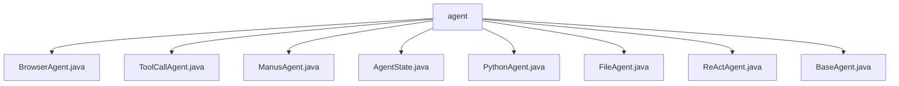

# 基础信息

|      |      |
|------|------|
| 名称 | agent |
| 编码语言 | .java |
| 代码路径 | spring-ai-alibaba/community/openmanus/src/main/java/com/alibaba/cloud/ai/example/manus/agent |
| 包名 | spring-ai-alibaba.community.openmanus.src.main.java.com.alibaba.cloud.ai.example.manus.agent |
| 概述说明 | BrowserAgent管理浏览器状态，PythonAgent执行Python代码，FileAgent处理文件操作，ReActAgent执行任务，BaseAgent提供核心功能。 |

# 说明

## 概述
该代码模块是一个基于智能体（Agent）的框架，主要用于管理和执行多种任务。模块的核心是`BaseAgent`，它提供了状态管理、执行控制和工具调用等基础功能。`ReActAgent`继承自`BaseAgent`，进一步提供了思考、行动和完整步骤执行的功能，并要求子类实现具体的业务逻辑。`ToolCallAgent`作为`ReActAgent`的一部分，专门负责工具调用的管理，支持工具的执行和重试机制，确保系统的可靠性和稳定性。模块中还包含多个继承自`ToolCallAgent`的子类，如`BrowserAgent`、`ManusAgent`、`PythonAgent`和`FileAgent`，它们分别负责浏览器管理、工作目录和Chrome驱动服务、Python代码执行以及文件操作等特定任务。

## 主要业务场景
1. **浏览器管理**：`BrowserAgent`负责管理浏览器的状态和执行相关任务，支持多种工具调用，确保浏览器操作的灵活性和高效性。
2. **工具调用与管理**：`ToolCallAgent`和其子类（如`ManusAgent`、`PythonAgent`、`FileAgent`）负责管理和执行各种工具调用，支持重试机制和错误处理，确保任务的顺利完成。
3. **Python代码执行**：`PythonAgent`专门用于执行Python代码，支持常用库如`math`和`numpy`，具备任务执行、错误处理和最佳实践功能。
4. **文件操作**：`FileAgent`负责处理文件相关操作，包括路径验证、文件处理、错误监控和任务完成跟踪，确保文件操作的安全性和可靠性。
5. **智能任务执行**：`ReActAgent`和`BaseAgent`提供了通用的执行流程和基础架构，支持子类实现具体的业务逻辑，确保智能任务的灵活性和扩展性。

该模块的设计旨在简化复杂任务的管理和执行，提供稳定和可靠的操作环境，支持多样化的工具调用和任务执行，从而提升整体操作效率。

### 包内部结构视图

该流程图展示了`agent`文件夹下的所有文件及其层级关系。`agent`作为根节点，包含了多个子节点，每个子节点代表一个具体的Java文件，如`BrowserAgent.java`、`ToolCallAgent.java`等。这些文件都直接位于`agent`文件夹下，没有进一步的子文件夹结构。

# 文件列表 File List

| 名称   | 类型  | 说明 |
|-------|------|-------------|
| [BaseAgent.java](BaseAgent.md) | file | BaseAgent是智能体基类，具备状态管理、执行控制和工具调用功能。 |
| [PythonAgent.java](PythonAgent.md) | file | PythonAgent继承ToolCallAgent，执行Python代码，支持math、numpy等库，具备任务完成、错误处理及最佳实践功能。 |
| [ToolCallAgent.java](ToolCallAgent.md) | file | ToolCallAgent管理ReActAgent工具调用，支持执行与重试。 |
| [ReActAgent.java](ReActAgent.md) | file | ReActAgent继承BaseAgent，具备思考、行动及执行功能，需子类实现逻辑。 |
| [ManusAgent.java](ManusAgent.md) | file | ManusAgent继承ToolCallAgent，具备工作目录和Chrome驱动服务，支持多种工具回调。 |
| [FileAgent.java](FileAgent.md) | file | FileAgent类继承ToolCallAgent，专管文件操作，涵盖路径验证、处理、错误监控及任务跟踪。 |
| [AgentState.java](AgentState.md) | file | 请提供具体信息以便生成概要描述。 |
| [BrowserAgent.java](BrowserAgent.md) | file | BrowserAgent继承ToolCallAgent，管理浏览器状态及任务执行，支持多工具调用。 |

