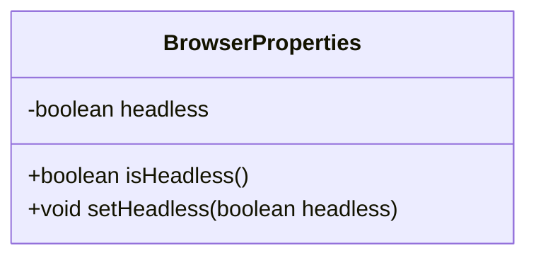
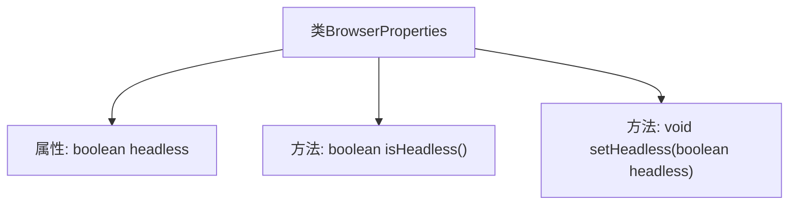

# 基础信息

|      |      |
|------|------|
| 名称 | BrowserProperties |
| 编码语言 | .java |
| 代码路径 | spring-ai-alibaba/community/openmanus/src/main/java/com/alibaba/cloud/ai/example/manus/config/BrowserProperties.java |
| 包名 | com.alibaba.cloud.ai.example.manus.config |
| 依赖项 | ['org.springframework.boot.context.properties.ConfigurationProperties', 'org.springframework.stereotype.Component'] |
| 概述说明 | BrowserProperties类配置无头浏览器模式，默认关闭。 |

# 说明

BrowserProperties类用于配置浏览器的无头模式，默认情况下该模式处于关闭状态。无头模式通常用于在后台运行浏览器，不显示图形界面，适用于自动化测试和服务器环境。通过该类，开发者可以灵活地启用或禁用无头模式，以适应不同的应用场景。

# 类列表 Class Summary

| 名称   | 类型  | 说明 |
|-------|------|-------------|
| BrowserProperties | class | BrowserProperties类配置无头浏览器模式，默认关闭。 |

## 类 BrowserProperties

|      |      |
|------|------|
| 访问范围 | @Component;@ConfigurationProperties(prefix = "manus.browser");public |
| 类型 | class |
| 名称 | BrowserProperties |
| 说明 | BrowserProperties类配置无头浏览器模式，默认关闭。 |

### UML类图

**描述：**  
`BrowserProperties` 类是一个配置类，用于管理浏览器的相关属性。它包含一个私有布尔类型字段 `headless`，表示浏览器是否以无头模式运行。类中提供了 `isHeadless()` 和 `setHeadless(boolean headless)` 两个公有方法，分别用于获取和设置 `headless` 属性的值。通过 `@ConfigurationProperties(prefix = "manus.browser")` 注解，该类能够从配置文件中读取以 `manus.browser` 为前缀的属性值，并自动绑定到类的字段中。

### 内部方法调用关系图

这段代码定义了一个名为 `BrowserProperties` 的类，该类包含一个布尔类型的属性 `headless`，默认值为 `false`。类中提供了两个方法：`isHeadless()` 用于获取 `headless` 的当前值，`setHeadless(boolean headless)` 用于设置 `headless` 的值。该类被标记为 `@Component` 和 `@ConfigurationProperties(prefix = "manus.browser")`，表明它是一个Spring组件，并且其属性可以通过配置文件中的 `manus.browser` 前缀进行配置。

### 字段列表 Field List

| 名称  | 类型  | 说明 |
|-------|-------|------|
| headless = false | boolean | 该代码定义了一个布尔类型私有变量headless，初始值为false。 |

### 方法列表 Method List

| 名称  | 类型  | 说明 |
|-------|-------|------|
| setHeadless | void | 设置无头模式的方法，接受布尔值参数。 |
| isHeadless | boolean | 该方法返回布尔值，判断是否为无头模式。 |

