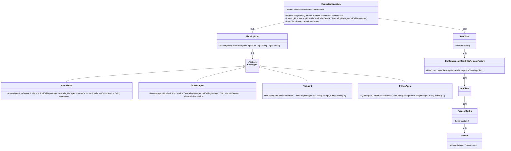
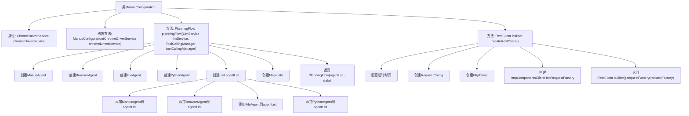

# 基础信息

|      |      |
|------|------|
| 名称 | ManusConfiguration |
| 编码语言 | .java |
| 代码路径 | spring-ai-alibaba/community/openmanus/src/main/java/com/alibaba/cloud/ai/example/manus/config/ManusConfiguration.java |
| 包名 | com.alibaba.cloud.ai.example.manus.config |
| 依赖项 | ['java.util.ArrayList', 'java.util.HashMap', 'java.util.List', 'java.util.Map', 'java.util.concurrent.TimeUnit', 'com.alibaba.cloud.ai.example.manus.agent.BaseAgent', 'com.alibaba.cloud.ai.example.manus.agent.BrowserAgent', 'com.alibaba.cloud.ai.example.manus.agent.FileAgent', 'com.alibaba.cloud.ai.example.manus.agent.ManusAgent', 'com.alibaba.cloud.ai.example.manus.agent.PythonAgent', 'com.alibaba.cloud.ai.example.manus.flow.PlanningFlow', 'com.alibaba.cloud.ai.example.manus.llm.LlmService', 'com.alibaba.cloud.ai.example.manus.service.ChromeDriverService', 'com.alibaba.cloud.ai.example.manus.tool.support.CodeUtils', 'org.apache.hc.client5.http.classic.HttpClient', 'org.apache.hc.client5.http.config.RequestConfig', 'org.apache.hc.client5.http.impl.classic.HttpClients', 'org.apache.hc.core5.util.Timeout', 'org.springframework.ai.model.tool.ToolCallingManager', 'org.springframework.context.annotation.Bean', 'org.springframework.context.annotation.Configuration', 'org.springframework.http.client.HttpComponentsClientHttpRequestFactory', 'org.springframework.web.client.RestClient'] |
| 概述说明 | ManusConfiguration类配置PlanningFlow和RestClient.Builder，含代理和超时设置。 |

# 说明

ManusConfiguration类用于配置PlanningFlow和RestClient.Builder，涉及多个代理和超时设置，确保系统在规划流程和客户端请求处理中的高效运行。

# 类列表 Class Summary

| 名称   | 类型  | 说明 |
|-------|------|-------------|
| ManusConfiguration | class | ManusConfiguration类配置了PlanningFlow和RestClient.Builder，包含多个代理和超时设置。 |

## 类 ManusConfiguration

|      |      |
|------|------|
| 访问范围 | @Configuration;public |
| 类型 | class |
| 名称 | ManusConfiguration |
| 说明 | ManusConfiguration类配置了PlanningFlow和RestClient.Builder，包含多个代理和超时设置。 |

### UML类图

这段代码定义了一个名为 `ManusConfiguration` 的配置类，负责创建 `PlanningFlow` 和 `RestClient.Builder` 实例。`PlanningFlow` 依赖于多个 `BaseAgent` 的实现类，如 `ManusAgent`、`BrowserAgent`、`FileAgent` 和 `PythonAgent`，这些代理类分别处理不同的任务。`RestClient.Builder` 通过 `HttpComponentsClientHttpRequestFactory` 和 `HttpClient` 配置超时时间，最终生成一个用于 HTTP 请求的 `RestClient` 实例。整体设计体现了依赖注入和配置管理的模式。

### 内部方法调用关系图

这段代码定义了一个名为`ManusConfiguration`的配置类，包含两个主要方法：`planningFlow`和`createRestClient`。`planningFlow`方法创建了多个代理对象（如`ManusAgent`、`BrowserAgent`等），并将它们添加到列表中，最终返回一个`PlanningFlow`对象。`createRestClient`方法配置了HTTP客户端的超时时间，并返回一个`RestClient.Builder`对象，用于构建REST客户端。整个流程展示了如何通过配置类来初始化和管理多个代理对象以及HTTP客户端的配置。

### 字段列表 Field List

| 名称  | 类型  | 说明 |
|-------|-------|------|
| chromeDriverService | ChromeDriverService | 私有不可变的ChromeDriverService实例。 |

### 方法列表 Method List

| 名称  | 类型  | 说明 |
|-------|-------|------|
| createRestClient | RestClient.Builder | 创建RestClient.Builder，配置超时时间，应用HttpClient，设置请求工厂。 |
| planningFlow | PlanningFlow | 创建PlanningFlow实例，包含ManusAgent、BrowserAgent、FileAgent和PythonAgent等代理。 |

