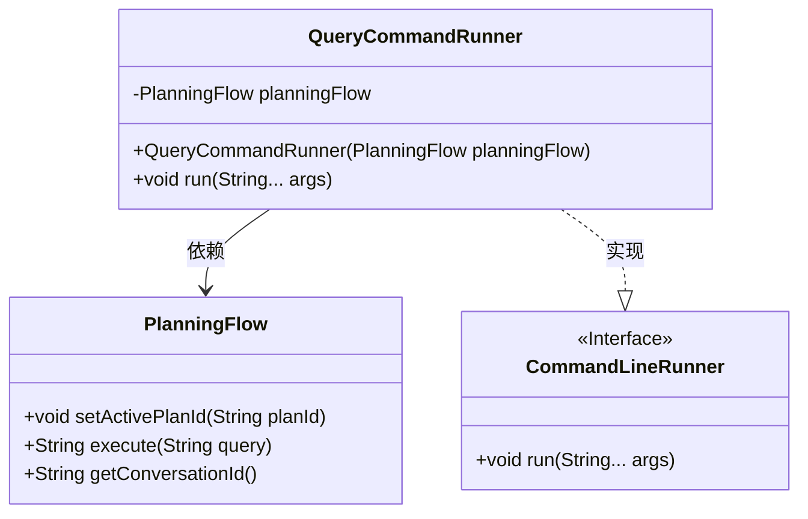
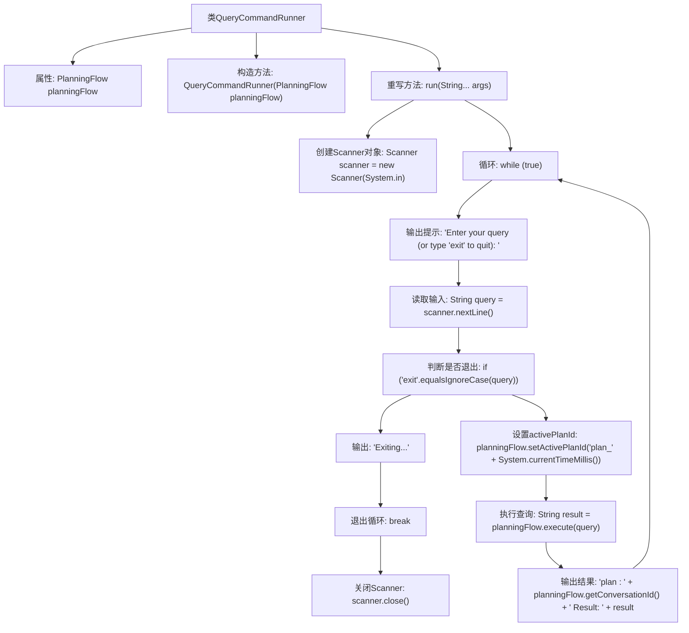

# 基础信息

|      |      |
|------|------|
| 名称 | QueryCommandRunner |
| 编码语言 | .java |
| 代码路径 | spring-ai-alibaba/community/openmanus/src/main/java/com/alibaba/cloud/ai/example/manus/config/QueryCommandRunner.java |
| 包名 | com.alibaba.cloud.ai.example.manus.config |
| 依赖项 | ['java.util.Scanner', 'com.alibaba.cloud.ai.example.manus.flow.PlanningFlow', 'org.springframework.boot.CommandLineRunner', 'org.springframework.context.annotation.Configuration'] |
| 概述说明 | QueryCommandRunner类实现CommandLineRunner接口，执行用户查询并支持退出操作。 |

# 说明

QueryCommandRunner类实现了CommandLineRunner接口，主要负责通过PlanningFlow执行用户查询操作，并支持用户退出功能。该类在应用程序启动时自动运行，处理用户输入的命令，调用PlanningFlow进行查询处理，同时提供退出机制以结束程序运行。

# 类列表 Class Summary

| 名称   | 类型  | 说明 |
|-------|------|-------------|
| QueryCommandRunner | class | QueryCommandRunner类实现CommandLineRunner接口，通过PlanningFlow执行用户查询，支持退出操作。 |

## 类 QueryCommandRunner

|      |      |
|------|------|
| 访问范围 | @Configuration;public |
| 类型 | class |
| 名称 | QueryCommandRunner |
| 说明 | QueryCommandRunner类实现CommandLineRunner接口，通过PlanningFlow执行用户查询，支持退出操作。 |

### UML类图

类图描述：`QueryCommandRunner`类实现了`CommandLineRunner`接口，并依赖于`PlanningFlow`类。`QueryCommandRunner`类通过`run`方法接收用户输入，调用`PlanningFlow`的`execute`方法执行查询，并输出结果。`PlanningFlow`类负责设置活动计划ID、执行查询以及获取会话ID。整个流程通过命令行交互实现，用户可以输入查询或退出程序。

### 内部方法调用关系图

这段代码描述了一个`QueryCommandRunner`类，它实现了`CommandLineRunner`接口，用于在命令行中运行查询任务。代码通过`Scanner`对象读取用户输入，并根据输入决定是否退出程序。如果用户输入的不是`exit`，则设置`planningFlow`的`activePlanId`并执行查询，最后输出查询结果。流程图清晰地展示了代码的执行流程，包括用户输入的读取、条件判断、查询执行和结果输出等步骤。

### 字段列表 Field List

| 名称  | 类型  | 说明 |
|-------|-------|------|
| planningFlow | PlanningFlow | 私有且不可变的PlanningFlow实例变量。 |

### 方法列表 Method List

| 名称  | 类型  | 说明 |
|-------|-------|------|
| run | void | 程序持续读取用户输入，执行查询并输出结果，输入"exit"退出。 |

