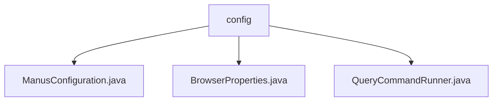

# 基础信息

|      |      |
|------|------|
| 名称 | config |
| 编码语言 | .java |
| 代码路径 | spring-ai-alibaba/community/openmanus/src/main/java/com/alibaba/cloud/ai/example/manus/config |
| 包名 | spring-ai-alibaba.community.openmanus.src.main.java.com.alibaba.cloud.ai.example.manus.config |
| 概述说明 | ManusConfiguration类配置规划流程和客户端请求，BrowserProperties类管理浏览器无头模式，QueryCommandRunner类处理用户查询和退出操作。 |

# 说明

## 概述

该代码模块主要涉及配置和执行规划流程、客户端请求处理以及浏览器无头模式的设置。模块中的类分别负责不同的功能，包括配置规划流程和客户端请求处理的代理与超时设置、控制浏览器的无头模式、以及处理用户查询操作并支持用户退出功能。这些类共同协作，确保系统在规划流程、客户端请求处理和浏览器操作中的高效运行。

## 主要业务场景

1. **规划流程和客户端请求处理配置**：
   - `ManusConfiguration`类用于配置`PlanningFlow`和`RestClient.Builder`，涉及多个代理和超时设置，确保系统在规划流程和客户端请求处理中的高效运行。

2. **浏览器无头模式控制**：
   - `BrowserProperties`类用于配置浏览器的无头模式，默认情况下该模式处于关闭状态。无头模式通常用于在后台运行浏览器，不显示图形界面，适用于自动化测试和服务器环境。通过该类，开发者可以灵活地启用或禁用无头模式，以适应不同的应用场景。

3. **用户查询操作处理**：
   - `QueryCommandRunner`类实现了`CommandLineRunner`接口，主要负责通过`PlanningFlow`执行用户查询操作，并支持用户退出功能。该类在应用程序启动时自动运行，处理用户输入的命令，调用`PlanningFlow`进行查询处理，同时提供退出机制以结束程序运行。

### 包内部结构视图

该流程图展示了`config`文件夹与其包含的三个Java文件之间的层级关系。`config`是根节点，`ManusConfiguration.java`、`BrowserProperties.java`和`QueryCommandRunner.java`是子节点，分别表示该文件夹下的具体配置文件。这种结构清晰地反映了配置文件的组织方式，便于理解和管理。

# 文件列表 File List

| 名称   | 类型  | 说明 |
|-------|------|-------------|
| [QueryCommandRunner.java](QueryCommandRunner.md) | file | QueryCommandRunner类实现CommandLineRunner接口，执行用户查询并支持退出操作。 |
| [ManusConfiguration.java](ManusConfiguration.md) | file | ManusConfiguration类配置PlanningFlow和RestClient.Builder，含代理和超时设置。 |
| [BrowserProperties.java](BrowserProperties.md) | file | BrowserProperties类配置无头浏览器模式，默认关闭。 |

