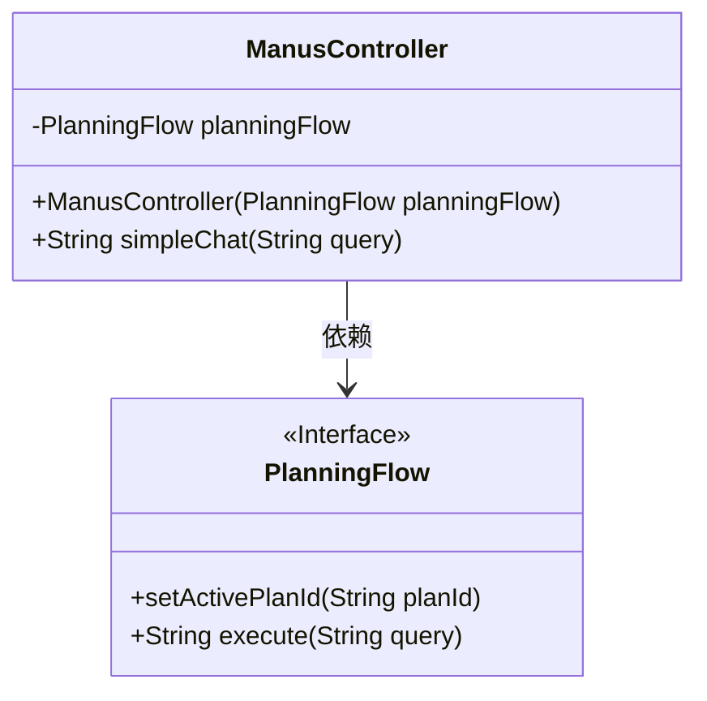
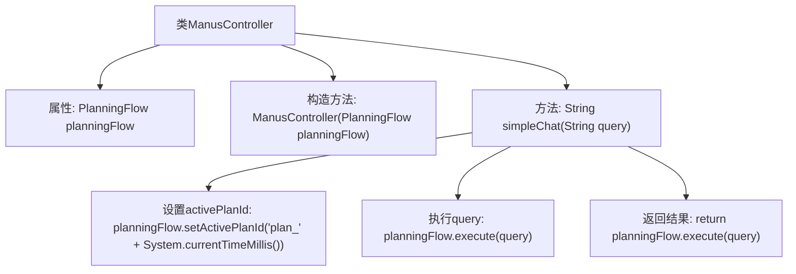

# 基础信息

|      |      |
|------|------|
| 名称 | ManusController |
| 编码语言 | .java |
| 代码路径 | spring-ai-alibaba/community/openmanus/src/main/java/com/alibaba/cloud/ai/example/manus/controller/ManusController.java |
| 包名 | com.alibaba.cloud.ai.example.manus.controller |
| 依赖项 | ['com.alibaba.cloud.ai.example.manus.flow.PlanningFlow', 'org.springframework.web.bind.annotation.GetMapping', 'org.springframework.web.bind.annotation.RequestMapping', 'org.springframework.web.bind.annotation.RequestParam', 'org.springframework.web.bind.annotation.RestController'] |
| 概述说明 | ManusController类处理聊天请求，执行查询并返回结果。 |

# 说明

ManusController类负责处理与/manus/chat相关的请求，其主要功能是执行查询操作并返回相应的结果。该控制器类通过接收请求、处理数据并生成响应，确保与聊天功能相关的操作能够顺利执行。其设计旨在高效地处理查询任务，并将结果准确地返回给请求方，从而支持系统的聊天功能。

# 类列表 Class Summary

| 名称   | 类型  | 说明 |
|-------|------|-------------|
| ManusController | class | ManusController类处理/manus/chat请求，执行查询并返回结果。 |

## 类 ManusController

|      |      |
|------|------|
| 访问范围 | @RestController;@RequestMapping("/manus");public |
| 类型 | class |
| 名称 | ManusController |
| 说明 | ManusController类处理/manus/chat请求，执行查询并返回结果。 |

### UML类图

这段代码定义了一个名为 `ManusController` 的控制器类，它依赖于 `PlanningFlow` 接口。`ManusController` 类通过构造函数注入 `PlanningFlow` 实例，并提供了一个 `simpleChat` 方法，该方法接受一个查询字符串作为参数，并返回执行结果。`PlanningFlow` 接口定义了 `setActivePlanId` 和 `execute` 两个方法，分别用于设置活动计划ID和执行查询。

### 内部方法调用关系图

这段代码定义了一个名为`ManusController`的Spring Boot控制器类，用于处理与`/manus/chat`路径相关的GET请求。控制器通过构造函数注入了一个`PlanningFlow`实例，并在`simpleChat`方法中使用该实例来设置一个动态生成的`activePlanId`，然后执行传入的查询并返回结果。流程图展示了类结构和方法调用关系，清晰地描述了从接收到请求到返回结果的完整流程。

### 字段列表 Field List

| 名称  | 类型  | 说明 |
|-------|-------|------|
| planningFlow | PlanningFlow | 私有且不可变的PlanningFlow实例。 |

### 方法列表 Method List

| 名称  | 类型  | 说明 |
|-------|-------|------|
| simpleChat | String | GET请求路径为/chat，默认查询参数为“你好，很高兴认识你，能简单介绍一下自己吗？”，执行并返回结果。 |

