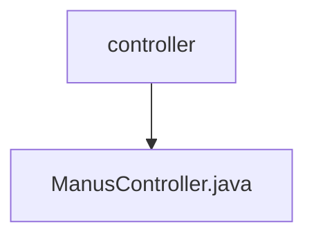

# 基础信息

|      |      |
|------|------|
| 名称 | controller |
| 编码语言 | .java |
| 代码路径 | spring-ai-alibaba/community/openmanus/src/main/java/com/alibaba/cloud/ai/example/manus/controller |
| 包名 | spring-ai-alibaba.community.openmanus.src.main.java.com.alibaba.cloud.ai.example.manus.controller |
| 概述说明 | ManusController类处理聊天请求，执行查询并返回结果。 |

# 说明

ManusController类负责处理与/manus/chat相关的请求，其主要功能是执行查询操作并返回相应的结果。该控制器类通过接收请求、处理数据并生成响应，确保与聊天功能相关的操作能够顺利执行。其设计旨在高效地处理查询任务，并将结果准确地返回给请求方，从而支持系统的聊天功能。

### 包内部结构视图

该流程图展示了路径的层级关系，`controller`文件夹包含`ManusController.java`文件。路径结构简洁明了，体现了文件与文件夹之间的从属关系。

# 文件列表 File List

| 名称   | 类型  | 说明 |
|-------|------|-------------|
| [ManusController.java](ManusController.md) | file | ManusController类处理聊天请求，执行查询并返回结果。 |

