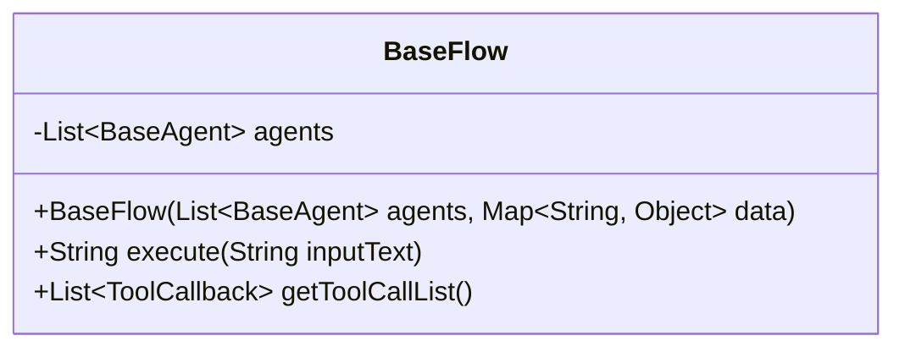
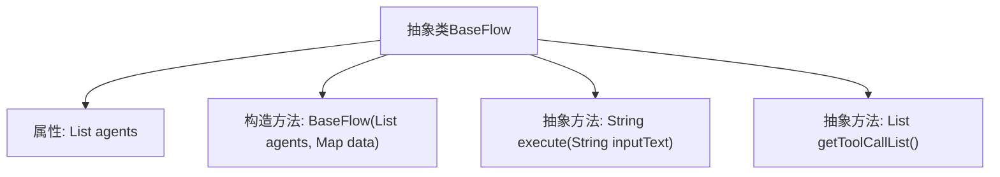

# 基础信息

|      |      |
|------|------|
| 名称 | BaseFlow |
| 编码语言 | .java |
| 代码路径 | spring-ai-alibaba/community/openmanus/src/main/java/com/alibaba/cloud/ai/example/manus/flow/BaseFlow.java |
| 包名 | com.alibaba.cloud.ai.example.manus.flow |
| 依赖项 | ['com.alibaba.cloud.ai.example.manus.agent.BaseAgent', 'java.util.List', 'java.util.Map', 'org.springframework.ai.tool.ToolCallback'] |
| 概述说明 | BaseFlow类含代理列表，初始化数据与代理，定义执行和工具回调方法。 |

# 说明

BaseFlow抽象类设计用于管理代理列表，其构造函数负责初始化代理和数据。该类定义了执行和获取工具回调的方法，确保流程的协调与执行。

# 类列表 Class Summary

| 名称   | 类型  | 说明 |
|-------|------|-------------|
| BaseFlow | class | BaseFlow抽象类包含代理列表，构造函数初始化代理和数据，定义执行和获取工具回调方法。 |

## 类 BaseFlow

|      |      |
|------|------|
| 访问范围 | public abstract |
| 类型 | class |
| 名称 | BaseFlow |
| 说明 | BaseFlow抽象类包含代理列表，构造函数初始化代理和数据，定义执行和获取工具回调方法。 |

### UML类图

这段代码定义了一个抽象类 `BaseFlow`，它包含一个受保护的 `agents` 列表，用于存储 `BaseAgent` 对象。类中有两个抽象方法：`execute` 用于执行输入文本并返回字符串结果，`getToolCallList` 用于获取工具回调列表。构造函数接受 `agents` 列表和一个 `data` 映射，并将 `agents` 放入 `data` 中。这个类主要用于定义流程的基本结构，具体的实现需要由子类完成。

### 内部方法调用关系图

这段代码定义了一个抽象类 `BaseFlow`，包含一个属性 `agents` 和一个构造方法，以及两个抽象方法 `execute` 和 `getToolCallList`。构造方法接收 `agents` 和一个 `data` 映射，并将 `agents` 存入 `data` 中。抽象方法 `execute` 用于执行输入文本的处理，而 `getToolCallList` 用于获取工具回调列表。该类的设计为后续具体实现提供了基础框架。

### 字段列表 Field List

| 名称  | 类型  | 说明 |
|-------|-------|------|
| agents | List<BaseAgent> | 保护类型为BaseAgent的列表agents。 |

### 方法列表 Method List

| 名称  | 类型  | 说明 |
|-------|-------|------|
| getToolCallList | List<ToolCallback> | 获取工具回调列表的抽象方法。 |
| execute | String | 抽象方法execute，接收字符串参数并返回字符串结果。 |

