# 基础信息

|      |      |
|------|------|
| 名称 | PlanningFlow |
| 编码语言 | .java |
| 代码路径 | spring-ai-alibaba/community/openmanus/src/main/java/com/alibaba/cloud/ai/example/manus/flow/PlanningFlow.java |
| 包名 | com.alibaba.cloud.ai.example.manus.flow |
| 依赖项 | ['com.alibaba.cloud.ai.example.manus.llm.LlmService', 'com.alibaba.cloud.ai.example.manus.service.ChromeDriverService', 'com.alibaba.cloud.ai.example.manus.tool.support.ToolExecuteResult', 'com.alibaba.fastjson.JSON', 'com.alibaba.cloud.ai.example.manus.agent.BaseAgent', 'com.alibaba.cloud.ai.example.manus.tool.PlanningTool', 'org.slf4j.Logger', 'org.slf4j.LoggerFactory', 'java.util', 'java.util.regex.Matcher', 'java.util.regex.Pattern', 'org.springframework.ai.chat.client.advisor.MessageChatMemoryAdvisor', 'org.springframework.ai.chat.model.ChatResponse', 'org.springframework.ai.chat.prompt.Prompt', 'org.springframework.ai.chat.prompt.PromptTemplate', 'org.springframework.ai.tool.ToolCallback', 'org.springframework.beans.factory.annotation.Autowired', 'org.springframework.ai.chat.client.advisor.AbstractChatMemoryAdvisor.CHAT_MEMORY_CONVERSATION_ID_KEY', 'org.springframework.ai.chat.client.advisor.AbstractChatMemoryAdvisor.CHAT_MEMORY_RETRIEVE_SIZE_KEY'] |
| 概述说明 | PlanningFlow类管理计划流程，含初始化、执行、完成标记和总结生成功能。 |

# 说明

PlanningFlow类是一个用于管理计划流程的工具，具备初始化、执行步骤、标记完成和生成总结的功能。它通过初始化设定流程基础，逐步执行计划中的各个步骤，并在每个步骤完成后进行标记，最终生成全面的总结报告。

# 类列表 Class Summary

| 名称   | 类型  | 说明 |
|-------|------|-------------|
| PlanningFlow | class | PlanningFlow类用于管理计划流程，包含初始化、执行步骤、标记完成和生成总结功能。 |

## 类 PlanningFlow

|      |      |
|------|------|
| 访问范围 | public |
| 类型 | class |
| 名称 | PlanningFlow |
| 说明 | PlanningFlow类用于管理计划流程，包含初始化、执行步骤、标记完成和生成总结功能。 |

### UML类图

```mermaid
classDiagram
    class BaseFlow {
        <<Interface>>
        +execute(String inputText) String
    }

    class PlanningFlow {
        -Logger log
        -PlanningTool planningTool
        -List~String~ executorKeys
        -String activePlanId
        -Integer currentStepIndex
        -LlmService llmService
        -ChromeDriverService chromeDriverService
        -Map~String, Object~ resultState
        +PlanningFlow(List~BaseAgent~ agents, Map~String, Object~ data)
        +getExecutor(String stepType) BaseAgent
        +execute(String inputText) String
        +createInitialPlan(String request)
        +getCurrentStepInfo() Map~Integer, Map~String, String~~
        +executeStep(BaseAgent executor, Map~String, String~ stepInfo) String
        +markStepCompleted()
        +getPlanText() String
        +generatePlanTextFromStorage() String
        +finalizePlan() String
        +getToolCallList() List~ToolCallback~
        +setActivePlanId(String activePlanId)
        +getConversationId() String
    }

    class PlanningTool {
        <<Interface>>
        +getPlans() Map~String, Map~String, Object~~
        +run(String json) ToolExecuteResult
    }

    class LlmService {
        <<Interface>>
        +getPlanningChatClient() ChatClient
        +getFinalizeChatClient() ChatClient
        +getMemory() ChatMemory
    }

    class ChromeDriverService {
        <<Interface>>
        +cleanup()
    }

    class BaseAgent {
        <<Interface>>
        +getName() String
        +getDescription() String
        +setConversationId(String conversationId)
        +run(Map~String, Object~ params) String
    }

    class ToolExecuteResult {
        +getOutput() String
    }

    class ChatClient {
        <<Interface>>
        +prompt() ChatClient
        +tools(List~ToolCallback~ tools) ChatClient
        +advisors(ChatMemoryAdvisor advisor) ChatClient
        +user(String userInput) ChatClient
        +call() ChatResponse
    }

    class ChatMemory {
        <<Interface>>
    }

    class ChatMemoryAdvisor {
        <<Interface>>
        +param(String key, Object value) ChatMemoryAdvisor
    }

    class ChatResponse {
        +getResult() ChatResult
    }

    class ChatResult {
        +getOutput() ChatOutput
    }

    class ChatOutput {
        +getText() String
    }

    class ToolCallback {
        <<Interface>>
    }

    PlanningFlow --> BaseFlow : 继承
    PlanningFlow --> PlanningTool : 依赖
    PlanningFlow --> LlmService : 依赖
    PlanningFlow --> ChromeDriverService : 依赖
    PlanningFlow --> BaseAgent : 依赖
    PlanningFlow --> ToolExecuteResult : 依赖
    PlanningFlow --> ChatClient : 依赖
    PlanningFlow --> ChatMemory : 依赖
    PlanningFlow --> ChatMemoryAdvisor : 依赖
    PlanningFlow --> ChatResponse : 依赖
    PlanningFlow --> ToolCallback : 依赖
```

这段代码描述了一个名为 `PlanningFlow` 的类，它继承自 `BaseFlow`，并依赖于多个接口和类，如 `PlanningTool`、`LlmService`、`ChromeDriverService` 和 `BaseAgent`。`PlanningFlow` 负责管理计划执行的流程，包括创建初始计划、获取当前步骤信息、执行步骤、标记步骤完成以及最终化计划。它还通过 `LlmService` 与语言模型进行交互，生成计划和分析结果。代码中使用了大量的依赖注入和接口实现，确保了模块化和可扩展性。

### 内部方法调用关系图

```mermaid
graph TD
    A["类PlanningFlow"]
    B["属性: Logger log"]
    C["属性: PlanningTool planningTool"]
    D["属性: List<String> executorKeys"]
    E["属性: String activePlanId"]
    F["属性: Integer currentStepIndex"]
    G["属性: LlmService llmService"]
    H["属性: ChromeDriverService chromeDriverService"]
    I["属性: Map<String, Object> resultState"]
    J["构造方法: PlanningFlow(List<BaseAgent> agents, Map<String, Object> data)"]
    K["方法: BaseAgent getExecutor(String stepType)"]
    L["方法: String execute(String inputText)"]
    M["方法: void createInitialPlan(String request)"]
    N["方法: Map.Entry<Integer, Map<String, String>> getCurrentStepInfo()"]
    O["方法: String executeStep(BaseAgent executor, Map<String, String> stepInfo)"]
    P["方法: void markStepCompleted()"]
    Q["方法: String getPlanText()"]
    R["方法: String generatePlanTextFromStorage()"]
    S["方法: String finalizePlan()"]
    T["方法: List<ToolCallback> getToolCallList()"]
    U["方法: void setActivePlanId(String activePlanId)"]
    V["方法: String getConversationId()"]

    A --> B
    A --> C
    A --> D
    A --> E
    A --> F
    A --> G
    A --> H
    A --> I
    A --> J
    A --> K
    A --> L
    A --> M
    A --> N
    A --> O
    A --> P
    A --> Q
    A --> R
    A --> S
    A --> T
    A --> U
    A --> V
```

这段代码定义了一个名为 `PlanningFlow` 的类，用于管理和执行任务计划。该类包含了多个属性和方法，用于初始化计划、执行计划步骤、获取当前步骤信息、标记步骤完成等操作。通过 `execute` 方法，类可以接收输入文本并执行相应的计划，最终生成执行结果。类中还使用了 `LlmService` 和 `ChromeDriverService` 等外部服务，用于与LLM交互和浏览器自动化操作。整体流程包括计划创建、步骤执行、状态更新和最终结果生成。

### 字段列表 Field List

| 名称  | 类型  | 说明 |
|-------|-------|------|
| log = LoggerFactory.getLogger(PlanningFlow.class) | Logger | PlanningFlow类中定义了静态私有日志记录器。 |
| llmService | LlmService | 自动注入LlmService实例。 |
| activePlanId | String | 定义私有字符串变量activePlanId。 |
| chromeDriverService | ChromeDriverService | 自动注入ChromeDriverService实例。 |
| executorKeys | List<String> | 包含执行器键的私有字符串列表。 |
| currentStepIndex | Integer | 当前步骤索引为私有整型变量。 |
| planningTool | PlanningTool | 私有变量planningTool用于规划工具。 |
| resultState | Map<String, Object> | 私有映射变量存储字符串与对象的键值对。 |

### 方法列表 Method List

| 名称  | 类型  | 说明 |
|-------|-------|------|
| setActivePlanId | void | 设置当前活动计划的ID。 |
| getConversationId | String | 方法getConversationId返回activePlanId的值。 |
| markStepCompleted | void | 方法标记当前步骤为完成，更新计划状态，失败时回滚状态。 |
| finalizePlan | String | 方法生成计划总结，调用LLM分析执行历史，返回用户友好格式的结果。 |
| getCurrentStepInfo | Map.Entry<Integer, Map<String, String>> | 获取当前步骤信息，检查计划ID和步骤状态，返回步骤索引和详细信息。 |
| getPlanText | String | 方法获取计划文本，执行命令并返回结果，异常时从存储生成文本。 |
| executeStep | String | 方法执行步骤，获取计划状态和步骤信息，运行步骤并标记完成，捕获并记录错误。 |
| createInitialPlan | void | 创建初始计划，记录ID，构建代理信息，生成提示模板，调用LLM服务获取响应，若无结果则创建默认计划。 |
| generatePlanTextFromStorage | String | 从存储生成计划文本，包含标题、步骤、状态、进度及注释。 |
| getExecutor | BaseAgent | 根据步骤类型获取执行代理，若未找到则使用默认或首个可用代理。 |
| getToolCallList | List<ToolCallback> | 获取工具回调列表，返回包含PlanningTool回调的列表。 |
| execute | String | 该方法执行输入文本处理，创建计划并逐步执行，返回结果或错误信息。 |

