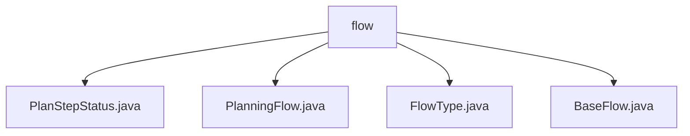

# 基础信息

|      |      |
|------|------|
| 名称 | flow |
| 编码语言 | .java |
| 代码路径 | spring-ai-alibaba/community/openmanus/src/main/java/com/alibaba/cloud/ai/example/manus/flow |
| 包名 | spring-ai-alibaba.community.openmanus.src.main.java.com.alibaba.cloud.ai.example.manus.flow |
| 概述说明 | PlanningFlow管理计划流程，BaseFlow管理代理列表。 |

# 说明

## 概述

该代码模块主要涉及计划流程的管理与执行，包含多个类用于处理流程的初始化、步骤执行、状态标记以及总结生成。模块的核心类包括 `PlanningFlow`、`PlanStepStatus`、`FlowType` 和 `BaseFlow`，它们共同协作以确保流程的顺利执行和状态管理。

## 主要业务场景

1. **流程初始化与执行**  
   - `PlanningFlow` 类负责管理计划流程的初始化、步骤执行和总结生成。它通过逐步执行计划中的各个步骤，并在每个步骤完成后进行标记，最终生成全面的总结报告。

2. **流程状态管理**  
   - `PlanStepStatus` 类用于标记和管理计划步骤的状态，确保每个步骤的执行状态能够被准确记录和跟踪。

3. **流程类型定义**  
   - `FlowType` 类定义了流程的类型，为不同类型的流程提供分类和标识，以便在流程管理中进行区分。

4. **基础流程管理**  
   - `BaseFlow` 抽象类负责管理代理列表，并通过构造函数初始化代理和数据。它定义了执行和获取工具回调的方法，确保流程的协调与执行。

通过这些类的协作，该模块能够有效地管理和执行复杂的计划流程，确保每个步骤的准确执行和状态的实时跟踪。

### 包内部结构视图

该流程图展示了路径 `spring-ai-alibaba/community/openmanus/src/main/java/com/alibaba/cloud/ai/example/manus/flow` 下的文件层级关系。`flow` 文件夹包含四个文件：`PlanStepStatus.java`、`PlanningFlow.java`、`FlowType.java` 和 `BaseFlow.java`。每个文件都是 `flow` 文件夹的直接子节点，没有进一步的嵌套层级。

# 文件列表 File List

| 名称   | 类型  | 说明 |
|-------|------|-------------|
| [BaseFlow.java](BaseFlow.md) | file | BaseFlow类含代理列表，初始化数据与代理，定义执行和工具回调方法。 |
| [PlanStepStatus.java](PlanStepStatus.md) | file | 信息为空，无法生成概要描述。 |
| [FlowType.java](FlowType.md) | file | 信息为空，无法生成概要描述。 |
| [PlanningFlow.java](PlanningFlow.md) | file | PlanningFlow类管理计划流程，含初始化、执行、完成标记和总结生成功能。 |

