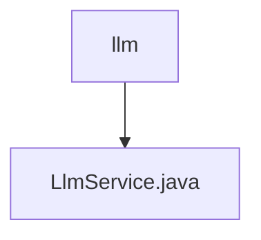

# 基础信息

|      |      |
|------|------|
| 名称 | llm |
| 编码语言 | .java |
| 代码路径 | spring-ai-alibaba/community/openmanus/src/main/java/com/alibaba/cloud/ai/example/manus/llm |
| 包名 | spring-ai-alibaba.community.openmanus.src.main.java.com.alibaba.cloud.ai.example.manus.llm |
| 概述说明 | LlmService类提供AI助手功能，支持多种任务和编程语言，具备规划和总结能力。 |

# 说明

LlmService类是一个提供AI助手功能的工具，支持多种任务包括信息处理、内容创作、问题解决和文件操作。它能够使用多种编程语言和工具，具备规划和总结能力，帮助用户高效完成复杂任务。

### 包内部结构视图

该流程图展示了路径的层级关系，`llm` 是顶层目录，`LlmService.java` 是其下的文件。路径结构简洁明了，清晰地反映了文件与目录之间的从属关系。

# 文件列表 File List

| 名称   | 类型  | 说明 |
|-------|------|-------------|
| [LlmService.java](LlmService.md) | file | LlmService类提供AI助手功能，支持多种任务和编程语言，具备规划和总结能力。 |

