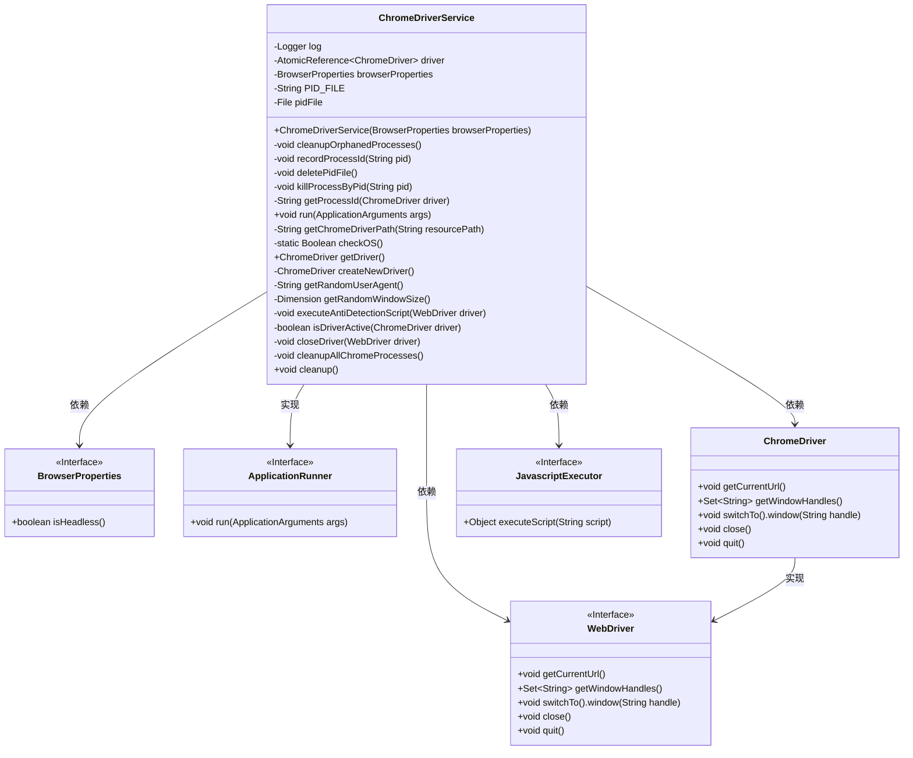
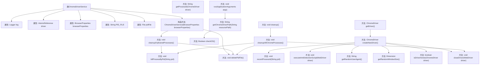

# 基础信息

|      |      |
|------|------|
| 名称 | ChromeDriverService |
| 编码语言 | .java |
| 代码路径 | spring-ai-alibaba/community/openmanus/src/main/java/com/alibaba/cloud/ai/example/manus/service/ChromeDriverService.java |
| 包名 | com.alibaba.cloud.ai.example.manus.service |
| 依赖项 | ['org.openqa.selenium.Dimension', 'org.openqa.selenium.JavascriptExecutor', 'org.openqa.selenium.WebDriver', 'org.openqa.selenium.chrome.ChromeDriver', 'org.openqa.selenium.chrome.ChromeOptions', 'org.slf4j.Logger', 'org.slf4j.LoggerFactory', 'org.springframework.boot.ApplicationArguments', 'org.springframework.boot.ApplicationRunner', 'org.springframework.context.annotation.Primary', 'org.springframework.stereotype.Service', 'com.alibaba.cloud.ai.example.manus.config.BrowserProperties', 'com.alibaba.cloud.ai.example.manus.OpenManusSpringBootApplication', 'jakarta.annotation.PreDestroy', 'java.net.URISyntaxException', 'java.net.URL', 'java.nio.file.Paths', 'java.nio.file.Files', 'java.nio.file.StandardOpenOption', 'java.io.File', 'java.io.IOException', 'java.util', 'java.util.concurrent.TimeUnit', 'java.util.concurrent.atomic.AtomicReference'] |
| 概述说明 | ChromeDriverService管理实例，清理僵尸进程，支持反检测和随机化配置。 |

# 说明

ChromeDriverService负责管理ChromeDriver实例，确保其正常运行并清理僵尸进程。它还支持反检测功能，防止被自动化工具识别，并提供随机化配置选项，以增强隐私和安全性。这些功能共同提升了ChromeDriver的稳定性和隐蔽性，适用于各种自动化测试和网页抓取场景。

# 类列表 Class Summary

| 名称   | 类型  | 说明 |
|-------|------|-------------|
| ChromeDriverService | class | ChromeDriverService管理ChromeDriver实例，清理僵尸进程，支持反检测和随机化配置。 |

## 类 ChromeDriverService

|      |      |
|------|------|
| 访问范围 | @Service;@Primary;public |
| 类型 | class |
| 名称 | ChromeDriverService |
| 说明 | ChromeDriverService管理ChromeDriver实例，清理僵尸进程，支持反检测和随机化配置。 |

### UML类图

### 描述
`ChromeDriverService` 是一个用于管理和控制 ChromeDriver 实例的类，实现了 `ApplicationRunner` 接口。它负责启动、关闭和清理 ChromeDriver 进程，并确保在 JVM 关闭时进行资源清理。类中包含多个私有方法用于处理进程管理、PID 文件操作、反检测脚本执行等。`BrowserProperties` 接口用于配置浏览器的行为，如是否启用 headless 模式。`ChromeDriver` 和 `WebDriver` 是 Selenium 的核心接口，用于控制浏览器行为。`JavascriptExecutor` 接口用于执行 JavaScript 代码，以增强浏览器的反检测能力。

### 内部方法调用关系图

这段代码定义了一个`ChromeDriverService`类，主要用于管理和控制ChromeDriver的生命周期。该类在初始化时会清理僵尸进程，并在JVM关闭时自动清理所有Chrome进程。它提供了创建、关闭和清理ChromeDriver实例的方法，并支持反检测机制以模拟真实浏览器环境。代码还包含记录和删除进程ID的功能，确保系统资源的正确释放。

### 字段列表 Field List

| 名称  | 类型  | 说明 |
|-------|-------|------|
| driver = new AtomicReference<>() | AtomicReference<ChromeDriver> | 私有原子引用存储ChromeDriver实例。 |
| pidFile | File | 私有文件对象pidFile。 |
| PID_FILE = "chrome-driver.pid" | String | 定义私有静态常量PID_FILE，值为"chrome-driver.pid"。 |
| browserProperties | BrowserProperties | 私有不可变的浏览器属性对象。 |
| log = LoggerFactory.getLogger(ChromeDriverService.class) | Logger | 定义ChromeDriverService类的私有静态日志对象log。 |

### 方法列表 Method List

| 名称  | 类型  | 说明 |
|-------|-------|------|
| checkOS | Boolean | 检查操作系统，返回是否为Windows。 |
| deletePidFile | void | 删除PID文件，失败时记录警告日志。 |
| cleanup | void | Spring容器关闭时清理Chrome资源。 |
| run | void | 根据操作系统设置ChromeDriver路径并初始化日志。 |
| getChromeDriverPath | String | 获取ChromeDriver路径，若未找到则抛出异常。 |
| executeAntiDetectionScript | void | 通过JavaScript脚本修改WebDriver属性，模拟真实浏览器行为以规避检测。 |
| isDriverActive | boolean | 检查ChromeDriver是否激活，激活返回true，否则关闭并返回false。 |
| getRandomUserAgent | String | 方法返回随机用户代理字符串。 |
| cleanupOrphanedProcesses | void | 清理孤儿进程：读取PID文件，终止进程，删除PID文件。 |
| killProcessByPid | void | 根据操作系统执行命令终止指定PID进程，失败时记录日志。 |
| recordProcessId | void | 记录Chrome进程PID到文件，成功记录日志，失败报错。 |
| cleanupAllChromeProcesses | void | 清理所有Chrome进程，包括关闭当前驱动、终止系统进程及删除PID文件。 |
| getRandomWindowSize | Dimension | 方法返回随机选择的窗口尺寸。 |
| closeDriver | void | 关闭WebDriver时，先关闭所有窗口，再退出driver，记录成功或错误信息。 |
| getProcessId | String | 获取ChromeDriver进程ID，失败返回null。 |
| getDriver | ChromeDriver | 获取或更新ChromeDriver实例，若存在且活跃则返回原实例，否则创建新实例。 |
| createNewDriver | ChromeDriver | 创建ChromeDriver实例，配置防检测参数，支持headless模式，随机化用户代理和窗口大小。 |

