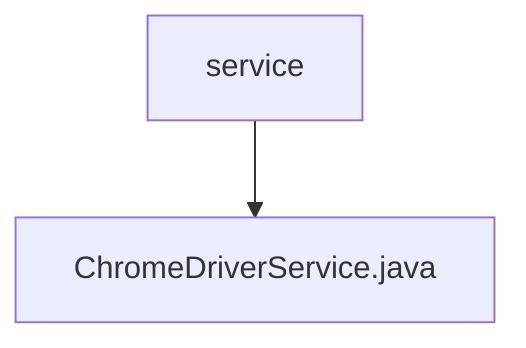

# 基础信息

|      |      |
|------|------|
| 名称 | service |
| 编码语言 | .java |
| 代码路径 | spring-ai-alibaba/community/openmanus/src/main/java/com/alibaba/cloud/ai/example/manus/service |
| 包名 | spring-ai-alibaba.community.openmanus.src.main.java.com.alibaba.cloud.ai.example.manus.service |
| 概述说明 | ChromeDriverService管理实例，清理僵尸进程，支持反检测和随机化配置。 |

# 说明

ChromeDriverService负责管理ChromeDriver实例，确保其正常运行并清理僵尸进程。它还支持反检测功能，防止被自动化工具识别，并提供随机化配置选项，以增强隐私和安全性。这些功能共同提升了ChromeDriver的稳定性和隐蔽性，适用于各种自动化测试和网页抓取场景。

### 包内部结构视图

该流程图展示了路径的层级关系，其中`service`是父节点，`ChromeDriverService.java`是其子节点。这种结构清晰地表示了文件在项目中的位置和依赖关系，帮助开发者快速理解项目的组织结构。

# 文件列表 File List

| 名称   | 类型  | 说明 |
|-------|------|-------------|
| [ChromeDriverService.java](ChromeDriverService.md) | file | ChromeDriverService管理实例，清理僵尸进程，支持反检测和随机化配置。 |

