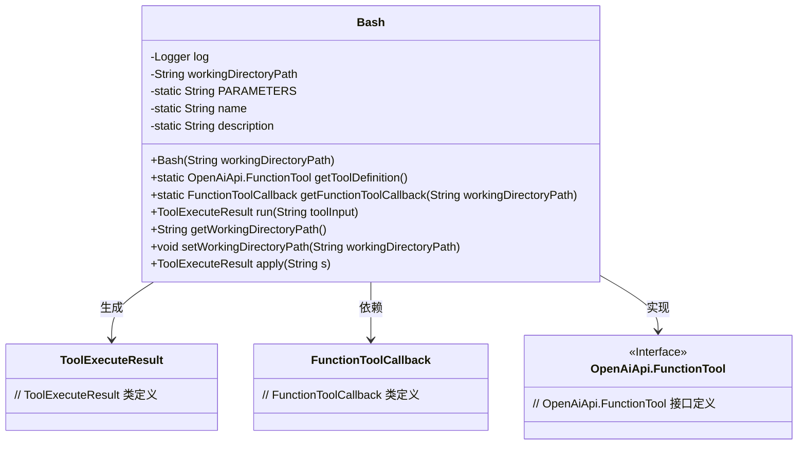
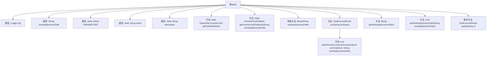

# 基础信息

|      |      |
|------|------|
| 名称 | Bash |
| 编码语言 | .java |
| 代码路径 | spring-ai-alibaba/community/openmanus/src/main/java/com/alibaba/cloud/ai/example/manus/tool/Bash.java |
| 包名 | com.alibaba.cloud.ai.example.manus.tool |
| 依赖项 | ['com.alibaba.cloud.ai.example.manus.tool.support.ToolExecuteResult', 'com.alibaba.cloud.ai.example.manus.tool.support.llmbash.BashProcess', 'com.alibaba.fastjson.JSON', 'com.alibaba.fastjson.TypeReference', 'org.slf4j.Logger', 'org.slf4j.LoggerFactory', 'java.util.ArrayList', 'java.util.List', 'java.util.Map', 'java.util.function.Function', 'org.springframework.ai.openai.api.OpenAiApi', 'org.springframework.ai.tool.function.FunctionToolCallback'] |
| 概述说明 | Bash类支持终端命令执行，含长运行、交互、超时处理及工具定义与回调功能。 |

# 说明

Bash类实现了终端命令的执行功能，支持长时间运行、交互式操作以及超时处理。该类提供了工具定义和回调功能，能够灵活应对各种命令执行场景，确保操作的稳定性和可控性。

# 类列表 Class Summary

| 名称   | 类型  | 说明 |
|-------|------|-------------|
| Bash | class | Bash类实现终端命令执行，支持长运行、交互和超时处理，提供工具定义和回调功能。 |

## 类 Bash

|      |      |
|------|------|
| 访问范围 | public |
| 类型 | class |
| 名称 | Bash |
| 说明 | Bash类实现终端命令执行，支持长运行、交互和超时处理，提供工具定义和回调功能。 |

### UML类图

这段代码定义了一个 `Bash` 类，用于执行 Bash 命令并返回执行结果。`Bash` 类包含了一些静态变量和方法，用于获取工具定义、回调函数以及执行命令。`Bash` 类实现了 `Function<String, ToolExecuteResult>` 接口，并通过 `apply` 方法调用 `run` 方法来执行命令。`ToolExecuteResult` 类用于封装执行结果，`FunctionToolCallback` 类用于处理回调，`OpenAiApi.FunctionTool` 是一个接口，定义了工具的功能。

### 内部方法调用关系图

**描述：**  
该流程图展示了`Bash`类的结构及其方法调用关系。`Bash`类包含多个属性和方法，用于执行Bash命令并返回结果。主要方法包括`getToolDefinition`用于获取工具定义，`getFunctionToolCallback`用于获取回调函数，`run`用于执行命令并返回结果，以及`apply`方法用于调用`run`方法。`BashProcess.executeCommand`方法被`run`方法调用，用于实际执行Bash命令。

### 字段列表 Field List

| 名称  | 类型  | 说明 |
|-------|-------|------|
| workingDirectoryPath | String | 私有字符串变量存储工作目录路径。 |
| PARAMETERS = """			{				"type": "object",				"properties": {					"command": {						"type": "string",						"description": "The bash command to execute. Can be empty to view additional logs when previous exit code is `-1`. Can be `ctrl+c` to interrupt the currently running process."					}				},				"required": ["command"]			}			""" | String | 定义JSON对象，包含字符串类型命令属性，必填。 |
| name = "bash" | String | 私有静态常量字符串变量name赋值为"bash"。 |
| log = LoggerFactory.getLogger(Bash.class) | Logger | Bash类中定义了一个私有的静态日志记录器。 |
| description = """			Execute a bash command in the terminal.			* Long running commands: For commands that may run indefinitely, it should be run in the background and the output should be redirected to a file, e.g. command = `python3 app.py > server.log 2>&1 &`.			* Interactive: If a bash command returns exit code `-1`, this means the process is not yet finished. The assistant must then send a second call to terminal with an empty `command` (which will retrieve any additional logs), or it can send additional text (set `command` to the text) to STDIN of the running process, or it can send command=`ctrl+c` to interrupt the process.			* Timeout: If a command execution result says "Command timed out. Sending SIGINT to the process", the assistant should retry running the command in the background.			""" | String | 在终端执行Bash命令，支持长时间运行、交互操作和超时重试。 |

### 方法列表 Method List

| 名称  | 类型  | 说明 |
|-------|-------|------|
| getWorkingDirectoryPath | String | 获取工作目录路径的方法。 |
| getToolDefinition | OpenAiApi.FunctionTool | 定义并返回OpenAiApi功能工具实例。 |
| apply | ToolExecuteResult | 重写apply方法，调用run方法执行并返回结果。 |
| setWorkingDirectoryPath | void | 设置工作目录路径的方法。 |
| getFunctionToolCallback | FunctionToolCallback | 获取函数工具回调，包含名称、描述、输入模式和类型。 |
| run | ToolExecuteResult | 该方法解析JSON输入，执行Bash命令并返回结果。 |

