# 基础信息

|      |      |
|------|------|
| 名称 | BrowserUseTool |
| 编码语言 | .java |
| 代码路径 | spring-ai-alibaba/community/openmanus/src/main/java/com/alibaba/cloud/ai/example/manus/tool/BrowserUseTool.java |
| 包名 | com.alibaba.cloud.ai.example.manus.tool |
| 依赖项 | ['com.alibaba.cloud.ai.example.manus.service.ChromeDriverService', 'com.alibaba.cloud.ai.example.manus.tool.support.ToolExecuteResult', 'com.alibaba.fastjson.JSON', 'com.alibaba.fastjson.TypeReference', 'org.openqa.selenium', 'org.openqa.selenium.interactions.Actions', 'org.openqa.selenium.support.ui.WebDriverWait', 'org.slf4j.Logger', 'org.slf4j.LoggerFactory', 'java.time.Duration', 'java.util.List', 'java.util.Map', 'java.util.Random', 'java.util.function.Function', 'java.util.stream.Collectors', 'java.util.HashMap', 'java.util.LinkedHashMap', 'java.util.Set', 'java.util.ArrayList', 'org.springframework.ai.openai.api.OpenAiApi', 'org.springframework.ai.tool.function.FunctionToolCallback'] |
| 概述说明 | BrowserUseTool支持导航、点击、输入、截图等浏览器操作。 |

# 说明

BrowserUseTool是一款功能强大的工具，专门用于实现浏览器操作。它支持多种常见操作，包括页面导航、元素点击、文本输入以及屏幕截图等。通过这些功能，用户可以方便地自动化浏览器任务，提高工作效率。该工具适用于各种需要浏览器交互的场景，能够满足多样化的操作需求。

# 类列表 Class Summary

| 名称   | 类型  | 说明 |
|-------|------|-------------|
| BrowserUseTool | class | BrowserUseTool实现浏览器操作，支持导航、点击、输入、截图等功能。 |


## 类 BrowserUseTool

|      |      |
|------|------|
| 访问范围 | public |
| 类型 | class |
| 名称 | BrowserUseTool |
| 说明 | BrowserUseTool实现浏览器操作，支持导航、点击、输入、截图等功能。 |


### UML类图

```mermaid
classDiagram
    class BrowserUseTool {
        -Logger log
        -ChromeDriverService chromeDriverService
        -static BrowserUseTool instance
        -static int MAX_LENGTH
        -static String PARAMETERS
        -static String name
        -static String description
        +BrowserUseTool(ChromeDriverService chromeDriverService)
        -WebDriver getDriver()
        +static OpenAiApi.FunctionTool getToolDefinition()
        +static synchronized BrowserUseTool getInstance(ChromeDriverService chromeDriverService)
        +static FunctionToolCallback getFunctionToolCallback(ChromeDriverService chromeDriverService)
        -void simulateHumanBehavior(WebElement element)
        -void typeWithHumanDelay(WebElement element, String text)
        +ToolExecuteResult run(String toolInput)
        -String formatElementInfo(int index, WebElement element)
        -List~WebElement~ getInteractiveElements(WebDriver driver)
        -String getInteractiveElementsInfo(WebDriver driver)
        +Map~String, Object~ getCurrentState()
        -boolean isElementVisible(WebElement element)
        +ToolExecuteResult apply(String s)
    }
    class ToolExecuteResult {
        +String result
        +ToolExecuteResult(String result)
    }
    class ChromeDriverService {
        +WebDriver getDriver()
    }
    class OpenAiApi.FunctionTool {
        +OpenAiApi.FunctionTool.Function function
        +OpenAiApi.FunctionTool(OpenAiApi.FunctionTool.Function function)
    }
    class OpenAiApi.FunctionTool.Function {
        +String description
        +String name
        +String parameters
        +OpenAiApi.FunctionTool.Function(String description, String name, String parameters)
    }
    class FunctionToolCallback {
        +String name
        +BrowserUseTool instance
        +String description
        +String inputSchema
        +Class~String~ inputType
        +static FunctionToolCallback builder(String name, BrowserUseTool instance)
        +FunctionToolCallback description(String description)
        +FunctionToolCallback inputSchema(String inputSchema)
        +FunctionToolCallback inputType(Class~String~ inputType)
        +FunctionToolCallback build()
    }
    class WebDriver {
        +void get(String url)
        +String getPageSource()
        +String getCurrentUrl()
        +String getTitle()
        +Set~String~ getWindowHandles()
        +String getWindowHandle()
        +void switchTo().window(String handle)
        +void close()
        +void navigate().refresh()
        +WebElement findElement(By by)
        +List~WebElement~ findElements(By by)
        +void manage().timeouts().pageLoadTimeout(Duration duration)
    }
    class WebElement {
        +void click()
        +String getText()
        +String getTagName()
        +String getAttribute(String name)
        +boolean isDisplayed()
        +boolean isEnabled()
        +void sendKeys(CharSequence... keys)
    }
    class JavascriptExecutor {
        +Object executeScript(String script, Object... args)
    }
    class TakesScreenshot {
        +String getScreenshotAs(OutputType~String~ outputType)
    }
    class By {
        +static By cssSelector(String selector)
    }
    class Keys {
        +static CharSequence RETURN
    }
    class Duration {
        +static Duration ofSeconds(long seconds)
    }
    class Map~K, V~ {
        +void put(K key, V value)
        +V get(K key)
    }
    class List~E~ {
        +E get(int index)
        +int size()
        +Stream~E~ stream()
    }
    class Stream~T~ {
        +Stream~T~ filter(Predicate~T~ predicate)
        +List~T~ collect(Collector~T, A, R~ collector)
    }
    class Predicate~T~ {
        +boolean test(T t)
    }
    class Collector~T, A, R~ {
        +static Collector~T, ?, List~T~~ toList()
    }
    class Random {
        +int nextInt(int bound)
    }
    class Thread {
        +static void sleep(long millis)
        +static Thread currentThread()
        +void interrupt()
    }
    class JSON {
        +static Map~String, Object~ parseObject(String json, TypeReference~Map~String, Object~~ typeReference)
    }
    class TypeReference~T~ {
        +TypeReference()
    }
    class WebDriverWait {
        +WebDriverWait(WebDriver driver, Duration timeout)
        +boolean until(Predicate~WebDriver~ condition)
    }
    class ElementClickInterceptedException {
        +ElementClickInterceptedException(String message)
    }
    class TimeoutException {
        +TimeoutException(String message)
    }
    class ElementNotInteractableException {
        +ElementNotInteractableException(String message)
    }
    class NoSuchElementException {
        +NoSuchElementException(String message)
    }
    BrowserUseTool --> ChromeDriverService : 依赖
    BrowserUseTool --> OpenAiApi.FunctionTool : 依赖
    BrowserUseTool --> FunctionToolCallback : 依赖
    BrowserUseTool --> WebDriver : 依赖
    BrowserUseTool --> WebElement : 依赖
    BrowserUseTool --> JavascriptExecutor : 依赖
    BrowserUseTool --> TakesScreenshot : 依赖
    BrowserUseTool --> By : 依赖
    BrowserUseTool --> Keys : 依赖
    BrowserUseTool --> Duration : 依赖
    BrowserUseTool --> Map~String, Object~ : 依赖
    BrowserUseTool --> List~WebElement~ : 依赖
    BrowserUseTool --> Stream~WebElement~ : 依赖
    BrowserUseTool --> Predicate~WebElement~ : 依赖
    BrowserUseTool --> Collector~WebElement, ?, List~WebElement~~ : 依赖
    BrowserUseTool --> Random : 依赖
    BrowserUseTool --> Thread : 依赖
    BrowserUseTool --> JSON : 依赖
    BrowserUseTool --> TypeReference~Map~String, Object~~ : 依赖
    BrowserUseTool --> WebDriverWait : 依赖
    BrowserUseTool --> ElementClickInterceptedException : 依赖
    BrowserUseTool --> TimeoutException : 依赖
    BrowserUseTool --> ElementNotInteractableException : 依赖
    BrowserUseTool --> NoSuchElementException : 依赖
    OpenAiApi.FunctionTool --> OpenAiApi.FunctionTool.Function : 依赖
    FunctionToolCallback --> BrowserUseTool : 依赖
    WebDriver --> WebElement : 依赖
    WebDriver --> JavascriptExecutor : 依赖
    WebDriver --> TakesScreenshot : 依赖
    WebDriver --> By : 依赖
    WebDriver --> Keys : 依赖
    WebDriver --> Duration : 依赖
    WebDriver --> Map~String, Object~ : 依赖
    WebDriver --> List~WebElement~ : 依赖
    WebDriver --> Stream~WebElement~ : 依赖
    WebDriver --> Predicate~WebElement~ : 依赖
    WebDriver --> Collector~WebElement, ?, List~WebElement~~ : 依赖
    WebDriver --> Random : 依赖
    WebDriver --> Thread : 依赖
    WebDriver --> JSON : 依赖
    WebDriver --> TypeReference~Map~String, Object~~ : 依赖
    WebDriver --> WebDriverWait : 依赖
    WebDriver --> ElementClickInterceptedException : 依赖
    WebDriver --> TimeoutException : 依赖
    WebDriver --> ElementNotInteractableException : 依赖
    WebDriver --> NoSuchElementException : 依赖
    WebElement --> JavascriptExecutor : 依赖
    WebElement --> TakesScreenshot : 依赖
    WebElement --> By : 依赖
    WebElement --> Keys : 依赖
    WebElement --> Duration : 依赖
    WebElement --> Map~String, Object~ : 依赖
    WebElement --> List~WebElement~ : 依赖
    WebElement --> Stream~WebElement~ : 依赖
    WebElement --> Predicate~WebElement~ : 依赖
    WebElement --> Collector~WebElement, ?, List~WebElement~~ : 依赖
    WebElement --> Random : 依赖
    WebElement --> Thread : 依赖
    WebElement --> JSON : 依赖
    WebElement --> TypeReference~Map~String, Object~~ : 依赖
    WebElement --> WebDriverWait : 依赖
    WebElement --> ElementClickInterceptedException : 依赖
    WebElement --> TimeoutException : 依赖
    WebElement --> ElementNotInteractableException : 依赖
    WebElement --> NoSuchElementException : 依赖
    JavascriptExecutor --> TakesScreenshot : 依赖
    JavascriptExecutor --> By : 依赖
    JavascriptExecutor --> Keys : 依赖
    JavascriptExecutor --> Duration : 依赖
    JavascriptExecutor --> Map~String, Object~ : 依赖
    JavascriptExecutor --> List~WebElement~ : 依赖
    JavascriptExecutor --> Stream~WebElement~ : 依赖
    JavascriptExecutor --> Predicate~WebElement~ : 依赖
    JavascriptExecutor --> Collector~WebElement, ?, List~WebElement~~ : 依赖
    JavascriptExecutor --> Random : 依赖
    JavascriptExecutor --> Thread : 依赖
    JavascriptExecutor --> JSON : 依赖
    JavascriptExecutor --> TypeReference~Map~String, Object~~ : 依赖
    JavascriptExecutor --> WebDriverWait : 依赖
    JavascriptExecutor --> ElementClickInterceptedException : 依赖
    JavascriptExecutor --> TimeoutException : 依赖
    JavascriptExecutor --> ElementNotInteractableException : 依赖
    JavascriptExecutor --> NoSuchElementException : 依赖
    TakesScreenshot --> By : 依赖
    TakesScreenshot --> Keys : 依赖
    TakesScreenshot --> Duration : 依赖
    TakesScreenshot --> Map~String, Object~ : 依赖
    TakesScreenshot --> List~WebElement~ : 依赖
    TakesScreenshot --> Stream~WebElement~ : 依赖
    TakesScreenshot --> Predicate~WebElement~ : 依赖
    TakesScreenshot --> Collector~WebElement, ?, List~WebElement~~ : 依赖
    TakesScreenshot --> Random : 依赖
    TakesScreenshot --> Thread : 依赖
    TakesScreenshot --> JSON : 依赖
    TakesScreenshot --> TypeReference~Map~String, Object~~ : 依赖
    TakesScreenshot --> WebDriverWait : 依赖
    TakesScreenshot --> ElementClickInterceptedException : 依赖
    TakesScreenshot --> TimeoutException : 依赖
    TakesScreenshot --> ElementNotInteractableException : 依赖
    TakesScreenshot --> NoSuchElementException : 依赖
    By --> Keys : 依赖
    By --> Duration : 依赖
    By --> Map~String, Object~ : 依赖
    By --> List~WebElement~ : 依赖
    By --> Stream~WebElement~ : 依赖
    By --> Predicate~WebElement~ : 依赖
    By --> Collector~WebElement, ?, List~WebElement~~ : 依赖
    By --> Random : 依赖
    By --> Thread : 依赖
    By --> JSON : 依赖
    By --> TypeReference~Map~String, Object~~ : 依赖
    By --> WebDriverWait : 依赖
    By --> ElementClickInterceptedException : 依赖
    By --> TimeoutException : 依赖
    By --> ElementNotInteractableException : 依赖
    By --> NoSuchElementException : 依赖
    Keys --> Duration : 依赖
    Keys --> Map~String, Object~ : 依赖
    Keys --> List~WebElement~ : 依赖
    Keys --> Stream~WebElement~ : 依赖
    Keys --> Predicate~WebElement~ : 依赖
    Keys --> Collector~WebElement, ?, List~WebElement~~ : 依赖
    Keys --> Random : 依赖
    Keys --> Thread : 依赖
    Keys --> JSON : 依赖
    Keys --> TypeReference~Map~String, Object~~ : 依赖
    Keys --> WebDriverWait : 依赖
    Keys --> ElementClickInterceptedException : 依赖
    Keys --> TimeoutException : 依赖
    Keys --> ElementNotInteractableException : 依赖
    Keys --> NoSuchElementException : 依赖
    Duration --> Map~String, Object~ : 依赖
    Duration --> List~WebElement~ : 依赖
    Duration --> Stream~WebElement~ : 依赖
    Duration --> Predicate~WebElement~ : 依赖
    Duration --> Collector~WebElement, ?, List~WebElement~~ : 依赖
    Duration --> Random : 依赖
    Duration --> Thread : 依赖
    Duration --> JSON : 依赖
    Duration --> TypeReference~Map~String, Object~~ : 依赖
    Duration --> WebDriverWait : 依赖
    Duration --> ElementClickInterceptedException : 依赖
    Duration --> TimeoutException : 依赖
    Duration --> ElementNotInteractableException : 依赖
    Duration --> NoSuchElementException : 依赖
    Map~String, Object~ --> List~WebElement~ : 依赖
    Map~String, Object~ --> Stream~WebElement~ : 依赖
    Map~String, Object~ --> Predicate~WebElement~ : 依赖
    Map~String, Object~ --> Collector~WebElement, ?, List~WebElement~~ : 依赖
    Map~String, Object~ --> Random : 依赖
    Map~String, Object~ --> Thread : 依赖
    Map~String, Object~ --> JSON : 依赖
    Map~String, Object~ --> TypeReference~Map~String, Object~~ : 依赖
    Map~String, Object~ --> WebDriverWait : 依赖
    Map~String, Object~ --> ElementClickInterceptedException : 依赖
    Map~String, Object~ --> TimeoutException : 依赖
    Map~String, Object~ --> ElementNotInteractableException : 依赖
    Map~String, Object~ --> NoSuchElementException : 依赖
    List~WebElement~ --> Stream~WebElement~ : 依赖
    List~WebElement~ --> Predicate~WebElement~ : 依赖
    List~WebElement~ --> Collector~WebElement, ?, List~WebElement~~ : 依赖
    List~WebElement~ --> Random : 依赖
    List~WebElement~ --> Thread : 依赖
    List~WebElement~ --> JSON : 依赖
    List~WebElement~ --> TypeReference~Map~String, Object~~ : 依赖
    List~WebElement~ --> WebDriverWait : 依赖
    List~WebElement~ --> ElementClickInterceptedException : 依赖
    List~WebElement~ --> TimeoutException : 依赖
    List~WebElement~ --> ElementNotInteractableException : 依赖
    List~WebElement~ --> NoSuchElementException : 依赖
    Stream~WebElement~ --> Predicate~WebElement~ : 依赖
    Stream~WebElement~ --> Collector~WebElement, ?, List~WebElement~~ : 依赖
    Stream~WebElement~ --> Random : 依赖
    Stream~WebElement~ --> Thread : 依赖
    Stream~WebElement~ --> JSON : 依赖
    Stream~WebElement~ --> TypeReference~Map~String, Object~~ : 依赖
    Stream~WebElement~ --> WebDriverWait : 依赖
    Stream~WebElement~ --> ElementClickInterceptedException : 依赖
    Stream~WebElement~ --> TimeoutException : 依赖
    Stream~WebElement~ --> ElementNotInteractableException : 依赖
    Stream~WebElement~ --> NoSuchElementException : 依赖
    Predicate~WebElement~ --> Collector~WebElement, ?, List~WebElement~~ : 依赖
    Predicate~WebElement~ --> Random : 依赖
    Predicate~WebElement~ --> Thread : 依赖
    Predicate~WebElement~ --> JSON : 依赖
    Predicate~WebElement~ --> TypeReference~Map~String, Object~~ : 依赖
    Predicate~WebElement~ --> WebDriverWait : 依赖
    Predicate~WebElement~ --> ElementClickInterceptedException : 依赖
    Predicate~WebElement~ --> TimeoutException : 依赖
    Predicate~WebElement~ --> ElementNotInteractableException : 依赖
    Predicate~WebElement~ --> NoSuchElementException : 依赖
    Collector~WebElement, ?, List~WebElement~~ --> Random : 依赖
    Collector~WebElement, ?, List~WebElement~~ --> Thread : 依赖
    Collector~WebElement, ?, List~WebElement~~ --> JSON : 依赖
    Collector~WebElement, ?, List~WebElement~~ --> TypeReference~Map~String, Object~~ : 依赖
    Collector~WebElement, ?, List~WebElement~~ --> WebDriverWait : 依赖
    Collector~WebElement, ?, List~WebElement~~ --> ElementClickInterceptedException : 依赖
    Collector~WebElement, ?, List~WebElement~~ --> TimeoutException : 依赖
    Collector~WebElement, ?, List~WebElement~~ --> ElementNotInteractableException : 依赖
    Collector~WebElement, ?, List~WebElement~~ --> NoSuchElementException : 依赖
    Random --> Thread : 依赖
    Random --> JSON : 依赖
    Random --> TypeReference~Map~String, Object~~ : 依赖
    Random --> WebDriverWait : 依赖
    Random --> ElementClickInterceptedException : 依赖
    Random --> TimeoutException : 依赖
    Random --> ElementNotInteractableException : 依赖
    Random --> NoSuchElementException : 依赖
    Thread --> JSON : 依赖
    Thread --> TypeReference~Map~String, Object~~ : 依赖
    Thread --> WebDriverWait : 依赖
    Thread --> ElementClickInterceptedException : 依赖
    Thread --> TimeoutException : 依赖
    Thread --> ElementNotInteractableException : 依赖
    Thread --> NoSuchElementException : 依赖
    JSON --> TypeReference~Map~String, Object~~ : 依赖
    JSON --> WebDriverWait : 依赖
    JSON --> ElementClickInterceptedException : 依赖
    JSON --> TimeoutException : 依赖
    JSON --> ElementNotInteractableException : 依赖
    JSON --> NoSuchElementException : 依赖
    TypeReference~Map~String, Object~~ --> WebDriverWait : 依赖
    TypeReference~Map~String, Object~~ --> ElementClickInterceptedException : 依赖
    TypeReference~Map~String, Object~~ --> TimeoutException : 依赖
    TypeReference~Map~String, Object~~ --> ElementNotInteractableException : 依赖
    TypeReference~Map~String, Object~~ --> NoSuchElementException : 依赖
    WebDriverWait --> ElementClickInterceptedException : 依赖
    WebDriverWait --> Time


### 内部方法调用关系图

```mermaid
graph TD
    A["类BrowserUseTool"]
    B["属性: Logger log"]
    C["属性: ChromeDriverService chromeDriverService"]
    D["属性: BrowserUseTool instance"]
    E["构造方法: BrowserUseTool(ChromeDriverService chromeDriverService)"]
    F["方法: WebDriver getDriver()"]
    G["方法: static BrowserUseTool getInstance(ChromeDriverService chromeDriverService)"]
    H["方法: static FunctionToolCallback getFunctionToolCallback(ChromeDriverService chromeDriverService)"]
    I["方法: void simulateHumanBehavior(WebElement element)"]
    J["方法: void typeWithHumanDelay(WebElement element, String text)"]
    K["方法: ToolExecuteResult run(String toolInput)"]
    L["方法: String formatElementInfo(int index, WebElement element)"]
    M["方法: List<WebElement> getInteractiveElements(WebDriver driver)"]
    N["方法: String getInteractiveElementsInfo(WebDriver driver)"]
    O["方法: Map<String, Object> getCurrentState()"]
    P["方法: boolean isElementVisible(WebElement element)"]
    Q["方法: ToolExecuteResult apply(String s)"]
    R["方法: static OpenAiApi.FunctionTool getToolDefinition()"]

    A --> B
    A --> C
    A --> D
    A --> E
    A --> F
    A --> G
    A --> H
    A --> I
    A --> J
    A --> K
    A --> L
    A --> M
    A --> N
    A --> O
    A --> P
    A --> Q
    A --> R
```



**描述：**
`BrowserUseTool` 类是一个用于控制浏览器行为的工具类，提供了多种浏览器操作功能，如导航、点击、输入文本、执行JavaScript等。类中包含多个方法用于处理不同的浏览器操作，并且通过`ChromeDriverService`来获取WebDriver实例。类还提供了日志记录、模拟人类行为、获取当前浏览器状态等功能。通过`getToolDefinition`方法可以获取工具的定义，`getInstance`方法用于获取单例实例，`getFunctionToolCallback`方法用于获取回调函数。

### 字段列表 Field List

| 名称  | 类型  | 说明 |
|-------|-------|------|
| chromeDriverService | ChromeDriverService | 私有且不可变的ChromeDriverService实例。 |
| log = LoggerFactory.getLogger(BrowserUseTool.class) | Logger | BrowserUseTool类中定义了一个私有的静态日志记录器。 |
| name = "browser_use" | String | 私有静态常量字符串name赋值为browser_use。 |
| instance | BrowserUseTool | 私有静态变量instance用于BrowserUseTool单例模式。 |
| description = """			Interact with a web browser to perform various actions such as navigation, element interaction,搜索类优先考虑此工具			content extraction, and tab management. Supported actions include:			- 'navigate': Go to a specific URL, use https://baidu.com by default			- 'click': Click an element by index			- 'input_text': Input text into an element, for 百度(Baidu), the index of the input button is			- 'key_enter': Hit the Enter key			- 'screenshot': Capture a screenshot			- 'get_html': Get page HTML content			- 'get_text': Get text content of the page			- 'execute_js': Execute JavaScript code			- 'scroll': Scroll the page			- 'switch_tab': Switch to a specific tab			- 'new_tab': Open a new tab			- 'close_tab': Close the current tab			- 'refresh': Refresh the current page			""" | String | 通过浏览器执行导航、点击、输入、截图、获取内容等操作，支持多标签管理。 |
| INTERACTIVE_ELEMENTS_SELECTOR = "a, button, input, select, textarea, [role='button'], [role='link']" | String | 用于选择交互元素的私有静态字符串常量。 |
| MAX_LENGTH = 20000 | int | 定义私有静态常量MAX_LENGTH，值为20000。 |
| PARAMETERS = """			{			    "type": "object",			    "properties": {			        "action": {			            "type": "string",			            "enum": [			                "navigate",			                "click",			                "input_text",			                "key_enter",			                "screenshot",			                "get_html",			                "get_text",			                "execute_js",			                "scroll",			                "switch_tab",			                "new_tab",			                "close_tab",			                "refresh"			            ],			            "description": "The browser action to perform"			        },			        "url": {			            "type": "string",			            "description": "URL for 'navigate' or 'new_tab' actions"			        },			        "index": {			            "type": "integer",			            "description": "Element index for 'click' or 'input_text' actions"			        },			        "text": {			            "type": "string",			            "description": "Text for 'input_text' action"			        },			        "script": {			            "type": "string",			            "description": "JavaScript code for 'execute_js' action"			        },			        "scroll_amount": {			            "type": "integer",			            "description": "Pixels to scroll (positive for down, negative for up) for 'scroll' action"			        },			        "tab_id": {			            "type": "integer",			            "description": "Tab ID for 'switch_tab' action"			        }			    },			    "required": [			        "action"			    ],			    "dependencies": {			        "navigate": [			            "url"			        ],			        "click": [			            "index"			        ],			        "input_text": [			            "index",			            "text"			        ],			        "key_enter": [			            "index"			        ],			        "execute_js": [			            "script"			        ],			        "switch_tab": [			            "tab_id"			        ],			        "new_tab": [			            "url"			        ],			        "scroll": [			            "scroll_amount"			        ]			    }			}			""" | String | 定义浏览器操作参数，包括动作、URL、索引、文本、脚本、滚动量、标签ID等，并指定依赖关系。 |

### 方法列表 Method List

| 名称  | 类型  | 说明 |
|-------|-------|------|
| getInteractiveElementsInfo | String | 获取网页交互元素信息并格式化输出。 |
| getInteractiveElements | List<WebElement> | 获取网页中可见的交互元素列表。 |
| apply | ToolExecuteResult | 重写apply方法，调用run方法执行字符串s。 |
| getDriver | WebDriver | 获取ChromeDriver实例的私有方法。 |
| getInstance | BrowserUseTool | 静态同步方法获取单例实例，确保线程安全。 |
| formatElementInfo | String | 该方法通过JavaScript获取网页元素信息，生成标准HTML格式输出。 |
| getFunctionToolCallback | FunctionToolCallback | 通过ChromeDriverService获取FunctionToolCallback实例，包含名称、描述、输入模式和输入类型。 |
| typeWithHumanDelay | void | 模拟人类输入速度，逐字符发送并随机延迟。 |
| simulateHumanBehavior | void | 模拟人类操作，添加随机延迟500-1500毫秒。 |
| getToolDefinition | OpenAiApi.FunctionTool | 定义并返回OpenAiApi.FunctionTool对象。 |
| getCurrentState | Map<String, Object> | 获取浏览器当前状态，包括URL、标题、标签页、滚动信息、可交互元素及截图。 |
| isElementVisible | boolean | 该方法检查网页元素是否可见且可用，若异常则返回不可见。 |
| run | ToolExecuteResult | 该方法执行浏览器操作，包括导航、点击、输入、截图等，处理异常并返回操作结果。 |


