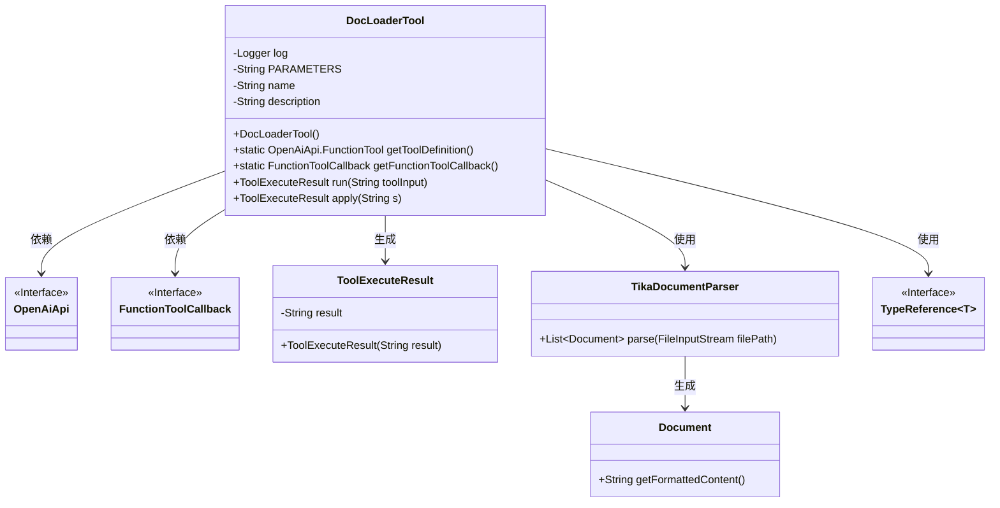
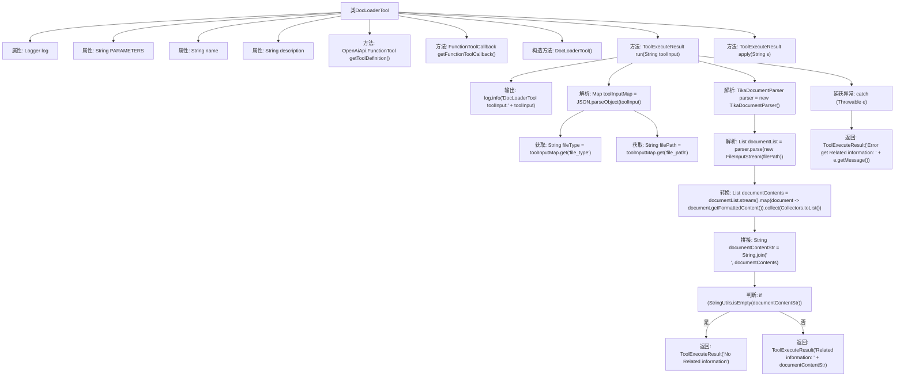

# 基础信息

|      |      |
|------|------|
| 名称 | DocLoaderTool |
| 编码语言 | .java |
| 代码路径 | spring-ai-alibaba/community/openmanus/src/main/java/com/alibaba/cloud/ai/example/manus/tool/DocLoaderTool.java |
| 包名 | com.alibaba.cloud.ai.example.manus.tool |
| 依赖项 | ['com.alibaba.cloud.ai.example.manus.tool.support.ToolExecuteResult', 'com.alibaba.cloud.ai.parser.tika.TikaDocumentParser', 'com.alibaba.fastjson.JSON', 'com.alibaba.fastjson.TypeReference', 'org.apache.commons.lang3.StringUtils', 'org.slf4j.Logger', 'org.slf4j.LoggerFactory', 'java.io.FileInputStream', 'java.util.List', 'java.util.Map', 'java.util.function.Function', 'java.util.stream.Collectors', 'org.springframework.ai.document.Document', 'org.springframework.ai.openai.api.OpenAiApi', 'org.springframework.ai.tool.ToolCallback', 'org.springframework.ai.tool.function.FunctionToolCallback'] |
| 概述说明 | DocLoaderTool类用于加载解析本地文件，支持多类型，返回信息或错误。 |

# 说明

DocLoaderTool类是一个用于加载和解析本地文件内容的工具，支持多种文件类型。其主要功能是读取文件并提取相关信息，同时能够返回处理结果或错误提示，确保文件处理的准确性和可靠性。

# 类列表 Class Summary

| 名称   | 类型  | 说明 |
|-------|------|-------------|
| DocLoaderTool | class | DocLoaderTool类用于加载并解析本地文件内容，支持多种文件类型，返回相关信息或错误提示。 |

## 类 DocLoaderTool

|      |      |
|------|------|
| 访问范围 | public |
| 类型 | class |
| 名称 | DocLoaderTool |
| 说明 | DocLoaderTool类用于加载并解析本地文件内容，支持多种文件类型，返回相关信息或错误提示。 |

### UML类图

**描述：**  
`DocLoaderTool` 类用于加载和解析本地文件内容，并将其转换为可读的信息。它通过 `OpenAiApi.FunctionTool` 和 `FunctionToolCallback` 与外部系统交互，并使用 `TikaDocumentParser` 解析文件内容。`ToolExecuteResult` 用于封装处理结果，`TypeReference` 用于处理泛型类型的 JSON 解析。整个过程包括文件路径的输入、文件内容的解析以及结果的处理和返回。

### 内部方法调用关系图

这段代码定义了一个名为`DocLoaderTool`的类，主要用于加载和解析本地文件内容。它包含多个方法，如`getToolDefinition`用于获取工具定义，`getFunctionToolCallback`用于获取回调函数，`run`方法用于执行文件解析并返回结果。代码通过`TikaDocumentParser`解析文件内容，并将结果拼接成字符串返回。如果解析失败，则返回错误信息。流程图展示了从输入文件路径到返回解析结果的完整流程。

### 字段列表 Field List

| 名称  | 类型  | 说明 |
|-------|-------|------|
| log = LoggerFactory.getLogger(DocLoaderTool.class) | Logger | DocLoaderTool类中定义了一个静态日志记录器。 |
| name = "doc_loader" | String | 定义私有静态常量字符串变量name，值为"doc_loader"。 |
| description = """			Get the content information of a local file at a specified path.			Use this tool when you want to get some related information asked by the user.			This tool accepts the file path and gets the related information content.			""" | String | 获取指定路径本地文件的内容信息，用于响应用户查询。 |
| PARAMETERS = """			{			    "type": "object",			    "properties": {			        "file_type": {			            "type": "string",			            "description": "(required) File type, such as pdf, text, docx, xlsx, csv, etc.."			        },			        "file_path": {			            "type": "string",			            "description": "(required) Get the absolute path of the file from the user request."			        }			    },			    "required": ["file_type","file_path"]			}			""" | String | 定义对象类型参数，需包含文件类型和路径。 |

### 方法列表 Method List

| 名称  | 类型  | 说明 |
|-------|-------|------|
| run | ToolExecuteResult | 解析文件内容并返回相关信息或错误提示。 |
| apply | ToolExecuteResult | 重写apply方法，调用run函数处理输入字符串。 |
| getFunctionToolCallback | FunctionToolCallback | 静态方法返回配置好的FunctionToolCallback实例，包含名称、描述、输入模式和类型。 |
| getToolDefinition | OpenAiApi.FunctionTool | 定义并返回一个包含描述、名称和参数的OpenAI API函数工具。 |

