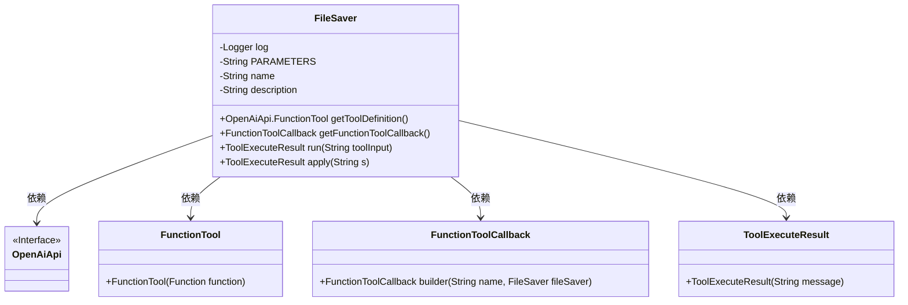
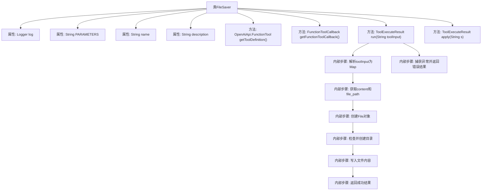

# 基础信息

|      |      |
|------|------|
| 名称 | FileSaver |
| 编码语言 | .java |
| 代码路径 | spring-ai-alibaba/community/openmanus/src/main/java/com/alibaba/cloud/ai/example/manus/tool/FileSaver.java |
| 包名 | com.alibaba.cloud.ai.example.manus.tool |
| 依赖项 | ['java.io.BufferedWriter', 'java.io.File', 'java.io.FileWriter', 'java.io.IOException', 'java.util.Map', 'java.util.function.Function', 'com.alibaba.cloud.ai.example.manus.tool.support.ToolExecuteResult', 'com.alibaba.fastjson.JSON', 'com.alibaba.fastjson.TypeReference', 'org.slf4j.Logger', 'org.slf4j.LoggerFactory', 'org.springframework.ai.openai.api.OpenAiApi', 'org.springframework.ai.tool.function.FunctionToolCallback'] |
| 概述说明 | FileSaver类提供将内容保存至指定路径的本地文件功能。 |

# 说明

FileSaver类的主要功能是将指定内容保存到本地文件的指定路径。该类通过实现文件保存的逻辑，确保用户能够将数据或信息持久化存储在本地磁盘上。它通常涉及文件的创建、写入和关闭操作，确保数据准确无误地保存到目标路径。FileSaver类在需要本地文件存储的场景中非常实用，能够简化文件操作流程。

# 类列表 Class Summary

| 名称   | 类型  | 说明 |
|-------|------|-------------|
| FileSaver | class | FileSaver类实现将内容保存到指定路径的本地文件功能。 |

## 类 FileSaver

|      |      |
|------|------|
| 访问范围 | public |
| 类型 | class |
| 名称 | FileSaver |
| 说明 | FileSaver类实现将内容保存到指定路径的本地文件功能。 |

### UML类图

这段代码定义了一个 `FileSaver` 类，用于将内容保存到本地文件。`FileSaver` 类实现了 `Function<String, ToolExecuteResult>` 接口，并提供了工具定义和回调方法。通过 `run` 方法，类解析输入参数并将内容写入指定文件路径。如果目录不存在，则创建目录。`apply` 方法调用 `run` 方法执行保存操作。类中还定义了工具的名称、描述和参数结构，用于与外部系统（如 OpenAI API）交互。

### 内部方法调用关系图

**描述：**
该流程图展示了`FileSaver`类的结构和主要方法调用关系。`FileSaver`类用于将内容保存到指定路径的文件中。它包含多个属性，如日志记录器、参数定义、工具名称和描述。主要方法包括获取工具定义、获取回调函数、运行工具以及应用工具。在`run`方法中，代码解析输入参数，创建文件，检查并创建目录，写入文件内容，最后返回执行结果或捕获异常并返回错误信息。

### 字段列表 Field List

| 名称  | 类型  | 说明 |
|-------|-------|------|
| log = LoggerFactory.getLogger(FileSaver.class) | Logger | FileSaver类中定义了一个私有的静态Logger对象。 |
| PARAMETERS = """			{			    "type": "object",			    "properties": {			        "content": {			            "type": "string",			            "description": "(required) The content to save to the file."			        },			        "file_path": {			            "type": "string",			            "description": "(required) The path where the file should be saved, including filename and extension."			        }			    },			    "required": ["content", "file_path"]			}			""" | String | 定义JSON对象，包含必填字段：内容和文件路径。 |
| description = """			Save content to a local file at a specified path.			Use this tool when you need to save text, code, or generated content to a file on the local filesystem.			The tool accepts content and a file path, and saves the content to that location.			""" | String | 将内容保存到指定路径的本地文件，支持文本、代码和生成内容。 |
| name = "file_saver" | String | 私有静态常量字符串名为"file_saver"。 |

### 方法列表 Method List

| 名称  | 类型  | 说明 |
|-------|-------|------|
| apply | ToolExecuteResult | 重写apply方法，调用run函数执行操作。 |
| getToolDefinition | OpenAiApi.FunctionTool | 静态方法返回OpenAiApi.FunctionTool实例，包含描述、名称和参数。 |
| getFunctionToolCallback | FunctionToolCallback | 获取函数工具回调实例，包含名称、文件保存器、描述、输入模式和输入类型。 |
| run | ToolExecuteResult | 方法将JSON输入解析并保存内容到指定文件路径，成功返回保存信息，失败返回错误信息。 |

