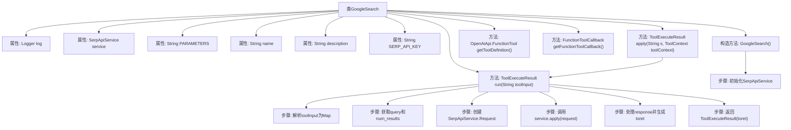
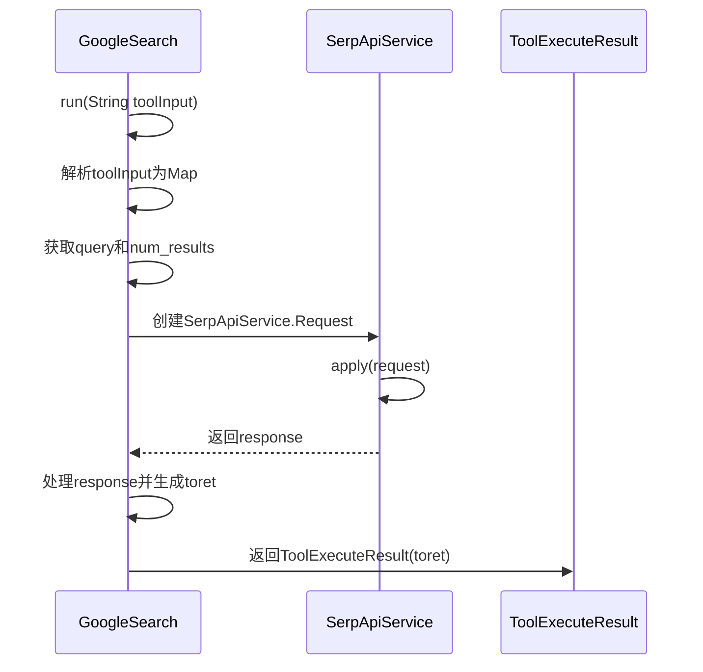

# 基础信息

|      |      |
|------|------|
| 名称 | GoogleSearch |
| 编码语言 | .java |
| 代码路径 | spring-ai-alibaba/community/openmanus/src/main/java/com/alibaba/cloud/ai/example/manus/tool/GoogleSearch.java |
| 包名 | com.alibaba.cloud.ai.example.manus.tool |
| 依赖项 | ['com.alibaba.cloud.ai.example.manus.flow.PlanningFlow', 'com.alibaba.cloud.ai.example.manus.tool.support.ToolExecuteResult', 'com.alibaba.cloud.ai.example.manus.tool.support.serpapi.SerpApiProperties', 'com.alibaba.cloud.ai.example.manus.tool.support.serpapi.SerpApiService', 'com.alibaba.fastjson.JSON', 'com.alibaba.fastjson.TypeReference', 'org.slf4j.Logger', 'org.slf4j.LoggerFactory', 'java.util.ArrayList', 'java.util.List', 'java.util.Map', 'java.util.function.BiFunction', 'java.util.function.Function', 'org.springframework.ai.chat.memory.InMemoryChatMemory', 'org.springframework.ai.chat.model.ToolContext', 'org.springframework.ai.openai.api.OpenAiApi', 'org.springframework.ai.tool.function.FunctionToolCallback'] |
| 概述说明 | GoogleSearch类实现搜索功能，返回相关链接列表。 |

# 说明

GoogleSearch类是一个用于实现Google搜索功能的工具，其主要功能是通过调用相关接口或方法，执行搜索操作并返回与搜索关键词相关的链接列表。该类的核心目的是简化搜索过程，使用户能够快速获取与查询内容相匹配的网页链接，从而提高信息检索的效率。

# 类列表 Class Summary

| 名称   | 类型  | 说明 |
|-------|------|-------------|
| GoogleSearch | class | GoogleSearch类实现Google搜索功能，返回相关链接列表。 |


## 类 GoogleSearch

|      |      |
|------|------|
| 访问范围 | public |
| 类型 | class |
| 名称 | GoogleSearch |
| 说明 | GoogleSearch类实现Google搜索功能，返回相关链接列表。 |


### UML类图

```mermaid
classDiagram
    class GoogleSearch {
        -Logger log
        -SerpApiService service
        -static String PARAMETERS
        -static String name
        -static String description
        -static String SERP_API_KEY
        +GoogleSearch()
        +static OpenAiApi.FunctionTool getToolDefinition()
        +static FunctionToolCallback getFunctionToolCallback()
        +ToolExecuteResult run(String toolInput)
        +ToolExecuteResult apply(String s, ToolContext toolContext)
    }
    class SerpApiService {
        +SerpApiService(SerpApiProperties properties)
        +Map~String, Object~ apply(SerpApiService.Request request)
    }
    class SerpApiProperties {
        +SerpApiProperties(String apiKey, String engine)
    }
    class OpenAiApi.FunctionTool {
        +OpenAiApi.FunctionTool(OpenAiApi.FunctionTool.Function function)
    }
    class OpenAiApi.FunctionTool.Function {
        +OpenAiApi.FunctionTool.Function(String description, String name, String parameters)
    }
    class FunctionToolCallback {
        +static FunctionToolCallback builder(String name, GoogleSearch googleSearch)
        +FunctionToolCallback description(String description)
        +FunctionToolCallback inputSchema(String inputSchema)
        +FunctionToolCallback inputType(Class~String~ inputType)
        +FunctionToolCallback build()
    }
    class ToolExecuteResult {
        +ToolExecuteResult(String result)
    }
    class ToolContext {
        // ToolContext类的内容未提供
    }
    class Logger {
        // Logger类的内容未提供
    }
    class LoggerFactory {
        +static Logger getLogger(Class~?~ clazz)
    }
    class Map~String, Object~ {
        // Map类的内容未提供
    }
    class List~Map~String, Object~~ {
        // List类的内容未提供
    }
    class TypeReference~Map~String, Object~~ {
        // TypeReference类的内容未提供
    }
    class JSON {
        +static Map~String, Object~ parseObject(String json, TypeReference~Map~String, Object~~ typeRef)
    }
    class ArrayList~String~ {
        // ArrayList类的内容未提供
    }

    GoogleSearch --> SerpApiService : 依赖
    GoogleSearch --> OpenAiApi.FunctionTool : 依赖
    GoogleSearch --> FunctionToolCallback : 依赖
    GoogleSearch --> ToolExecuteResult : 依赖
    GoogleSearch --> Logger : 依赖
    GoogleSearch --> LoggerFactory : 依赖
    GoogleSearch --> Map~String, Object~ : 依赖
    GoogleSearch --> List~Map~String, Object~~ : 依赖
    GoogleSearch --> TypeReference~Map~String, Object~~ : 依赖
    GoogleSearch --> JSON : 依赖
    GoogleSearch --> ArrayList~String~ : 依赖
    SerpApiService --> SerpApiProperties : 依赖
    FunctionToolCallback --> GoogleSearch : 依赖
```

这段代码定义了一个名为 `GoogleSearch` 的类，该类实现了 `BiFunction` 接口，用于执行 Google 搜索并返回搜索结果。`GoogleSearch` 类依赖于多个其他类，如 `SerpApiService` 用于与 SerpAPI 服务交互，`OpenAiApi.FunctionTool` 和 `FunctionToolCallback` 用于定义和回调函数工具，`ToolExecuteResult` 用于封装执行结果。此外，`GoogleSearch` 类还使用了日志记录、JSON 解析、集合操作等功能。


### 内部方法调用关系图





这段代码定义了一个名为`GoogleSearch`的类，该类实现了`BiFunction`接口，用于执行Google搜索并返回搜索结果。代码首先初始化了`SerpApiService`，然后通过解析输入参数、创建请求、调用服务并处理响应来生成最终的结果。流程图展示了类的结构和方法之间的调用关系，时序图则详细描述了`run`方法的执行流程。

### 字段列表 Field List

| 名称  | 类型  | 说明 |
|-------|-------|------|
| service | SerpApiService | 声明私有SerpApiService服务实例。 |
| name = "google_search" | String | 定义私有静态常量字符串"google_search"。 |
| description = """			Perform a Google search and return a list of relevant links.			Use this tool when you need to find information on the web, get up-to-date data, or research specific topics.			The tool returns a list of URLs that match the search query.			""" | String | 执行谷歌搜索并返回相关链接列表，用于查找信息、获取最新数据或研究特定主题。 |
| log = LoggerFactory.getLogger(GoogleSearch.class) | Logger | GoogleSearch类中定义了一个私有的静态日志记录器。 |
| PARAMETERS = """			{			    "type": "object",			    "properties": {			        "query": {			            "type": "string",			            "description": "(required) The search query to submit to Google."			        },			        "num_results": {			            "type": "integer",			            "description": "(optional) The number of search results to return. Default is 10.",			            "default": 10			        }			    },			    "required": ["query"]			}			""" | String | 定义JSON对象，包含查询字符串和结果数量，查询必填，结果数默认为10。 |
| SERP_API_KEY = System.getenv("SERP_API_KEY") | String | 从环境变量获取SERP_API_KEY并设为私有静态常量。 |

### 方法列表 Method List

| 名称  | 类型  | 说明 |
|-------|-------|------|
| getToolDefinition | OpenAiApi.FunctionTool | 定义并返回OpenAiApi功能工具实例。 |
| getFunctionToolCallback | FunctionToolCallback | 获取函数工具回调，构建包含名称、Google搜索、描述、输入模式和输入类型。 |
| apply | ToolExecuteResult | 重写apply方法，调用run方法并返回结果。 |
| run | ToolExecuteResult | 方法解析Google搜索输入，提取查询和结果数量，调用API获取响应，根据响应内容返回不同结果。 |


