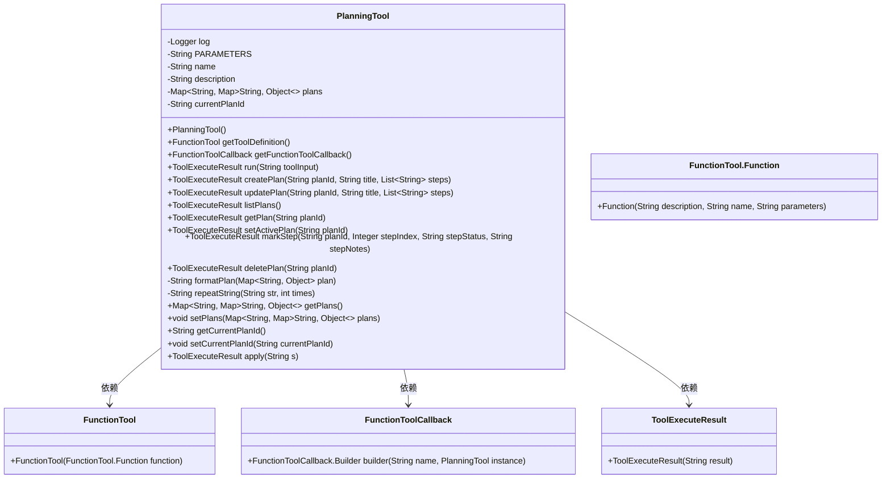

# 基础信息

|      |      |
|------|------|
| 名称 | PlanningTool |
| 编码语言 | .java |
| 代码路径 | spring-ai-alibaba/community/openmanus/src/main/java/com/alibaba/cloud/ai/example/manus/tool/PlanningTool.java |
| 包名 | com.alibaba.cloud.ai.example.manus.tool |
| 依赖项 | ['com.alibaba.cloud.ai.example.manus.tool.support.ToolExecuteResult', 'com.alibaba.fastjson.JSON', 'com.alibaba.fastjson.TypeReference', 'org.springframework.ai.openai.api.OpenAiApi.FunctionTool', 'org.springframework.ai.tool.function.FunctionToolCallback', 'org.springframework.ai.tool.metadata.ToolMetadata', 'org.slf4j.Logger', 'org.slf4j.LoggerFactory', 'java.util', 'java.util.function.Function'] |
| 概述说明 | PlanningTool类用于管理复杂任务，支持计划创建、更新、列出、获取、激活、标记和删除。 |

# 说明

PlanningTool类是一个用于创建和管理复杂任务计划的工具，提供了多种功能以支持任务的全面管理。它允许用户创建新的计划，更新现有计划的内容，列出所有计划，获取特定计划的详细信息，激活计划以开始执行，标记计划中的步骤以跟踪进度，以及删除不再需要的计划。通过这些功能，PlanningTool类能够有效地帮助用户组织和监控复杂任务的执行过程。

# 类列表 Class Summary

| 名称   | 类型  | 说明 |
|-------|------|-------------|
| PlanningTool | class | PlanningTool类用于创建和管理复杂任务的计划，支持创建、更新、列出、获取、激活、标记步骤和删除计划。 |

## 类 PlanningTool

|      |      |
|------|------|
| 访问范围 | public |
| 类型 | class |
| 名称 | PlanningTool |
| 说明 | PlanningTool类用于创建和管理复杂任务的计划，支持创建、更新、列出、获取、激活、标记步骤和删除计划。 |

### UML类图

**描述：**  
`PlanningTool` 是一个用于创建和管理计划的工具类，实现了 `Function<String, ToolExecuteResult>` 接口。它提供了创建、更新、列出、获取、设置活动计划、标记步骤状态和删除计划的功能。通过 `getToolDefinition` 和 `getFunctionToolCallback` 方法，工具的定义和回调机制被封装。`run` 方法根据输入的命令执行相应的操作，并将结果封装在 `ToolExecuteResult` 中返回。

### 内部方法调用关系图

```mermaid
graph TD
    A["类PlanningTool"]
    B["属性: Logger log"]
    C["属性: String PARAMETERS"]
    D["属性: String name"]
    E["属性: String description"]
    F["属性: Map<String, Map<String, Object>> plans"]
    G["属性: String currentPlanId"]
    H["方法: FunctionTool getToolDefinition()"]
    I["方法: FunctionToolCallback getFunctionToolCallback()"]
    J["方法: ToolExecuteResult run(String toolInput)"]
    K["方法: ToolExecuteResult createPlan(String planId, String title, List<String> steps)"]
    L["方法: ToolExecuteResult updatePlan(String planId, String title, List<String> steps)"]
    M["方法: ToolExecuteResult listPlans()"]
    N["方法: ToolExecuteResult getPlan(String planId)"]
    O["方法: ToolExecuteResult setActivePlan(String planId)"]
    P["方法: ToolExecuteResult markStep(String planId, Integer stepIndex, String stepStatus, String stepNotes)"]
    Q["方法: ToolExecuteResult deletePlan(String planId)"]
    R["方法: String formatPlan(Map<String, Object> plan)"]
    S["方法: String repeatString(String str, int times)"]
    T["方法: Map<String, Map<String, Object>> getPlans()"]
    U["方法: void setPlans(Map<String, Map<String, Object>> plans)"]
    V["方法: String getCurrentPlanId()"]
    W["方法: void setCurrentPlanId(String currentPlanId)"]
    X["方法: ToolExecuteResult apply(String s)"]

    A --> B
    A --> C
    A --> D
    A --> E
    A --> F
    A --> G
    A --> H
    A --> I
    A --> J
    A --> K
    A --> L
    A --> M
    A --> N
    A --> O
    A --> P
    A --> Q
    A --> R
    A --> S
    A --> T
    A --> U
    A --> V
    A --> W
    A --> X
```

这段代码定义了一个名为 `PlanningTool` 的类，用于管理和执行与计划相关的操作。类中包含多个方法，如创建计划、更新计划、列出计划、获取计划、设置活动计划、标记步骤状态、删除计划等。代码还定义了工具的参数、名称和描述，并通过 `getToolDefinition` 和 `getFunctionToolCallback` 方法返回工具的定义和回调函数。流程图展示了类中各个属性和方法之间的调用关系，帮助理解代码的结构和功能。

### 字段列表 Field List

| 名称  | 类型  | 说明 |
|-------|-------|------|
| log = LoggerFactory.getLogger(PlanningTool.class) | Logger | 定义PlanningTool类的静态日志记录器实例。 |
| INSTANCE = new PlanningTool() | PlanningTool | 静态单例PlanningTool实例化。 |
| name = "planning" | String | 定义私有静态常量字符串name，值为"planning"。 |
| plans = new HashMap<>() | Map<String, Map<String, Object>> | 私有变量plans为嵌套HashMap，存储键值对。 |
| PARAMETERS = """			{			    "type": "object",			    "properties": {			        "command": {			            "description": "The command to execute. Available commands: create, update, list, get, set_active, mark_step, delete.",			            "enum": [			                "create",			                "update",			                "list",			                "get",			                "set_active",			                "mark_step",			                "delete"			            ],			            "type": "string"			        },			        "plan_id": {			            "description": "Unique identifier for the plan. Required for create, update, set_active, and delete commands. Optional for get and mark_step (uses active plan if not specified).",			            "type": "string"			        },			        "title": {			            "description": "Title for the plan. Required for create command, optional for update command.",			            "type": "string"			        },			        "steps": {			            "description": "List of plan steps. Required for create command, optional for update command.",			            "type": "array",			            "items": {			                "type": "string"			            }			        },			        "step_index": {			            "description": "Index of the step to update (0-based). Required for mark_step command.",			            "type": "integer"			        },			        "step_status": {			            "description": "Status to set for a step. Used with mark_step command.",			            "enum": ["not_started", "in_progress", "completed", "blocked"],			            "type": "string"			        },			        "step_notes": {			            "description": "Additional notes for a step. Optional for mark_step command.",			            "type": "string"			        }			    },			    "required": ["command"],			    "additionalProperties": false			}			""" | String | 定义JSON对象参数，包含命令、计划ID、标题、步骤、步骤索引、步骤状态和步骤备注等字段。 |
| currentPlanId | String | 私有字符串变量存储当前计划ID。 |
| description = """			A planning tool that allows the agent to create and manage plans for solving complex tasks.			The tool provides functionality for creating plans, updating plan steps, and tracking progress.			""" | String | 规划工具，支持创建、更新步骤及跟踪进度，用于解决复杂任务。 |

### 方法列表 Method List

| 名称  | 类型  | 说明 |
|-------|-------|------|
| getCurrentPlanId | String | 获取当前计划ID的方法。 |
| getPlans | Map<String, Map<String, Object>> | 该方法返回包含计划信息的嵌套映射。 |
| repeatString | String | 该方法重复拼接字符串指定次数并返回结果。 |
| apply | ToolExecuteResult | 重写apply方法，调用run方法执行并返回结果。 |
| deletePlan | ToolExecuteResult | 删除指定ID的计划，若ID为空或不存在则抛出异常，成功删除后返回结果。 |
| getToolDefinition | FunctionTool | 静态方法返回包含描述、名称和参数的FunctionTool对象。 |
| updatePlan | ToolExecuteResult | 更新计划方法，验证ID和步骤，更新标题和步骤状态，返回成功信息。 |
| formatPlan | String | 格式化计划，显示标题、ID、进度统计和步骤状态及备注。 |
| setActivePlan | ToolExecuteResult | 方法setActivePlan设置当前计划，需非空ID且存在，否则抛出异常。 |
| getPlan | ToolExecuteResult | 方法获取计划，检查ID有效性，返回格式化结果。 |
| setCurrentPlanId | void | 设置当前计划ID的方法。 |
| run | ToolExecuteResult | 解析输入并执行相应命令，支持创建、更新、列出、获取、激活、标记步骤和删除计划。 |
| listPlans | ToolExecuteResult | 方法列出可用计划，显示计划ID、标题、进度及当前活动状态。若无计划，提示创建新计划。 |
| setPlans | void | 设置计划方法，接收嵌套映射参数并赋值给类成员变量。 |
| createPlan | ToolExecuteResult | 创建计划方法，验证参数并生成新计划，返回成功信息。 |
| markStep | ToolExecuteResult | 方法`markStep`用于更新计划步骤状态和备注，需提供计划ID、步骤索引、状态和备注，并进行有效性检查。 |
| getFunctionToolCallback | FunctionToolCallback | 获取FunctionToolCallback实例，配置名称、描述、输入模式和元数据。 |

