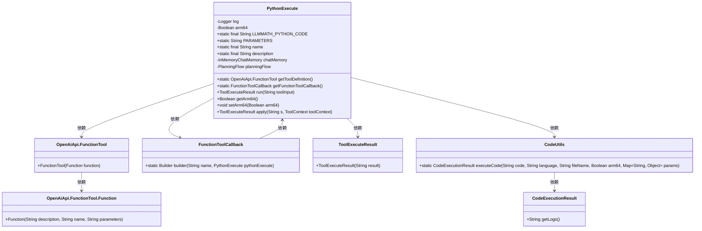

# 基础信息

|      |      |
|------|------|
| 名称 | PythonExecute |
| 编码语言 | .java |
| 代码路径 | spring-ai-alibaba/community/openmanus/src/main/java/com/alibaba/cloud/ai/example/manus/tool/PythonExecute.java |
| 包名 | com.alibaba.cloud.ai.example.manus.tool |
| 依赖项 | ['com.alibaba.cloud.ai.example.manus.flow.PlanningFlow', 'com.alibaba.cloud.ai.example.manus.tool.support.ToolExecuteResult', 'com.alibaba.fastjson.JSON', 'com.alibaba.fastjson.TypeReference', 'com.alibaba.cloud.ai.example.manus.tool.support.CodeExecutionResult', 'com.alibaba.cloud.ai.example.manus.tool.support.CodeUtils', 'com.alibaba.cloud.ai.example.manus.tool.support.LogIdGenerator', 'org.slf4j.Logger', 'org.slf4j.LoggerFactory', 'java.util.HashMap', 'java.util.Map', 'java.util.function.BiFunction', 'java.util.function.Function', 'org.springframework.ai.chat.memory.InMemoryChatMemory', 'org.springframework.ai.chat.model.ToolContext', 'org.springframework.ai.openai.api.OpenAiApi', 'org.springframework.ai.tool.function.FunctionToolCallback'] |
| 概述说明 | PythonExecute类支持ARM64架构，执行Python代码并输出结果。 |

# 说明

PythonExecute类实现了Python代码的执行功能，并特别支持ARM64架构。该类能够接收Python代码作为输入，执行该代码，并返回执行结果。这一功能使得在ARM64架构的设备上运行Python代码成为可能，为开发者提供了跨平台的代码执行能力。通过该类，用户可以轻松地在不同架构的设备上测试和运行Python代码，确保代码的兼容性和执行效果。

# 类列表 Class Summary

| 名称   | 类型  | 说明 |
|-------|------|-------------|
| PythonExecute | class | PythonExecute类实现Python代码执行，支持ARM64架构，输出执行结果。 |

## 类 PythonExecute

|      |      |
|------|------|
| 访问范围 | public |
| 类型 | class |
| 名称 | PythonExecute |
| 说明 | PythonExecute类实现Python代码执行，支持ARM64架构，输出执行结果。 |

### UML类图

### 描述
该代码定义了一个`PythonExecute`类，实现了`BiFunction`接口，用于执行Python代码并返回执行结果。类中包含静态常量和方法，用于定义和执行Python代码，并通过`OpenAiApi.FunctionTool`和`FunctionToolCallback`与外部工具进行交互。`PythonExecute`类依赖于`CodeUtils`类来执行代码，并生成`ToolExecuteResult`对象作为执行结果。整个设计旨在通过清晰的接口和工具类实现Python代码的执行和结果返回。

### 内部方法调用关系图

```mermaid
graph TD
    A["类PythonExecute"]
    B["属性: Logger log"]
    C["属性: Boolean arm64"]
    D["常量: String LLMMATH_PYTHON_CODE"]
    E["常量: String PARAMETERS"]
    F["常量: String name"]
    G["常量: String description"]
    H["方法: OpenAiApi.FunctionTool getToolDefinition()"]
    I["方法: FunctionToolCallback getFunctionToolCallback()"]
    J["属性: InMemoryChatMemory chatMemory"]
    K["属性: PlanningFlow planningFlow"]
    L["方法: ToolExecuteResult run(String toolInput)"]
    M["方法: Boolean getArm64()"]
    N["方法: void setArm64(Boolean arm64)"]
    O["方法: ToolExecuteResult apply(String s, ToolContext toolContext)"]

    A --> B
    A --> C
    A --> D
    A --> E
    A --> F
    A --> G
    A --> H
    A --> I
    A --> J
    A --> K
    A --> L
    A --> M
    A --> N
    A --> O

    L --> P["log.info('PythonExecute toolInput:' + toolInput)"]
    L --> Q["Map<String, Object> toolInputMap = JSON.parseObject(toolInput, new TypeReference<Map<String, Object>>() {})"]
    L --> R["String code = (String) toolInputMap.get('code')"]
    L --> S["CodeExecutionResult codeExecutionResult = CodeUtils.executeCode(code, 'python', 'tmp_' + LogIdGenerator.generateUniqueId() + '.py', arm64, new HashMap<>())"]
    L --> T["String result = codeExecutionResult.getLogs()"]
    L --> U["return new ToolExecuteResult(result)"]

    O --> V["return run(s)"]
```

这段代码定义了一个名为 `PythonExecute` 的类，该类实现了 `BiFunction<String, ToolContext, ToolExecuteResult>` 接口。主要功能是执行传入的 Python 代码，并返回执行结果。代码中包含多个常量和方法，如 `getToolDefinition()` 用于获取工具定义，`getFunctionToolCallback()` 用于获取工具回调，`run()` 方法用于执行 Python 代码并返回结果。代码还包含了日志记录、输入参数解析、代码执行和结果返回等步骤。整体流程清晰，功能明确。

### 字段列表 Field List

| 名称  | 类型  | 说明 |
|-------|-------|------|
| chatMemory | InMemoryChatMemory | 私有内存聊天记录实例。 |
| planningFlow | PlanningFlow | 私有变量planningFlow，类型为PlanningFlow。 |
| arm64 = true | Boolean | 变量arm64为布尔类型，初始值为true。 |
| LLMMATH_PYTHON_CODE = """			import sys			import math			import numpy as np			import numexpr as ne			input = '%s'			res = ne.evaluate(input)			print(res)			""" | String | 定义Python代码，导入库并计算输入表达式，输出结果。 |
| name = "python_execute" | String | 定义私有静态常量字符串变量"python_execute"。 |
| log = LoggerFactory.getLogger(PythonExecute.class) | Logger | PythonExecute类中定义了一个静态的日志记录器log。 |
| description = """			Executes Python code string. Note: Only print outputs are visible, function return values are not captured. Use print statements to see results.			""" | String | 执行Python代码字符串，仅显示print输出，不捕获函数返回值。 |
| PARAMETERS = """			{			    "type": "object",			    "properties": {			        "code": {			            "type": "string",			            "description": "The Python code to execute."			        }			    },			    "required": ["code"]			}			""" | String | 定义JSON对象，包含执行Python代码的参数，code为必填字符串。 |

### 方法列表 Method List

| 名称  | 类型  | 说明 |
|-------|-------|------|
| getToolDefinition | OpenAiApi.FunctionTool | 定义并返回OpenAiApi功能工具实例。 |
| run | ToolExecuteResult | 执行Python代码并返回结果日志。 |
| apply | ToolExecuteResult | 重写apply方法，调用run方法执行并返回结果。 |
| getFunctionToolCallback | FunctionToolCallback | 获取函数工具回调，构建Python执行器，描述和输入模式。 |
| getArm64 | Boolean | 该方法返回布尔值，表示是否为ARM64架构。 |
| setArm64 | void | 设置ARM64架构状态的Java方法。 |

