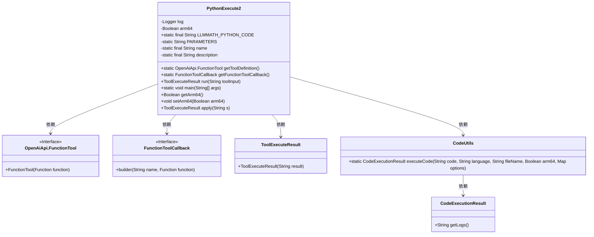
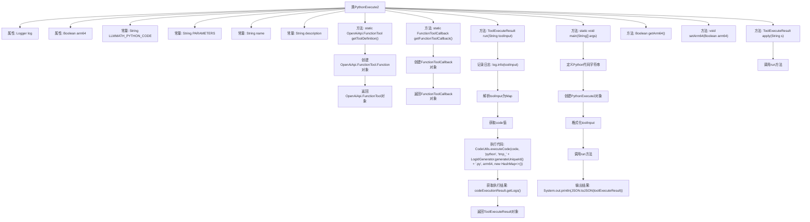

# 基础信息

|      |      |
|------|------|
| 名称 | PythonExecute2 |
| 编码语言 | .java |
| 代码路径 | spring-ai-alibaba/community/openmanus/src/main/java/com/alibaba/cloud/ai/example/manus/tool/PythonExecute2.java |
| 包名 | com.alibaba.cloud.ai.example.manus.tool |
| 依赖项 | ['java.util.HashMap', 'java.util.Map', 'java.util.function.Function', 'com.alibaba.cloud.ai.example.manus.tool.support.CodeExecutionResult', 'com.alibaba.cloud.ai.example.manus.tool.support.CodeUtils', 'com.alibaba.cloud.ai.example.manus.tool.support.LogIdGenerator', 'com.alibaba.cloud.ai.example.manus.tool.support.ToolExecuteResult', 'com.alibaba.fastjson.JSON', 'com.alibaba.fastjson.TypeReference', 'org.slf4j.Logger', 'org.slf4j.LoggerFactory', 'org.springframework.ai.openai.api.OpenAiApi', 'org.springframework.ai.tool.function.FunctionToolCallback'] |
| 概述说明 | PythonExecute2类实现字符串转工具执行结果，支持Python代码执行并返回。 |

# 说明

PythonExecute2类是一个用于将字符串转换为工具执行结果的工具。它支持执行Python代码，并能够返回执行结果。该类的主要功能是将输入的Python代码字符串进行解析和执行，然后将执行结果返回给调用者。通过这种方式，用户可以方便地在程序中动态执行Python代码，并获取相应的输出。这种功能在需要动态生成或执行代码的场景中非常有用，例如在脚本编写、自动化测试或数据分析等应用中。

# 类列表 Class Summary

| 名称   | 类型  | 说明 |
|-------|------|-------------|
| PythonExecute2 | class | PythonExecute2类实现字符串到工具执行结果的转换，支持Python代码执行并返回结果。 |

## 类 PythonExecute2

|      |      |
|------|------|
| 访问范围 | public |
| 类型 | class |
| 名称 | PythonExecute2 |
| 说明 | PythonExecute2类实现字符串到工具执行结果的转换，支持Python代码执行并返回结果。 |

### UML类图

### 类图描述：
该代码定义了一个名为 `PythonExecute2` 的类，实现了 `Function<String, ToolExecuteResult>` 接口。`PythonExecute2` 类主要用于执行 Python 代码，并通过 `run` 方法返回执行结果。类中包含了一些静态常量和方法，如 `getToolDefinition` 和 `getFunctionToolCallback`，用于获取工具定义和回调函数。`PythonExecute2` 依赖于 `OpenAiApi.FunctionTool`、`FunctionToolCallback`、`ToolExecuteResult` 和 `CodeUtils` 等类，其中 `CodeUtils` 负责实际执行代码并返回执行结果。

### 内部方法调用关系图

这段代码定义了一个名为`PythonExecute2`的类，用于执行Python代码并返回执行结果。类中包含多个方法和属性，主要用于获取和设置配置、执行Python代码、以及处理执行结果。代码的核心功能是通过`run`方法执行传入的Python代码，并返回执行日志。`main`方法展示了如何使用该类执行一段Python代码，并输出执行结果。

### 字段列表 Field List

| 名称  | 类型  | 说明 |
|-------|-------|------|
| log = LoggerFactory.getLogger(PythonExecute2.class) | Logger | PythonExecute2类中定义了静态日志记录器log。 |
| arm64 = false | Boolean | 定义布尔变量arm64，初始值为false。 |
| description = """			Executes Python code string. Note: Only print outputs are visible, function return values are not captured. Use print statements to see results.			""" | String | 执行Python代码字符串，仅显示打印输出，不捕获函数返回值。 |
| PARAMETERS = """			{			    "type": "object",			    "properties": {			        "code": {			            "type": "string",			            "description": "The Python code to execute."			        }			    },			    "required": ["code"]			}			""" | String | 定义JSON对象，包含字符串类型属性"code"，为必填项，描述为执行Python代码。 |
| LLMMATH_PYTHON_CODE = "import sys; import math; import numpy as np; import numexpr as ne; input = '%s'; res = ne.evaluate(input); print(res)" | String | 静态字符串LLMMATH_PYTHON_CODE包含Python代码，用于计算输入表达式并输出结果。 |
| name = "python_execute" | String | 定义私有静态常量字符串变量名为"python_execute"。 |

### 方法列表 Method List

| 名称  | 类型  | 说明 |
|-------|-------|------|
| setArm64 | void | 设置ARM64架构的布尔值。 |
| getArm64 | Boolean | 获取arm64架构状态的布尔值。 |
| main | void | Java代码执行Python脚本，生成阿里巴巴股价趋势图并显示。 |
| getToolDefinition | OpenAiApi.FunctionTool | 静态方法返回OpenAiApi.FunctionTool实例，包含描述、名称和参数。 |
| getFunctionToolCallback | FunctionToolCallback | 获取函数工具回调，包含名称、描述、输入模式和输入类型。 |
| apply | ToolExecuteResult | 重写apply方法，调用run函数执行操作。 |
| run | ToolExecuteResult | 方法运行Python代码并返回执行结果。 |

