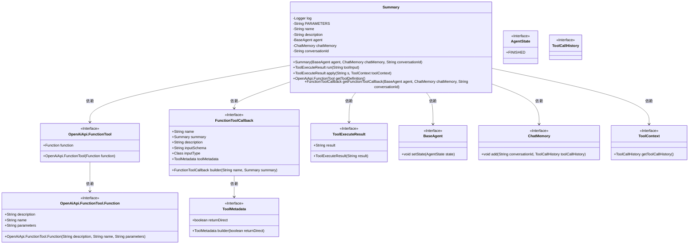
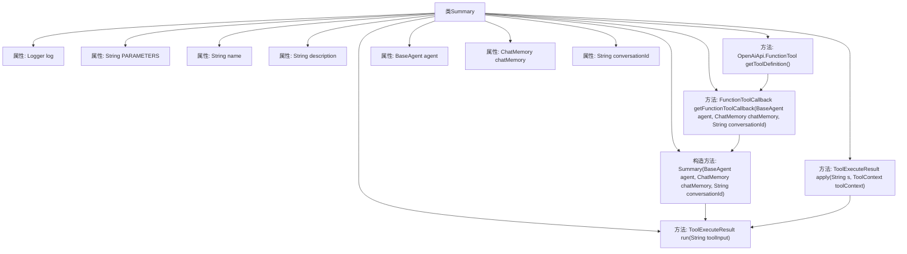

# 基础信息

|      |      |
|------|------|
| 名称 | Summary |
| 编码语言 | .java |
| 代码路径 | spring-ai-alibaba/community/openmanus/src/main/java/com/alibaba/cloud/ai/example/manus/tool/Summary.java |
| 包名 | com.alibaba.cloud.ai.example.manus.tool |
| 依赖项 | ['java.util.function.BiFunction', 'java.util.function.Function', 'com.alibaba.cloud.ai.example.manus.agent.AgentState', 'com.alibaba.cloud.ai.example.manus.agent.BaseAgent', 'com.alibaba.cloud.ai.example.manus.flow.PlanningFlow', 'com.alibaba.cloud.ai.example.manus.tool.support.ToolExecuteResult', 'org.slf4j.Logger', 'org.slf4j.LoggerFactory', 'org.springframework.ai.chat.memory.ChatMemory', 'org.springframework.ai.chat.memory.InMemoryChatMemory', 'org.springframework.ai.chat.model.ToolContext', 'org.springframework.ai.openai.api.OpenAiApi', 'org.springframework.ai.tool.function.FunctionToolCallback', 'org.springframework.ai.tool.metadata.ToolMetadata'] |
| 概述说明 | Summary类记录步骤总结并终止步骤，含工具定义和回调方法。 |

# 说明

Summary类用于记录和终止当前步骤的总结信息，其中包含工具的定义和回调方法，确保步骤的完整性和可追溯性。

# 类列表 Class Summary

| 名称   | 类型  | 说明 |
|-------|------|-------------|
| Summary | class | Summary类用于记录当前步骤的总结并终止该步骤，包含工具定义和回调方法。 |

## 类 Summary

|      |      |
|------|------|
| 访问范围 | public |
| 类型 | class |
| 名称 | Summary |
| 说明 | Summary类用于记录当前步骤的总结并终止该步骤，包含工具定义和回调方法。 |

### UML类图

**类图描述：**  
该代码定义了一个名为 `Summary` 的类，实现了 `BiFunction` 接口，用于处理工具执行结果并记录当前步骤的摘要。`Summary` 类依赖于多个接口，包括 `OpenAiApi.FunctionTool`、`FunctionToolCallback`、`BaseAgent`、`ChatMemory` 和 `ToolContext`，用于获取工具定义、回调函数、代理状态、聊天记忆和工具上下文信息。`Summary` 类通过 `run` 和 `apply` 方法执行工具操作，并返回 `ToolExecuteResult` 结果。

### 内部方法调用关系图

这段代码定义了一个名为`Summary`的类，实现了`BiFunction`接口。该类用于记录当前步骤的摘要并终止当前步骤。它包含多个属性和方法，包括获取工具定义、获取回调函数、运行工具以及应用工具的方法。流程图展示了类中各部分的关系和调用顺序。

### 字段列表 Field List

| 名称  | 类型  | 说明 |
|-------|-------|------|
| log = LoggerFactory.getLogger(Summary.class) | Logger | 私有静态日志记录器，用于Summary类的日志输出。 |
| chatMemory | ChatMemory | 私有ChatMemory实例变量chatMemory。 |
| conversationId | String | 定义了一个私有字符串变量conversationId。 |
| agent | BaseAgent | 定义了一个私有变量agent，类型为BaseAgent。 |
| name = "summary" | String | 定义私有静态常量字符串变量名为summary。 |
| description = "Record the summary of current step. and terminate the current step ." | String | 记录当前步骤摘要并终止该步骤。 |
| PARAMETERS = """			{			  "type" : "object",			  "properties" : {			    "summary" : {			      "type" : "string",			      "description" : "The output of current step, better make a summary."			    }			  },			  "required" : [ "summary" ]			}			""" | String | 定义JSON对象参数，包含必填的“summary”字符串属性。 |

### 方法列表 Method List

| 名称  | 类型  | 说明 |
|-------|-------|------|
| apply | ToolExecuteResult | 重写apply方法，调用run并返回结果。 |
| run | ToolExecuteResult | 方法run接收工具输入，记录日志，设置代理状态为完成，返回执行结果。 |
| getFunctionToolCallback | FunctionToolCallback | 创建函数工具回调，包含名称、描述、输入模式和工具元数据。 |
| getToolDefinition | OpenAiApi.FunctionTool | 定义并返回OpenAiApi.FunctionTool对象。 |

