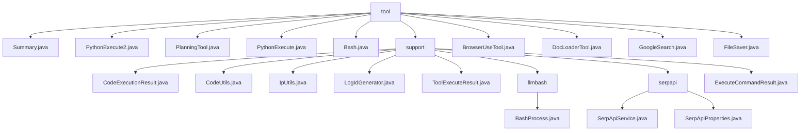

# 基础信息

|      |      |
|------|------|
| 名称 | tool |
| 编码语言 | .java |
| 代码路径 | spring-ai-alibaba/community/openmanus/src/main/java/com/alibaba/cloud/ai/example/manus/tool |
| 包名 | spring-ai-alibaba.community.openmanus.src.main.java.com.alibaba.cloud.ai.example.manus.tool |
| 概述说明 | 多功能工具集支持代码执行、命令处理、IP管理、日志生成等功能。 |

# 说明

## 概述
该代码模块是一个多功能工具集，主要用于代码执行、命令处理、IP地址管理、日志生成以及工具执行结果封装等功能。模块中的各个类通过提供灵活且高效的API，简化了开发者在处理代码执行、命令操作、网络环境管理以及日志生成等任务时的复杂性。核心类包括`CodeExecutionResult`、`CodeUtils`、`IpUtils`、`LogIdGenerator`、`ToolExecuteResult`、`BashProcess`和`ExecuteCommandResult`，它们共同协作，提供了强大的工具支持能力。

## 主要业务场景
1. **代码执行与结果管理**：通过`CodeExecutionResult`和`ExecuteCommandResult`类，开发者可以方便地管理和操作代码或命令执行后的结果，包括退出状态码、输出内容以及日志信息。
2. **多语言代码解析与执行**：`CodeUtils`类提供了多语言代码解析与执行的能力，适用于需要跨语言代码处理的场景，提升了代码操作的灵活性和效率。
3. **本地IP地址管理**：`IpUtils`类能够动态获取和更新本地IP地址，确保在网络环境变化时仍能准确反映当前网络状态，适用于需要实时获取IP地址的场景。
4. **全局有序日志生成**：`LogIdGenerator`类用于生成全局有序的UUID，并支持生成子RPC ID，确保在分布式系统中标识的唯一性和顺序性，适用于日志管理和分布式系统追踪。
5. **命令执行与工作目录控制**：`BashProcess`类允许用户在执行命令时指定工作目录，确保命令在特定路径下运行，适用于需要精确控制命令执行环境的场景。
6. **工具执行结果封装**：`ToolExecuteResult`类用于封装工具执行的结果，包括输出内容和中断状态，便于开发者管理和操作工具执行后的数据。
7. **浏览器操作自动化**：`BrowserUseTool`类支持页面导航、元素点击、文本输入以及屏幕截图等操作，适用于需要自动化浏览器任务的场景。
8. **文件加载与解析**：`DocLoaderTool`类能够读取和解析多种类型的本地文件，适用于需要提取文件信息的场景。
9. **Google搜索功能**：`GoogleSearch`类通过调用相关接口或方法，执行搜索操作并返回与搜索关键词相关的链接列表，适用于需要快速检索信息的场景。
10. **文件保存与持久化**：`FileSaver`类用于将指定内容保存到本地文件的指定路径，适用于需要本地文件存储的场景。

该模块适用于需要高效处理代码执行、命令操作、网络环境管理以及日志生成的开发场景，能够帮助开发者快速实现相关功能，同时通过灵活的API设计提升开发效率。

### 包内部结构视图

该流程图展示了`tool`目录及其子目录和文件的层级关系。`tool`目录下包含多个工具类和`support`子目录，`support`子目录下又包含多个支持类和`llmbash`、`serpapi`子目录。每个子目录下也有相应的文件，展示了完整的项目结构。

# 文件列表 File List

| 名称   | 类型  | 说明 |
|-------|------|-------------|
| [FileSaver.java](FileSaver.md) | file | FileSaver类提供将内容保存至指定路径的本地文件功能。 |
| [GoogleSearch.java](GoogleSearch.md) | file | GoogleSearch类实现搜索功能，返回相关链接列表。 |
| [Bash.java](Bash.md) | file | Bash类支持终端命令执行，含长运行、交互、超时处理及工具定义与回调功能。 |
| [Summary.java](Summary.md) | file | Summary类记录步骤总结并终止步骤，含工具定义和回调方法。 |
| [DocLoaderTool.java](DocLoaderTool.md) | file | DocLoaderTool类用于加载解析本地文件，支持多类型，返回信息或错误。 |
| [BrowserUseTool.java](BrowserUseTool.md) | file | BrowserUseTool支持导航、点击、输入、截图等浏览器操作。 |
| [PythonExecute.java](PythonExecute.md) | file | PythonExecute类支持ARM64架构，执行Python代码并输出结果。 |
| [PlanningTool.java](PlanningTool.md) | file | PlanningTool类用于管理复杂任务，支持计划创建、更新、列出、获取、激活、标记和删除。 |
| [PythonExecute2.java](PythonExecute2.md) | file | PythonExecute2类实现字符串转工具执行结果，支持Python代码执行并返回。 |
| [support](support/_module.md) | package | CodeExecutionResult管理执行状态、日志和镜像；CodeUtils处理多语言代码；IpUtils获取动态IP；LogIdGenerator生成全局UUID；ToolExecuteResult封装工具结果；BashProcess执行命令；SerpApiService处理搜索API；ExecuteCommandResult管理命令执行结果。 |

