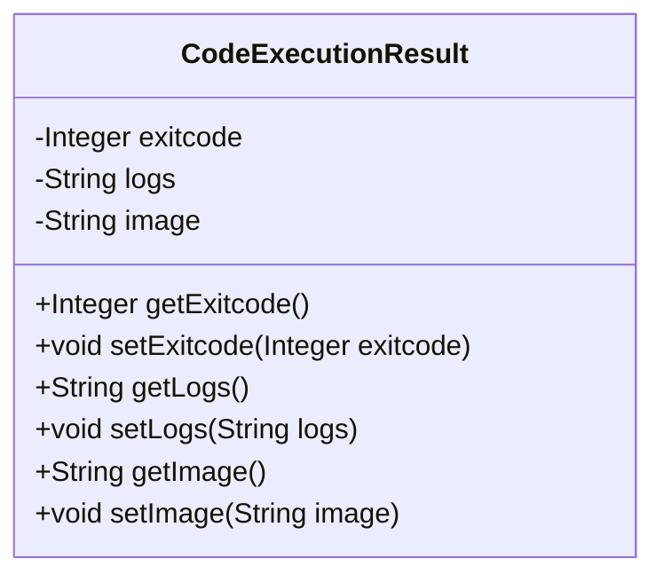
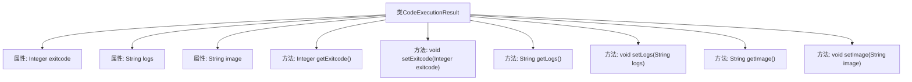

# 基础信息

|      |      |
|------|------|
| 名称 | CodeExecutionResult |
| 编码语言 | .java |
| 代码路径 | spring-ai-alibaba/community/openmanus/src/main/java/com/alibaba/cloud/ai/example/manus/tool/support/CodeExecutionResult.java |
| 包名 | com.alibaba.cloud.ai.example.manus.tool.support |
| 依赖项 | [] |
| 概述说明 | 类CodeExecutionResult包含exitcode、logs和image属性及其getter和setter方法。 |

# 说明

类CodeExecutionResult包含三个属性：exitcode、logs和image，分别用于存储执行结果的状态码、日志信息和镜像信息。每个属性都配有对应的getter和setter方法，用于获取和设置这些属性的值。exitcode表示代码执行的退出状态，logs用于记录执行过程中的日志信息，image则可能用于存储与执行相关的镜像数据。通过这些方法和属性，可以方便地管理和访问代码执行结果的相关信息。

# 类列表 Class Summary

| 名称   | 类型  | 说明 |
|-------|------|-------------|
| CodeExecutionResult | class | 类CodeExecutionResult包含exitcode、logs和image属性及其getter和setter方法。 |

## 类 CodeExecutionResult

|      |      |
|------|------|
| 访问范围 | public |
| 类型 | class |
| 名称 | CodeExecutionResult |
| 说明 | 类CodeExecutionResult包含exitcode、logs和image属性及其getter和setter方法。 |

### UML类图

这段代码定义了一个名为 `CodeExecutionResult` 的类，用于存储代码执行的结果。该类包含三个私有属性：`exitcode`（退出码）、`logs`（日志信息）和 `image`（图像信息）。每个属性都有对应的公有getter和setter方法，用于获取和设置这些属性的值。这个类主要用于封装代码执行后的状态和输出信息，便于在程序中进行管理和传递。

### 内部方法调用关系图

这段代码定义了一个名为 `CodeExecutionResult` 的类，该类包含三个属性：`exitcode`、`logs` 和 `image`，分别用于存储退出码、日志信息和图像数据。类中提供了对应的 `getter` 和 `setter` 方法，用于访问和修改这些属性的值。代码结构清晰，主要用于封装与代码执行结果相关的数据，并提供了对这些数据的操作接口。

### 字段列表 Field List

| 名称  | 类型  | 说明 |
|-------|-------|------|
| logs | String | 定义字符串变量logs。 |
| exitcode | Integer | 定义整数类型变量exitcode。 |
| image | String | 图像字符串变量声明。 |

### 方法列表 Method List

| 名称  | 类型  | 说明 |
|-------|-------|------|
| getExitcode | Integer | 该方法返回退出码exitcode的值。 |
| setLogs | void | 设置日志内容的方法。 |
| setExitcode | void | 设置退出码的方法，将传入的整数值赋给类成员变量exitcode。 |
| getLogs | String | 该方法返回日志字符串。 |
| getImage | String | 方法getImage返回字符串类型变量image。 |
| setImage | void | 设置图像属性的方法。 |

