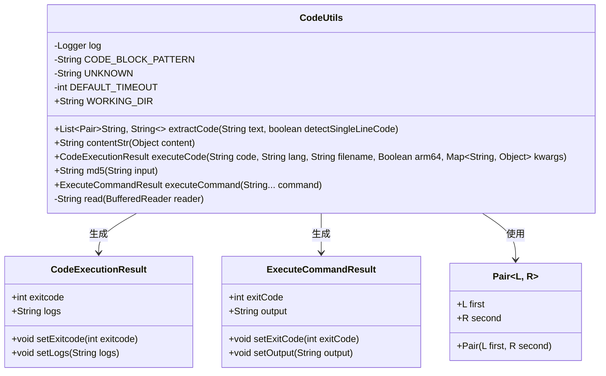
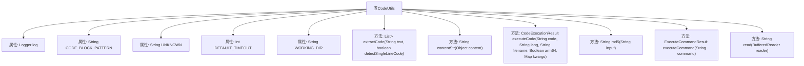

# 基础信息

|      |      |
|------|------|
| 名称 | CodeUtils |
| 编码语言 | .java |
| 代码路径 | spring-ai-alibaba/community/openmanus/src/main/java/com/alibaba/cloud/ai/example/manus/tool/support/CodeUtils.java |
| 包名 | com.alibaba.cloud.ai.example.manus.tool.support |
| 依赖项 | ['org.apache.commons.codec.digest.DigestUtils', 'org.apache.commons.lang3.tuple.Pair', 'org.slf4j.Logger', 'org.slf4j.LoggerFactory', 'java.io.BufferedReader', 'java.io.FileWriter', 'java.io.IOException', 'java.io.InputStreamReader', 'java.nio.file.Files', 'java.nio.file.Paths', 'java.util.ArrayList', 'java.util.List', 'java.util.Map', 'java.util.regex.Matcher', 'java.util.regex.Pattern', 'java.util.stream.Collectors', 'org.apache.commons.lang3.StringUtils.EMPTY'] |
| 概述说明 | CodeUtils类支持多语言代码解析、执行及命令处理。 |

# 说明

CodeUtils类是一个多功能工具类，主要用于代码提取、执行以及命令处理。它具备多语言代码解析与执行的能力，能够处理多种编程语言的代码，提供高效且灵活的代码操作功能。该类的设计旨在简化代码处理流程，提升开发效率，适用于需要跨语言代码解析和执行的场景。

# 类列表 Class Summary

| 名称   | 类型  | 说明 |
|-------|------|-------------|
| CodeUtils | class | CodeUtils类提供代码提取、执行及命令处理功能，支持多语言代码解析与执行。 |


## 类 CodeUtils

|      |      |
|------|------|
| 访问范围 | public |
| 类型 | class |
| 名称 | CodeUtils |
| 说明 | CodeUtils类提供代码提取、执行及命令处理功能，支持多语言代码解析与执行。 |


### UML类图



**描述：**
`CodeUtils` 是一个工具类，提供了从文本中提取代码块、执行代码、生成MD5哈希值以及执行命令行命令的功能。它依赖于 `CodeExecutionResult` 和 `ExecuteCommandResult` 来存储执行结果，并使用 `Pair` 类来存储提取的代码块及其语言类型。该类还包含一些私有方法，如 `read`，用于读取命令行输出。


### 内部方法调用关系图



这段代码定义了一个名为 `CodeUtils` 的工具类，主要用于处理代码的提取、执行和文件操作。类中包含多个方法，如 `extractCode` 用于从文本中提取代码块，`contentStr` 用于将对象内容转换为字符串，`executeCode` 用于执行代码并返回执行结果，`md5` 用于生成字符串的 MD5 哈希值，`executeCommand` 用于执行系统命令并返回执行结果，`read` 用于读取 `BufferedReader` 的内容。这些方法共同构成了一个功能强大的代码处理工具集。

### 字段列表 Field List

| 名称  | 类型  | 说明 |
|-------|-------|------|
| DEFAULT_TIMEOUT = 600 | int | 默认超时时间设为600。 |
| log = LoggerFactory.getLogger(CodeUtils.class) | Logger | CodeUtils类中定义了一个私有的静态日志对象log。 |
| UNKNOWN = "unknown" | String | 定义了一个私有静态常量UNKNOWN，值为"unknown"。 |
| WORKING_DIR = Paths.get(System.getProperty("user.dir"), "extensions").toString() | String | 定义静态常量WORKING_DIR，值为用户目录下extensions路径。 |
| CODE_BLOCK_PATTERN = "```(\\w*)\n(.*?)\n```" | String | 定义正则表达式匹配代码块模式。 |

### 方法列表 Method List

| 名称  | 类型  | 说明 |
|-------|-------|------|
| contentStr | String | 静态方法将对象内容转换为字符串，处理文本和图片URL类型。 |
| executeCode | CodeExecutionResult | 执行代码方法，处理代码或文件名，生成文件路径并执行命令，返回执行结果。 |
| read | String | 静态方法读取BufferedReader内容并拼接为字符串返回。 |
| extractCode | List<Pair<String, String>> | 提取代码块，支持多行和单行检测，返回语言和代码对。 |
| md5 | String | 静态方法md5使用DigestUtils生成输入字符串的MD5哈希值。 |
| executeCommand | ExecuteCommandResult | 执行命令并返回结果，记录错误和成功输出，处理异常。 |


