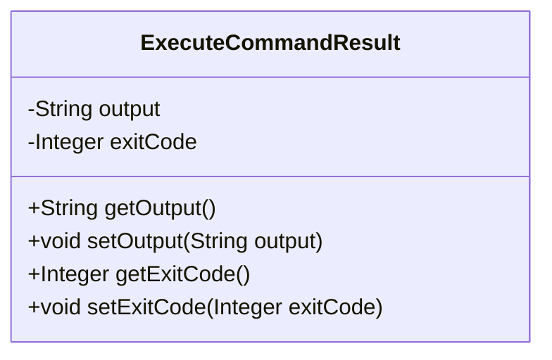
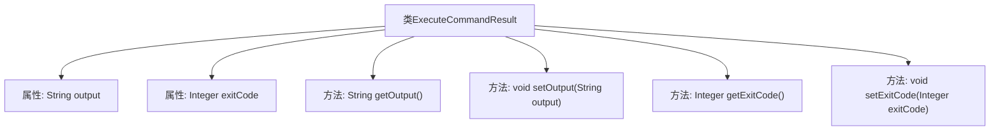

# 基础信息

|      |      |
|------|------|
| 名称 | ExecuteCommandResult |
| 编码语言 | .java |
| 代码路径 | spring-ai-alibaba/community/openmanus/src/main/java/com/alibaba/cloud/ai/example/manus/tool/support/ExecuteCommandResult.java |
| 包名 | com.alibaba.cloud.ai.example.manus.tool.support |
| 依赖项 | [] |
| 概述说明 | 类ExecuteCommandResult提供输出和退出码的获取与设置功能。 |

# 说明

类ExecuteCommandResult包含两个主要方法：获取输出和获取退出码，以及设置输出和设置退出码。这些方法用于管理和操作命令执行后的输出结果和退出状态码。获取输出方法用于读取命令执行后的输出内容，获取退出码方法用于读取命令执行后的状态码。设置输出方法用于更新或设定命令执行后的输出内容，设置退出码方法用于更新或设定命令执行后的状态码。通过这些方法，可以有效地管理和处理命令执行的结果。

# 类列表 Class Summary

| 名称   | 类型  | 说明 |
|-------|------|-------------|
| ExecuteCommandResult | class | 类ExecuteCommandResult包含输出和退出码的获取与设置方法。 |

## 类 ExecuteCommandResult

|      |      |
|------|------|
| 访问范围 | public |
| 类型 | class |
| 名称 | ExecuteCommandResult |
| 说明 | 类ExecuteCommandResult包含输出和退出码的获取与设置方法。 |

### UML类图

**描述：**
`ExecuteCommandResult` 类用于封装执行命令后的结果，包含两个私有成员变量：`output`（输出内容）和 `exitCode`（退出码）。类提供了对应的 `getter` 和 `setter` 方法，用于访问和修改这两个成员变量。这个类的主要作用是存储和传递命令执行的结果信息，便于后续处理和分析。

### 内部方法调用关系图

该流程图展示了`ExecuteCommandResult`类的结构，包括两个私有属性`output`和`exitCode`，以及对应的getter和setter方法。`getOutput()`和`getExitCode()`用于获取属性值，而`setOutput(String output)`和`setExitCode(Integer exitCode)`用于设置属性值。类通过这些方法实现对属性的封装和访问控制。

### 字段列表 Field List

| 名称  | 类型  | 说明 |
|-------|-------|------|
| output | String | 定义私有字符串变量output。 |
| exitCode | Integer | 私有整型变量exitCode用于存储退出状态码。 |

### 方法列表 Method List

| 名称  | 类型  | 说明 |
|-------|-------|------|
| getOutput | String | 该方法返回输出变量output的值。 |
| getExitCode | Integer | 获取退出代码的方法。 |
| setExitCode | void | 设置退出代码的方法，将传入值赋给退出代码变量。 |
| setOutput | void | 定义方法`setOutput`，用于设置类成员变量`output`。 |

