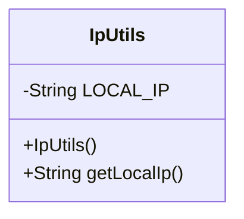
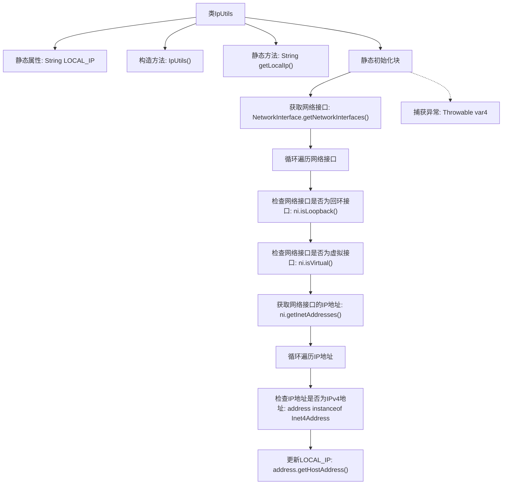

# 基础信息

|      |      |
|------|------|
| 名称 | IpUtils |
| 编码语言 | .java |
| 代码路径 | spring-ai-alibaba/community/openmanus/src/main/java/com/alibaba/cloud/ai/example/manus/tool/support/IpUtils.java |
| 包名 | com.alibaba.cloud.ai.example.manus.tool.support |
| 依赖项 | ['java.net.Inet4Address', 'java.net.InetAddress', 'java.net.NetworkInterface', 'java.util.Enumeration'] |
| 概述说明 | IpUtils类获取本地IP，默认127.0.0.1，支持动态更新。 |

# 说明

IpUtils类的主要功能是获取本地IP地址，其默认值为127.0.0.1。该类支持动态更新功能，能够根据网络环境的变化自动调整IP地址，确保获取的地址始终准确反映当前网络状态。这一特性使得IpUtils类在处理需要实时获取本地IP地址的场景中非常实用。

# 类列表 Class Summary

| 名称   | 类型  | 说明 |
|-------|------|-------------|
| IpUtils | class | IpUtils类用于获取本地IP地址，默认值为127.0.0.1，支持动态更新。 |

## 类 IpUtils

|      |      |
|------|------|
| 访问范围 | public |
| 类型 | class |
| 名称 | IpUtils |
| 说明 | IpUtils类用于获取本地IP地址，默认值为127.0.0.1，支持动态更新。 |

### UML类图

这段代码定义了一个名为 `IpUtils` 的类，用于获取本地IP地址。类中包含一个私有静态字符串 `LOCAL_IP`，初始值为 `"127.0.0.1"`。类中定义了一个无参构造函数和一个静态方法 `getLocalIp()`，用于返回 `LOCAL_IP` 的值。静态代码块在类加载时执行，尝试通过遍历网络接口来获取本地IP地址，并将结果赋值给 `LOCAL_IP`。如果获取过程中发生异常，则忽略异常并保持 `LOCAL_IP` 的初始值。

### 内部方法调用关系图

这段代码定义了一个`IpUtils`类，用于获取本地IP地址。代码通过静态初始化块在类加载时自动执行，遍历所有网络接口，找到非回环、非虚拟的IPv4地址，并将其赋值给静态变量`LOCAL_IP`。`getLocalIp()`方法用于返回该IP地址。流程图中详细展示了从获取网络接口到最终更新IP地址的整个过程，并考虑了异常处理。

### 字段列表 Field List

| 名称  | 类型  | 说明 |
|-------|-------|------|
| LOCAL_IP = "127.0.0.1" | String | 定义私有静态字符串变量LOCAL_IP，值为"127.0.0.1"。 |

### 方法列表 Method List

| 名称  | 类型  | 说明 |
|-------|-------|------|
| getLocalIp | String | 获取本地IP地址的静态方法。 |

