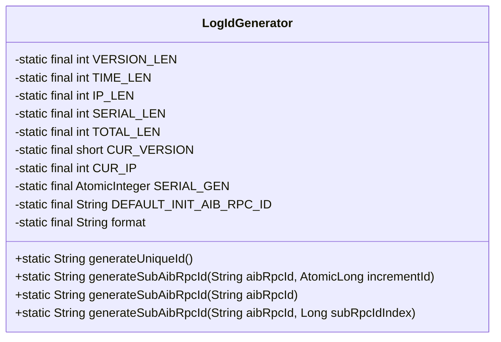

# 基础信息

|      |      |
|------|------|
| 名称 | LogIdGenerator |
| 编码语言 | .java |
| 代码路径 | spring-ai-alibaba/community/openmanus/src/main/java/com/alibaba/cloud/ai/example/manus/tool/support/LogIdGenerator.java |
| 包名 | com.alibaba.cloud.ai.example.manus.tool.support |
| 依赖项 | ['cn.hutool.core.util.ByteUtil', 'com.google.common.net.InetAddresses', 'org.apache.commons.lang3.StringUtils', 'java.nio.charset.StandardCharsets', 'java.util.Base64', 'java.util.Objects', 'java.util.concurrent.atomic.AtomicInteger', 'java.util.concurrent.atomic.AtomicLong'] |
| 概述说明 | LogIdGenerator生成有序UUID，含版本、时间、IP、序列号，编码为Base64，支持子RPC ID。 |

# 说明

LogIdGenerator类用于生成全局有序的UUID，该UUID由版本号、时间戳、IP地址和序列号组成，并最终编码为Base64格式。此外，该类还支持生成子RPC ID，确保在分布式系统中标识的唯一性和顺序性。

# 类列表 Class Summary

| 名称   | 类型  | 说明 |
|-------|------|-------------|
| LogIdGenerator | class | LogIdGenerator类生成全局有序UUID，使用版本、时间戳、IP和序列号，并编码为Base64。同时支持生成子RPC ID。 |

## 类 LogIdGenerator

|      |      |
|------|------|
| 访问范围 | public |
| 类型 | class |
| 名称 | LogIdGenerator |
| 说明 | LogIdGenerator类生成全局有序UUID，使用版本、时间戳、IP和序列号，并编码为Base64。同时支持生成子RPC ID。 |

### UML类图

**描述：**
`LogIdGenerator` 类用于生成全局唯一的ID和子RPC ID。它通过结合版本号、时间戳、IP地址和序列号生成一个全局大致有序的UUID，并使用Base64编码确保生成的字符串不包含特殊符号。此外，该类还提供了生成子RPC ID的方法，支持不同的参数组合，确保在并发情况下生成唯一的ID。该类的主要功能包括生成唯一ID和子RPC ID，适用于分布式系统中的日志记录和请求追踪。

### 内部方法调用关系图

```mermaid
graph TD
    A["类LogIdGenerator"]
    B["静态常量: VERSION_LEN = Short.BYTES"]
    C["静态常量: TIME_LEN = Long.BYTES"]
    D["静态常量: IP_LEN = Integer.BYTES"]
    E["静态常量: SERIAL_LEN = Integer.BYTES"]
    F["静态常量: TOTAL_LEN = VERSION_LEN + TIME_LEN + IP_LEN + SERIAL_LEN"]
    G["静态常量: CUR_VERSION = 0"]
    H["静态常量: CUR_IP = InetAddresses.coerceToInteger(InetAddresses.forString(IpUtils.getLocalIp()))"]
    I["静态常量: SERIAL_GEN = new AtomicInteger(Integer.MIN_VALUE)"]
    J["静态常量: DEFAULT_INIT_AIB_RPC_ID = '0.1'"]
    K["静态常量: format = '%s.%s'"]
    L["方法: generateUniqueId()"]
    M["方法: generateSubAibRpcId(String aibRpcId, AtomicLong incrementId)"]
    N["方法: generateSubAibRpcId(String aibRpcId)"]
    O["方法: generateSubAibRpcId(String aibRpcId, Long subRpcIdIndex)"]
    P["步骤: 创建字节数组 array = new byte[TOTAL_LEN]"]
    Q["步骤: 将版本号 CUR_VERSION 转换为字节数组 versionByte"]
    R["步骤: 将 versionByte 复制到 array 中"]
    S["步骤: 将当前时间戳 System.currentTimeMillis() 转换为字节数组 timeByte"]
    T["步骤: 将 timeByte 复制到 array 中"]
    U["步骤: 将 IP 地址 CUR_IP 转换为字节数组 ipByte"]
    V["步骤: 将 ipByte 复制到 array 中"]
    W["步骤: 将序列号 SERIAL_GEN.getAndIncrement() 转换为字节数组 serialByte"]
    X["步骤: 将 serialByte 复制到 array 中"]
    Y["步骤: 对 array 进行 Base64 编码并返回结果"]
    Z["步骤: 检查 aibRpcId 是否为空"]
    AA["步骤: 如果为空，返回 DEFAULT_INIT_AIB_RPC_ID"]
    AB["步骤: 否则，返回 String.format(format, aibRpcId, incrementId.getAndIncrement())"]
    AC["步骤: 检查 aibRpcId 是否为空"]
    AD["步骤: 如果为空，返回 DEFAULT_INIT_AIB_RPC_ID"]
    AE["步骤: 否则，返回 String.format(format, aibRpcId, '1')"]
    AF["步骤: 检查 aibRpcId 是否为空"]
    AG["步骤: 如果为空，返回 DEFAULT_INIT_AIB_RPC_ID"]
    AH["步骤: 检查 subRpcIdIndex 是否为空"]
    AI["步骤: 如果为空，返回 String.format(format, aibRpcId, '1')"]
    AJ["步骤: 否则，返回 String.format(format, aibRpcId, subRpcIdIndex)"]

    A --> B
    A --> C
    A --> D
    A --> E
    A --> F
    A --> G
    A --> H
    A --> I
    A --> J
    A --> K
    A --> L
    A --> M
    A --> N
    A --> O
    L --> P
    L --> Q
    L --> R
    L --> S
    L --> T
    L --> U
    L --> V
    L --> W
    L --> X
    L --> Y
    M --> Z
    Z --> AA
    Z --> AB
    N --> AC
    AC --> AD
    AC --> AE
    O --> AF
    AF --> AG
    AF --> AH
    AH --> AI
    AH --> AJ
```

**描述：**
该流程图展示了`LogIdGenerator`类的结构和主要方法调用关系。`generateUniqueId`方法通过版本号、时间戳、IP地址和序列号生成唯一的ID，并进行Base64编码。`generateSubAibRpcId`方法则根据输入的`aibRpcId`和`incrementId`生成新的子ID，处理了空值和并发情况。每个步骤都清晰地展示了数据的流动和处理过程。

### 字段列表 Field List

| 名称  | 类型  | 说明 |
|-------|-------|------|
| VERSION_LEN = Short.BYTES | int | 定义私有静态常量VERSION_LEN，长度为Short.BYTES。 |
| TIME_LEN = Long.BYTES | int | 定义常量TIME_LEN为Long类型字节长度。 |
| SERIAL_GEN = new AtomicInteger(Integer.MIN_VALUE) | AtomicInteger | 私有静态原子整数序列生成器初始化为最小整数值。 |
| IP_LEN = Integer.BYTES | int | 定义私有静态常量IP_LEN，值为整数字节数。 |
| DEFAULT_INIT_AIB_RPC_ID = "0.1" | String | 默认初始化AIB RPC ID为"0.1"。 |
| format = "%s.%s" | String | 定义静态常量format，格式为"%s.%s"。 |
| SERIAL_LEN = Integer.BYTES | int | 定义常量SERIAL_LEN，值为整数类型字节长度。 |
| CUR_VERSION = 0 | short | 定义静态常量CUR_VERSION，初始值为0。 |
| CUR_IP = InetAddresses.coerceToInteger(InetAddresses.forString(IpUtils.getLocalIp())) | int | 获取本地IP并转换为整数存储于CUR_IP常量。 |
| TOTAL_LEN = VERSION_LEN + TIME_LEN + IP_LEN + SERIAL_LEN | int | 私有静态常量TOTAL_LEN等于各长度之和。 |

### 方法列表 Method List

| 名称  | 类型  | 说明 |
|-------|-------|------|
| generateSubAibRpcId | String | 生成子AIB RPC ID，若为空则返回默认初始ID。 |
| generateSubAibRpcId | String | 生成子RPC ID，空时返回默认值，否则格式化输出。 |
| generateUniqueId | String | 生成唯一ID，包含版本、时间、IP和序列号，编码为Base64字符串。 |
| generateSubAibRpcId | String | 生成子AibRpcId，空则返回默认值，否则格式化递增ID。 |

