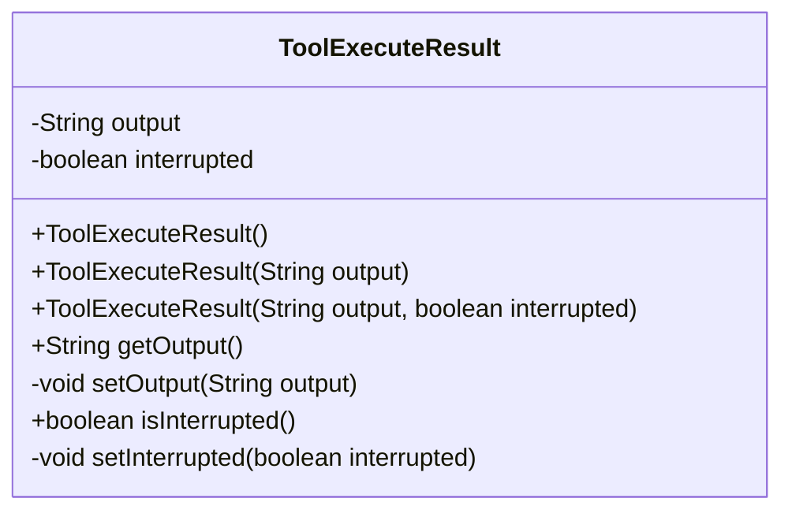
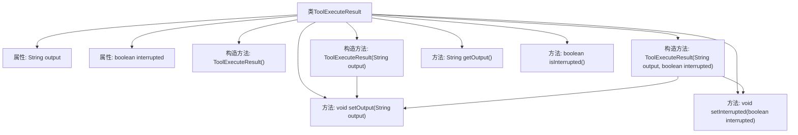

# 基础信息

|      |      |
|------|------|
| 名称 | ToolExecuteResult |
| 编码语言 | .java |
| 代码路径 | spring-ai-alibaba/community/openmanus/src/main/java/com/alibaba/cloud/ai/example/manus/tool/support/ToolExecuteResult.java |
| 包名 | com.alibaba.cloud.ai.example.manus.tool.support |
| 依赖项 | [] |
| 概述说明 | ToolExecuteResult类管理输出内容和中断状态，提供构造及访问方法。 |

# 说明

ToolExecuteResult类用于封装工具执行的结果，包含输出内容和中断状态两个主要属性。该类提供了构造器用于初始化这些属性，并包含相应的getter和setter方法，以便于访问和修改输出内容及中断状态。通过这种设计，可以方便地管理和操作工具执行后的结果数据。

# 类列表 Class Summary

| 名称   | 类型  | 说明 |
|-------|------|-------------|
| ToolExecuteResult | class | ToolExecuteResult类包含输出内容和中断状态，提供构造器和getter/setter方法。 |

## 类 ToolExecuteResult

|      |      |
|------|------|
| 访问范围 | public |
| 类型 | class |
| 名称 | ToolExecuteResult |
| 说明 | ToolExecuteResult类包含输出内容和中断状态，提供构造器和getter/setter方法。 |

### UML类图

**描述：**  
`ToolExecuteResult` 类用于表示工具执行的结果，包含两个主要属性：`output`（工具返回的内容）和 `interrupted`（是否中断）。类提供了三个构造函数，分别用于初始化不同的属性组合，以及相应的 getter 和 setter 方法。该类主要用于封装工具执行后的输出状态和中断状态，便于在程序中进行传递和处理。

### 内部方法调用关系图

这段代码定义了一个名为 `ToolExecuteResult` 的类，用于表示工具执行的结果。该类包含两个私有属性：`output` 表示工具返回的内容，`interrupted` 表示是否中断。类提供了三个构造方法，分别用于初始化不同的属性组合。此外，类还提供了 `getOutput`、`setOutput`、`isInterrupted` 和 `setInterrupted` 方法，用于获取和设置这些属性的值。流程图展示了类的结构及其方法之间的调用关系。

### 字段列表 Field List

| 名称  | 类型  | 说明 |
|-------|-------|------|
| output | String | 声明一个私有字符串变量output。 |
| interrupted | boolean | 定义了一个私有布尔变量interrupted。 |

### 方法列表 Method List

| 名称  | 类型  | 说明 |
|-------|-------|------|
| setOutput | void | 该方法用于设置输出字符串。 |
| isInterrupted | boolean | 检查中断状态的布尔方法。 |
| setInterrupted | void | 设置中断状态的布尔值。 |
| getOutput | String | 该方法返回字符串类型的输出变量。 |

