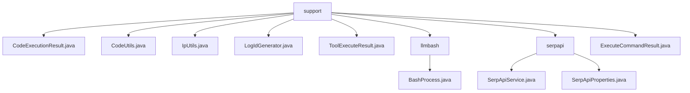

# 基础信息

|      |      |
|------|------|
| 名称 | support |
| 编码语言 | .java |
| 代码路径 | spring-ai-alibaba/community/openmanus/src/main/java/com/alibaba/cloud/ai/example/manus/tool/support |
| 包名 | spring-ai-alibaba.community.openmanus.src.main.java.com.alibaba.cloud.ai.example.manus.tool.support |
| 概述说明 | CodeExecutionResult管理执行状态、日志和镜像；CodeUtils处理多语言代码；IpUtils获取动态IP；LogIdGenerator生成全局UUID；ToolExecuteResult封装工具结果；BashProcess执行命令；SerpApiService处理搜索API；ExecuteCommandResult管理命令执行结果。 |

# 说明

## 概述
该代码模块是一个多功能工具集，主要用于代码执行、命令处理、IP地址管理、日志生成以及工具执行结果封装等功能。模块中的各个类通过提供灵活且高效的API，简化了开发者在处理代码执行、命令操作、网络环境管理以及日志生成等任务时的复杂性。核心类包括`CodeExecutionResult`、`CodeUtils`、`IpUtils`、`LogIdGenerator`、`ToolExecuteResult`、`BashProcess`和`ExecuteCommandResult`，它们共同协作，提供了强大的工具支持能力。

## 主要业务场景
1. **代码执行与结果管理**：通过`CodeExecutionResult`和`ExecuteCommandResult`类，开发者可以方便地管理和操作代码或命令执行后的结果，包括退出状态码、输出内容以及日志信息。
2. **多语言代码解析与执行**：`CodeUtils`类提供了多语言代码解析与执行的能力，适用于需要跨语言代码处理的场景，提升了代码操作的灵活性和效率。
3. **本地IP地址管理**：`IpUtils`类能够动态获取和更新本地IP地址，确保在网络环境变化时仍能准确反映当前网络状态，适用于需要实时获取IP地址的场景。
4. **全局有序日志生成**：`LogIdGenerator`类用于生成全局有序的UUID，并支持生成子RPC ID，确保在分布式系统中标识的唯一性和顺序性，适用于日志管理和分布式系统追踪。
5. **命令执行与工作目录控制**：`BashProcess`类允许用户在执行命令时指定工作目录，确保命令在特定路径下运行，适用于需要精确控制命令执行环境的场景。
6. **工具执行结果封装**：`ToolExecuteResult`类用于封装工具执行的结果，包括输出内容和中断状态，便于开发者管理和操作工具执行后的数据。

该模块适用于需要高效处理代码执行、命令操作、网络环境管理以及日志生成的开发场景，能够帮助开发者快速实现相关功能，同时通过灵活的API设计提升开发效率。

### 包内部结构视图

该流程图展示了 `support` 目录下的文件及其子目录的层级关系。`support` 包含了多个工具类文件，如 `CodeExecutionResult.java` 和 `CodeUtils.java`，以及两个子目录 `llmbash` 和 `serpapi`。`llmbash` 目录下包含 `BashProcess.java`，而 `serpapi` 目录下包含 `SerpApiService.java` 和 `SerpApiProperties.java`。整体结构清晰，展示了工具支持模块的文件组织方式。

# 文件列表 File List

| 名称   | 类型  | 说明 |
|-------|------|-------------|
| [ToolExecuteResult.java](ToolExecuteResult.md) | file | ToolExecuteResult类管理输出内容和中断状态，提供构造及访问方法。 |
| [CodeUtils.java](CodeUtils.md) | file | CodeUtils类支持多语言代码解析、执行及命令处理。 |
| [ExecuteCommandResult.java](ExecuteCommandResult.md) | file | 类ExecuteCommandResult提供输出和退出码的获取与设置功能。 |
| [LogIdGenerator.java](LogIdGenerator.md) | file | LogIdGenerator生成有序UUID，含版本、时间、IP、序列号，编码为Base64，支持子RPC ID。 |
| [IpUtils.java](IpUtils.md) | file | IpUtils类获取本地IP，默认127.0.0.1，支持动态更新。 |
| [CodeExecutionResult.java](CodeExecutionResult.md) | file | 类CodeExecutionResult包含exitcode、logs和image属性及其getter和setter方法。 |
| [serpapi](serpapi/_module.md) | package | SerpApiService类处理API密钥、搜索引擎设置及WebClient初始化，支持GET请求和JSON解析。SerpApiProperties类管理API配置，包括URL、用户代理和搜索引擎参数。 |
| [llmbash](llmbash/_module.md) | package | BashProcess类执行命令，可指定工作目录并返回输出。 |

