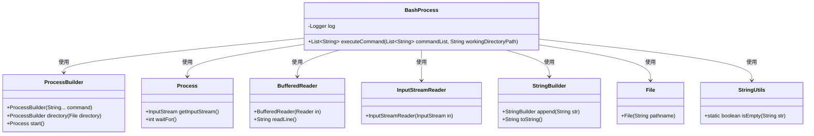
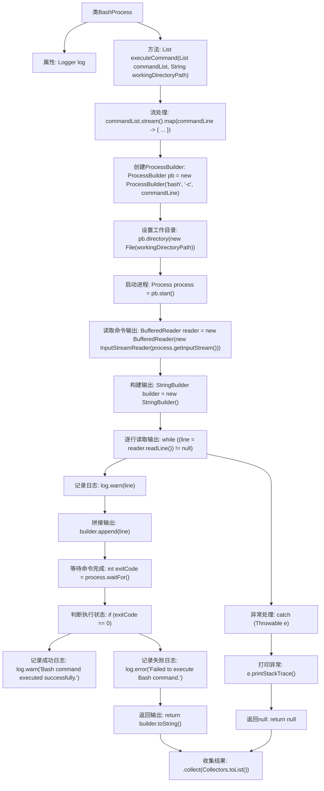

# 基础信息

|      |      |
|------|------|
| 名称 | BashProcess |
| 编码语言 | .java |
| 代码路径 | spring-ai-alibaba/community/openmanus/src/main/java/com/alibaba/cloud/ai/example/manus/tool/support/llmbash/BashProcess.java |
| 包名 | com.alibaba.cloud.ai.example.manus.tool.support.llmbash |
| 依赖项 | ['java.io.BufferedReader', 'java.io.File', 'java.io.InputStreamReader', 'java.util.List', 'java.util.stream.Collectors', 'org.apache.commons.lang3.StringUtils', 'org.slf4j.Logger', 'org.slf4j.LoggerFactory'] |
| 概述说明 | BashProcess类执行命令，可指定工作目录并返回输出。 |

# 说明

BashProcess类用于执行命令并返回输出结果，具备指定工作目录的功能。该类允许用户在执行命令时设置特定的工作路径，确保命令在指定目录下运行，并返回执行后的输出内容。这一功能在处理需要特定环境或路径依赖的命令时非常有用，提供了灵活性和精确控制。

# 类列表 Class Summary

| 名称   | 类型  | 说明 |
|-------|------|-------------|
| BashProcess | class | BashProcess类执行命令并返回输出，支持指定工作目录。 |

## 类 BashProcess

|      |      |
|------|------|
| 访问范围 | public |
| 类型 | class |
| 名称 | BashProcess |
| 说明 | BashProcess类执行命令并返回输出，支持指定工作目录。 |

### UML类图

这段代码定义了一个`BashProcess`类，用于执行Bash命令。`executeCommand`方法接收命令列表和工作目录路径，使用`ProcessBuilder`启动进程并执行命令。通过`BufferedReader`读取命令输出，并使用`StringBuilder`构建输出结果。代码还处理了命令执行的成功与失败情况，并记录日志。类图中展示了`BashProcess`类与其他相关类之间的依赖关系。

### 内部方法调用关系图

这段代码定义了一个名为 `BashProcess` 的类，其中包含一个 `executeCommand` 方法，用于执行Bash命令并返回输出结果。该方法通过 `ProcessBuilder` 启动进程，读取命令的输出，并根据执行状态记录日志。代码使用流处理对命令列表进行映射，最终将结果收集到一个列表中。异常处理部分捕获并打印可能的错误信息。

### 字段列表 Field List

| 名称  | 类型  | 说明 |
|-------|-------|------|
| log = LoggerFactory.getLogger(BashProcess.class) | Logger | BashProcess类中定义了一个静态的日志记录器log。 |

### 方法列表 Method List

| 名称  | 类型  | 说明 |
|-------|-------|------|
| executeCommand | List<String> | 该方法执行Bash命令并返回输出，支持指定工作目录。 |

