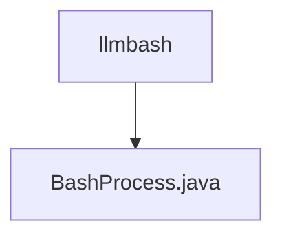

# 基础信息

|      |      |
|------|------|
| 名称 | llmbash |
| 编码语言 | .java |
| 代码路径 | spring-ai-alibaba/community/openmanus/src/main/java/com/alibaba/cloud/ai/example/manus/tool/support/llmbash |
| 包名 | spring-ai-alibaba.community.openmanus.src.main.java.com.alibaba.cloud.ai.example.manus.tool.support.llmbash |
| 概述说明 | BashProcess类执行命令，可指定工作目录并返回输出。 |

# 说明

BashProcess类用于执行命令并返回输出结果，具备指定工作目录的功能。该类允许用户在执行命令时设置特定的工作路径，确保命令在指定目录下运行，并返回执行后的输出内容。这一功能在处理需要特定环境或路径依赖的命令时非常有用，提供了灵活性和精确控制。

### 包内部结构视图

该流程图展示了路径的层级关系，其中`llmbash`是父目录，`BashProcess.java`是子文件。通过简洁的图形表示，清晰地反映了文件与目录之间的从属关系，便于快速理解项目结构。

# 文件列表 File List

| 名称   | 类型  | 说明 |
|-------|------|-------------|
| [BashProcess.java](BashProcess.md) | file | BashProcess类执行命令，可指定工作目录并返回输出。 |

