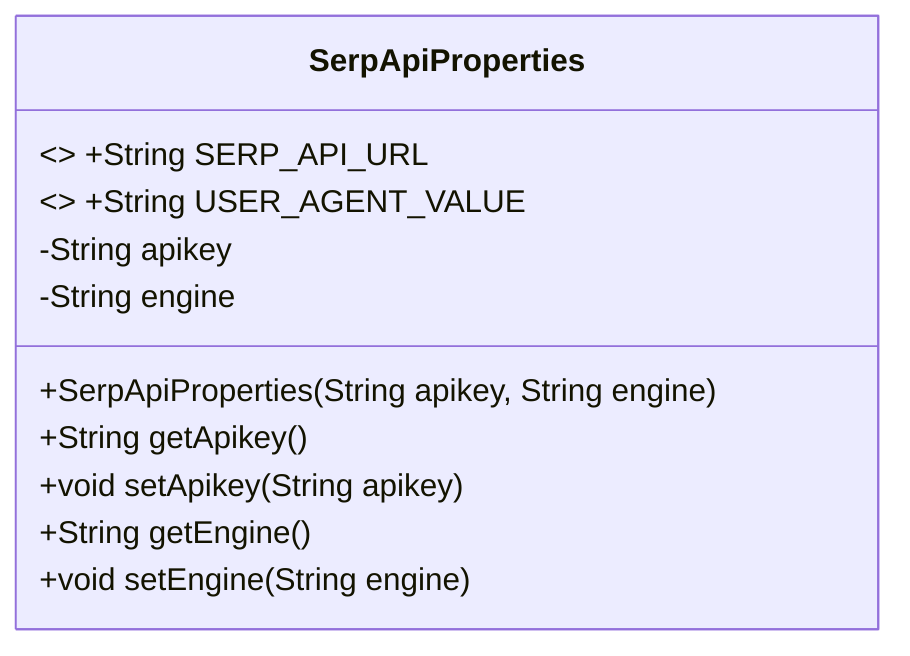
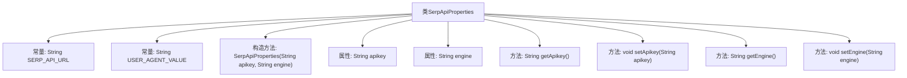

# 基础信息

|      |      |
|------|------|
| 名称 | SerpApiProperties |
| 编码语言 | .java |
| 代码路径 | spring-ai-alibaba/community/openmanus/src/main/java/com/alibaba/cloud/ai/example/manus/tool/support/serpapi/SerpApiProperties.java |
| 包名 | com.alibaba.cloud.ai.example.manus.tool.support.serpapi |
| 依赖项 | ['org.springframework.boot.context.properties.ConfigurationProperties'] |
| 概述说明 | SerpApiProperties类包含API URL、用户代理和引擎配置。 |

# 说明

SerpApiProperties类用于管理API相关的配置信息，主要包括API的URL地址、用户代理设置以及搜索引擎的配置参数。这些配置项共同确保了API调用的准确性和有效性，为用户提供了灵活且可定制的API访问方式。通过该类，用户可以轻松配置和管理与API交互所需的各种参数，从而优化API的使用体验。

# 类列表 Class Summary

| 名称   | 类型  | 说明 |
|-------|------|-------------|
| SerpApiProperties | class | SerpApiProperties类包含API URL、用户代理及引擎配置。 |

## 类 SerpApiProperties

|      |      |
|------|------|
| 访问范围 | public |
| 类型 | class |
| 名称 | SerpApiProperties |
| 说明 | SerpApiProperties类包含API URL、用户代理及引擎配置。 |

### UML类图

这段代码定义了一个名为 `SerpApiProperties` 的类，用于存储与 SerpApi 服务相关的配置属性。类中包含两个静态常量 `SERP_API_URL` 和 `USER_AGENT_VALUE`，分别表示 API 的 URL 和用户代理字符串。类还包含两个私有成员变量 `apikey` 和 `engine`，分别表示 API 密钥和搜索引擎类型。类提供了构造方法用于初始化这两个变量，并提供了相应的 getter 和 setter 方法用于访问和修改这些属性。

### 内部方法调用关系图

这段代码定义了一个名为`SerpApiProperties`的类，包含了两个常量`SERP_API_URL`和`USER_AGENT_VALUE`，以及两个私有属性`apikey`和`engine`。类中提供了构造方法用于初始化这两个属性，并提供了相应的getter和setter方法来访问和修改这些属性。这段代码主要用于管理和封装与SerpApi相关的配置信息。

### 字段列表 Field List

| 名称  | 类型  | 说明 |
|-------|-------|------|
| engine | String | 定义私有字符串类型变量engine。 |
| apikey | String | 定义私有字符串变量apikey。 |
| SERP_API_URL = "https://serpapi.com/search" | String | SERP API的搜索URL为https://serpapi.com/search。 |
| USER_AGENT_VALUE = "Mozilla/5.0 (Windows NT 10.0; Win64; x64) AppleWebKit/537.36 (KHTML, like Gecko) Chrome/131.0.0.0 Safari/537.36" | String | 定义常量USER_AGENT_VALUE，模拟Chrome浏览器用户代理。 |

### 方法列表 Method List

| 名称  | 类型  | 说明 |
|-------|-------|------|
| getEngine | String | 获取引擎信息的方法。 |
| setEngine | void | 设置引擎属性的方法。 |
| getApikey | String | 该方法返回apikey字符串值。 |
| setApikey | void | 设置API密钥的方法。 |

